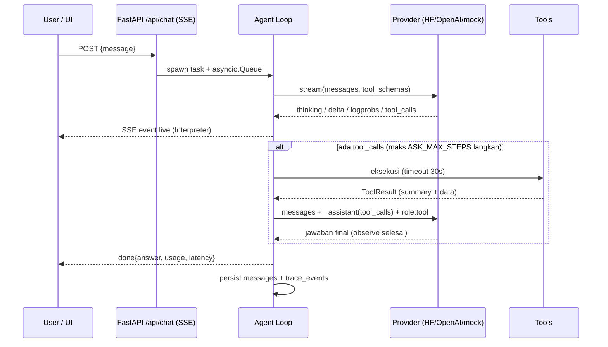

# Ask Anything

Platform AI chatbot **agentic** — bukan hanya menjawab: agent ini bisa *browsing*
web, men-generate **diagram alir (flowchart)** maupun **diagram graph** (Mermaid,
dirender live di UI), dan — yang membuatnya berbeda — **seluruh proses LLM
terlihat**: thinking/reasoning, tool call + argumen mentah, hasil tool, logprobs
per-token, prompt assembly, sampai metrik usage. Semuanya tampil live di panel
**Mechanistic Interpreter**.

- **Backend**: FastAPI (monolith) dengan streaming SSE terbaru.
- **Frontend**: Next.js 16 (latest) + Tailwind, design system light/indigo
  (sidebar riwayat per tanggal, hero grid, prompt card, chips, Explore).
- **LLM fleksibel**: HuggingFace **lokal** (llama.cpp / server OpenAI-compatible
  apa pun) **maupun OpenAI API**, plus mode `mock` untuk demo offline.
  Default: `huggingface`.

```
┌──────────────┐   SSE (/api/chat)   ┌──────────────────────────────┐
│  Next.js UI  │ ◄────────────────── │  FastAPI backend (monolith)  │
│  + Mermaid   │ ──────────────────► │  agent loop + tools + trace  │
└──────────────┘      POST           │        │            │       │
                                     │   providers         tools   │
                                     │  hf / openai / mock  search │
                                     │        │             fetch  │
                                     │        ▼             diagram│
                                     │  llama-server(8081)  calc   │
                                     └──────────────────────────────┘
```

## Quick start (satu perintah)

Prasyarat: **Python ≥ 3.10**, **Node ≥ 18** (+npm). Sisanya diurus launcher:
cek dependensi → install yang kurang → jalankan backend+frontend → health check.

```bash
# Linux / macOS
python3 run.py            # atau ./run.sh

# Windows
run.bat

# Tanpa GPU / tanpa download model (server HF lokal di-emulasi):
python3 run.py --demo

# Dengan model GGUF asli dari HuggingFace (butuh llama.cpp ter-install):
python3 run.py --gguf ~/models/qwen3-8b-q4_k_m.gguf
```

- UI: http://localhost:3000 · API: http://localhost:8000/docs
- Launcher menampilkan checklist dependensi (`[ OK ] python/node/npm/backend/frontend`)
  dan status keterjangkauan LLM server.
- Tanpa server LLM & tanpa `--demo`, backend tetap jalan dan UI menawarkan
  tombol **"Pakai mode mock"** di banner peringatan.

## Model HuggingFace lokal untuk laptop 16 GB

Rekomendasi (quant Q4_K_M, via **llama.cpp `llama-server`** yang mengekspos API
OpenAI-compatible — tool-calling + streaming logprobs native):

| Model | RAM | Catatan |
|---|---|---|
| **Qwen3-8B Q4_K_M** (default) | ~6 GB | All-rounder terbaik 16 GB, ~8–15 tok/s CPU, thinking + tool call |
| Qwen3-14B Q4_K_M | ~8.5–9 GB | "Sweet spot" kualitas bila mau lebih cerdas |
| Gemma 3 12B Q4_K_M | ~8 GB | Alternatif multilingual kuat |
| Qwen3.6-35B-A3B IQ2_M | ~11.5 GB | Bila punya **GPU 16 GB** (MoE, sangat cepat) |

Sumber rekomendasi: [PromptQuorum](https://www.promptquorum.com/prompt-bites/best-local-llm-16gb-ram-laptop),
[frankx.ai](https://www.frankx.ai/blog/best-local-llm-2026),
[LocalAIMaster](https://localaimaster.com/vram/best-llm-16gb-vram),
[HF blog](https://huggingface.co/blog/daya-shankar/open-source-llm-models-to-run-locally).

```bash
# 1) install llama.cpp (sekali)
#    brew install llama.cpp          (mac)
#    atau build: https://github.com/ggml-org/llama.cpp
# 2) download GGUF dari HF Hub
huggingface-cli download Qwen/Qwen3-8B-GGUF qwen3-8b-q4_k_m.gguf --local-dir ~/models
# 3) serve (port default aplikasi: 8081)
llama-server -m ~/models/qwen3-8b-q4_k_m.gguf --host 0.0.0.0 --port 8081 --jinja -c 8192
```

GPU: tambah `-ngl 99`. Apple Silicon otomatis via Metal.

### OpenAI API

Set dari UI (tombol *Settings provider*) atau env:

```bash
ASK_PROVIDER=openai ASK_OPENAI_API_KEY=sk-... python3 run.py
# opsional base url custom (Azure/vLLM/proxy): ASK_OPENAI_BASE_URL=...
```

## Mechanistic Interpreter

Panel kanan UI (tombol `Mechanistic Interpreter →`) menampilkan **semua** yang
LLM & agent lakukan, per-event, dan juga tersimpan di SQLite sehingga riwayat
bisa di-replay:

| Tab | Isi |
|---|---|
| **Timeline** | Urutan event: `meta → thinking → tool_call → tool_result → … → done`, tiap baris bisa dibentangkan jadi JSON mentah |
| **Prompt** | Prompt assembly: system prompt + messages persis seperti dikirim ke LLM + daftar tools |
| **Tokens** | Logprobs streaming: token terpilih, probability bar, top alternatif (butuh provider yang mendukung — llama.cpp ya) |
| **Metrics** | provider/model, temperature, steps, latency, token usage, jumlah event/error |

Event yang sama juga dirender inline di chat: chip tool (`web_search ✓`),
kotak thinking 💭, dan diagram Mermaid auto-render.

## Tools agent

| Tool | Fungsi |
|---|---|
| `web_search` | Cari web — DuckDuckGo lite default (tanpa API key); Serper/Tavily opsional via env |
| `fetch_url` | Ambil & ekstrak teks sebuah halaman (readability ringan) |
| `create_diagram` | Generate Mermaid: `flowchart` (diagram alir), `graph` (relasi), `mindmap` — tervalidasi server-side |
| `calculator` | Aritmetika aman (AST) |

## Konfigurasi (env, prefix `ASK_`)

| Variabel | Default | Keterangan |
|---|---|---|
| `ASK_PROVIDER` | `huggingface` | `huggingface` \| `openai` \| `mock` |
| `ASK_HF_BASE_URL` | `http://127.0.0.1:8081/v1` | Server lokal OpenAI-compatible |
| `ASK_HF_MODEL` | `Qwen/Qwen3-8B-GGUF` | Label model |
| `ASK_OPENAI_API_KEY` / `ASK_OPENAI_BASE_URL` / `ASK_OPENAI_MODEL` | – / api.openai.com / gpt-4o-mini | OpenAI |
| `ASK_TEMPERATURE`, `ASK_MAX_STEPS`, `ASK_LOGPROBS` | 0.7 / 6 / true | Generasi & interpreter |
| `ASK_SEARCH_BACKEND` | `ddg` | `ddg` \| `serper` \| `tavily` (+key masing-masing) |
| `ASK_DB_PATH` | `data/ask_anything.db` | SQLite |

Semua juga bisa diubah runtime dari UI → *Settings provider*.

## Cara kerja agent (detail)

> 📚 **Slide interaktif & metodologi lengkap**: buka
> [`docs/slides-cara-kerja.html`](docs/slides-cara-kerja.html) (jalan langsung
> di browser, navigasi `←`/`→`) atau via app di `/slides/slides-cara-kerja.html`,
> plus prose di [`docs/METODOLOGI.md`](docs/METODOLOGI.md).

### Loop ReAct dengan pagar pengaman

Agent berjalan sebagai loop **reason → act → observe → answer**:



Mekanisme inti (semua bisa dilihat di panel **Mechanistic Interpreter**):

1. **Prompt assembly** — history (termasuk pesan `tool` & `assistant_toolcalls`)
   dikonversi ke protokol OpenAI dan dikirim bersama system prompt + schema
   tools; tab *Prompt* menampilkan persis apa yang diterima LLM.
2. **Streaming parsing** — klien SSE menangani realitas wire-format: blok
   `<think>…</think>` yang terbelah antar chunk (state-machine parser),
   `tool_calls.arguments` yang datang dicicil (akumulasi per index),
   `reasoning_content`, logprobs per token, dan `usage`.
3. **Eksekusi tools** — setiap call di-emit (`tool_call` dengan argumen
   mentah), dijalankan via registry schema-driven, hasilnya (`tool_result`)
   dikembalikan ke model sebagai message `role:tool` supaya model
   *mengamati* sebelum menjawab; hint sistem meminta jawaban final.
4. **Pagar pengaman** — `max_steps` (loop liar), timeout tool 30 dtk, payload
   dipangkas 12k, error tool diberikan ke model sebagai data (graceful),
   klien putus → task di-cancel, DB tetap konsisten.
5. **Persist & replay** — setiap event ditulis ke `trace_events`
   (conversation_id, run_id, seq, type, payload) sehingga riwayat percakapan
   membuka kembali seluruh timeline, prompt, logprobs, dan metriknya.

### Pipeline tools

- **Browsing**: `web_search` (DDG lite → parse BS4 judul/URL/snippet; Serper/
  Tavily opsional) lalu `fetch_url` (ekstraksi teks ≤ 12k char). Gagal jaringan
  ≠ crash: error menjadi `tool_result` yang dikutip model secara jujur.
- **Diagram**: `create_diagram(kind=flowchart|graph|mindmap, nodes, edges)`
  menormalisasi id, escape label, memvalidasi edge, dan memproduksi Mermaid;
  frontend merender via `mermaid.render()`. Model juga boleh emit fence
  ` ```mermaid ` langsung — markdown renderer mendeteksinya otomatis.

## Struktur repo

```
run.py / run.bat / run.sh      # launcher general: cek+install dependensi, jalankan BE+FE
backend/
  app/
    main.py                    # FastAPI app
    config.py                  # pydantic-settings (ASK_*)
    db.py                      # SQLite: conversations, messages, trace_events
    providers/                 # base / openai / huggingface / mock
    tools/                     # web_search, fetch_url, diagrams, calculator
    agent/                     # loop.py (agent+tracing), prompts.py
    api/routes.py              # /api/chat (SSE), conversations, settings, health
  tests/                       # pytest (15 test: provider SSE parser, agent, tools, API)
scripts/fake_llama_server.py   # emulator llama-server (mode --demo & testing)
frontend/                      # Next.js 16: sidebar, hero, chat, interpreter, mermaid
```

## Development & testing

```bash
.venv/bin/python -m pytest backend/tests -q   # 15 passed
cd frontend && npx tsc --noEmit && npx next build
python3 run.py --demo                          # E2E live
```

Catatan: pencarian web asli (DuckDuckGo) butuh internet; di lingkungan offline
tool mengembalikan error yang tetap diproses agent secara graceful (terlihat di
Interpreter sebagai `tool_result` berstatus error).
