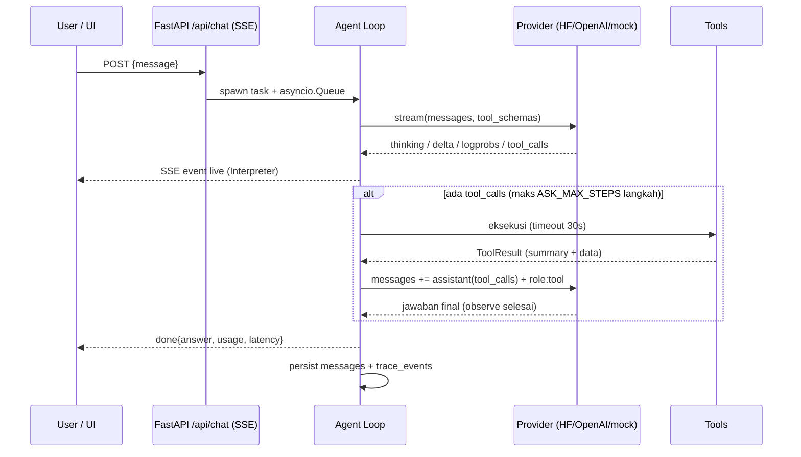

# Ask Anything

Platform AI chatbot **agentic** — bukan hanya menjawab: agent ini bisa *browsing*
web, men-generate **diagram alir (flowchart)** maupun **diagram graph** yang
dirender live di UI sebagai **graph HTML interaktif** (pan/zoom/drag node/klik
untuk relasi — dengan Mermaid sebagai mode pembanding, dan kanvas yang bisa
**layar penuh**), dan — yang membuatnya berbeda — **seluruh proses LLM terlihat**:
thinking/reasoning, tool call + argumen mentah, hasil tool, logprobs per-token,
prompt assembly, sampai metrik usage. Semuanya tampil live di panel
**Mechanistic Interpreter** sebagai **log eksekusi** (satu baris per langkah,
dengan status + durasi), bukan sebagai narasi panjang.

Setiap keluaran diberi **lencana asal** — 🌐 **Browser** (bukti web, wajib
disitasi), 🔀 **Tool diagram** (konten yang dibuat alat, bukan sumber), 🧮
**Kalkulator** — dan setiap klaim dari browsing **tersitasi ke URL asalnya**:
tool browser mendaftarkan sumber bernomor, model menulis `[1]`, backend
memverifikasi marker itu, dan UI menandainya bila ada nomor yang tidak ada di
daftar. Bila browser tidak menghasilkan apa pun, UI mengatakannya
(`0 hasil — belum ada data`) alih-alih menampilkan gelembung kosong atau
sitasi karangan.

- **Backend**: FastAPI (monolith) dengan streaming SSE terbaru.
- **Frontend**: Next.js 16 (latest) + Tailwind, design system light/indigo.
  Navbar kiri **bisa di-collapse/expand** (`Ctrl+B`, tersimpan) sehingga ruang
  chat & kanvas ikut meluas; kolom chat lega (maks 1180px), kartu diagram
  `clamp(420px,68vh,760px)` yang **kanvasnya mengisi seluruh sisa kartu**
  (toolbar di atas, bukan di samping kanvas) + layar penuh, panel Interpreter
  bisa diseret 380–980px.
- **Tiga mode LLM**: `huggingface` (**inference lokal** — model HuggingFace
  dijalankan `transformers` langsung di proses backend, tanpa llama.cpp),
  `openai` (OpenAI API **atau gateway OpenAI-compatible** apa pun), dan `mock`
  (demo offline). Default: `huggingface`.
- **Model offline dari HuggingFace**: cari model berdasarkan namanya
  (`deepseek-ai/DeepSeek-V4.1-Flash`, `qwen3`, …) → **Download** dengan progress
  ke folder project `models/` → **Pakai & muat**. Boleh menyimpan banyak model
  dan berganti kapan saja.
- **Model offline “pasti jalan”**: model di-load **otomatis setiap (re)start**
  (model aktif → model terakhir dipakai → model terunduh terbaru), model boleh
  berasal dari **folder mana pun** di disk (*Muat model dari folder* — hasil
  `huggingface-cli`, zip, git, di luar `models/` pun bisa), engine robust
  terhadap banyak arsitektur & generasi transformers, dan **chat yang dikirim
  sambil model masih di-load otomatis menunggu** sampai siap.
- **Loading screen di seluruh proses**: splash saat startup (backend mati →
  layar error + *Coba lagi*), banner “model sedang dimuat” + kartu berdetik di
  tab Model offline, “Model sedang berpikir…” sebelum token pertama, overlay
  saat membuka riwayat.
- **Streaming otomatis**: semua mode (lokal/openai/mock) selalu memakai
  streaming token-per-token tanpa perlu disetel apa pun — fallback
  non-streaming hanya bila endpoint benar-benar menolak semua bentuk
  streaming.
- **Diagnostik endpoint**: tombol **Test koneksi** menjalankan request sungguhan
  (`GET /models`, chat non-streaming seperti contoh `curl`, chat streaming) dan
  menampilkan status + pesan server apa adanya — 401, model tidak ada, dan
  payload ditolak tidak lagi terlihat sama.
- **Retry ladder + fallback**: payload diturun-kan bertahap
  (`stream_options`/`logprobs` → extras → `tools`), lalu fallback ke request
  **non-streaming** persis seperti contoh `curl` — jadi bila curl Anda jalan,
  chat pun jalan.
- **Daftar model otomatis**: tombol **Muat model** mengisi dropdown model dari
  `GET <base>/models` endpoint yang dikonfigurasi — plus opsi ketik manual.
- **URL endpoint fleksibel**: base URL boleh ditulis
  `https://host/v1/chat/completions` seperti pada contoh curl — otomatis
  dinormalkan.
- **Siap produksi**: `Dockerfile` multi-stage (backend + frontend dalam satu
  container, satu port publik) untuk deploy di **Coolify** / VPS mana pun.
- **Login & peran (halaman `/login`)**: dua role — **admin** (semua mode/tool,
  settings provider + model offline, seluruh papan task, konsol `/admin`) dan
  **member** (playground teks/diagram/RAG dengan provider **OpenAI**, task yang
  ditugaskan, ganti password sendiri). Batasnya **ditegakkan server-side**
  (403), bukan hanya disembunyikan di UI; sesi = cookie HttpOnly `ask_session`.
  Akun awal di-seed (`admin`, `intern1..3`, plus akun internship dari
  `ASK_INTERN_*`) dan bisa dikelola di **Admin → Users**
  (buat/nonaktifkan/hapus/peran/reset password). Login menerima **username
  atau email**.
- **Papan proyek internship (`/internship`)**: trek terpisah dengan id
  `INT-NNN` (29 task, **6 sprint**, ±41 hari kerja) + statistik sendiri,
  berisi proyek **chatbot LLM prototipe** (Python + Streamlit + SQLite) di
  `projects/ai-agent`. Isinya memetakan lima epic LLM: konteks & memori,
  orkestrasi & tooling, guardrail, observability, dan performa. Hanya task
  **Sprint 0 (PRD)** yang berada di kolom *To do*; sprint berikutnya menunggu
  di *Backlog*. Materi kerja dibaca dari `docs/internship/*.md`
  (`python scripts/gen_internship_docs.py` menghasilkan ringkasan sprint dari
  rencana). Member hanya melihat task yang ditugaskan kepadanya, dan akun
  intern (`ASK_INTERN_*`) dibuat otomatis dengan password acak sekali-cetak.
- **Halaman Admin (`/admin`) — pipeline governance**: atur **mode** yang boleh
  dipakai user (teks, gambar, diagram, PPT, RAG, deep research) dan **tool**
  yang boleh dieksekusi agent (`web_search`, `fetch_url`, `create_diagram`,
  `calculator`, `generate_image`, `generate_ppt`, `save_memory`), plus
  **akses per peran** (provider chat, cakupan task, izin model offline/settings/
  konsol/upload/ubah task). Penegakan **server-side**: tool yang dimatikan tidak
  diiklankan ke model dan panggilan liar ditolak + terecord. Konsol bisa
  dilindungi sesi admin **atau** `ASK_ADMIN_TOKEN` (`X-Admin-Token`).
- **Kuota token harian/mingguan per end user**: identitas diambil dari sesi
  login (fallback header `X-User-Id`, lalu IP), periode **berbasis kalender**
  sehingga reset otomatis tiap tengah malam & Senin — tanpa scheduler. Batas
  berlapis: kebijakan global + **override per user** (0 = tanpa batas).
  Ditegakkan *sebelum* model dipanggil, dan `block_on_exceed=false` memberi
  **mode pemantauan** untuk menakar batas sebelum diberlakukan. Tab **Kuota
  token** di /admin menampilkan pemakaian per user, batas efektif, dan daftar
  request yang benar-benar ditolak.
- **Instruksi advanced (playbook domain + teori cara menjawab)**: satu playbook
  = PERAN (domain) + **METODE** + BATASAN + FORMAT KELUARAN. Katalog 9 teori
  siap pakai ditulis sebagai *prosedur* — IRAC (hukum), SOAP (klinis), Piramida
  Minto (konsultan), Feynman, Socratic, hypothesis-driven, Toulmin, STAR,
  penalaran bertahap+verifikasi. Aktivasi `always` / `keywords` (dicocokkan
  sebagai kata utuh) / `manual`. Tombol **Uji pemicu** di /admin
  memperlihatkan playbook mana yang menyala **tanpa memanggil model**, dan
  statistiknya menandai playbook aktif yang belum pernah terpakai (pemicu
  salah).
- **OCR untuk dokumen hasil scan & gambar**: halaman PDF tanpa lapisan teks
  dideteksi (`needs_ocr`), dirender `pypdfium2`, diluruskan bila miring, lalu
  dibaca **rapidocr-onnxruntime** (PP-OCRv4 — wheel pip, tanpa binary sistem).
  Upload gambar (`.png/.jpg/.webp/.bmp/.tif`) juga jadi dokumen RAG. Teks
  tertanam **tidak pernah** ditimpa hasil OCR yang lebih miskin. Karena OCR
  CPU-bound, ingest berjalan di latar belakang dengan status
  `queued → ocr → chunking → embedding → ready`.
  Install: `pip install -r backend/requirements-ocr.txt`.
- **Retrieval RAG hibrida**: embedding (parafrasa) + **BM25** (istilah persis
  seperti nomor pasal/kode produk), digabung **reciprocal-rank-fusion**, lalu
  **MMR** membuang potongan yang saling duplikat. Terukur: pada dokumen dengan
  paragraf boilerplate berulang, tanpa MMR keempat hasil `top_k` identik dan
  informasi pentingnya hilang; dengan default `mmr_lambda=0.7` potongan pembawa
  informasi ikut terangkat. Rincian skor (`vector`/`lexical`/`fused`) tampil di
  Interpreter sehingga keputusan retrieval bisa diaudit.
- **Mode Gambar & PPT**: `generate_image` (poster generatif offline atau
  gateway OpenAI-compatible) dan `generate_ppt` (deck `.pptx` via python-pptx)
  — hasilnya **artifact** teregistry: file + metadata + kartu unduh di chat +
  kelola/hapus di /admin.
- **Manajemen memori**: memori (admin / AI via `save_memory` / hasil feedback)
  di-inject ke system prompt tiap run — perilaku berubah tanpa restart. CRUD
  lengkap di /admin.
- **Feedback 👍/👎 → pedoman perilaku**: user menilai jawaban (+komentar);
  feedback terecord lengkap dengan konteks run (mode, tool, cuplikan jawaban).
  👎 berkomentar otomatis jadi **pedoman** (memory `source=feedback`) yang
  menggeser perilaku run berikutnya; admin bisa review/apply manual, matikan
  auto-guidance, atau mematikan feedback sepenuhnya.
- **Mode RAG — upload PDF otomatis**: parsing (`pypdf`) → chunking (sliding
  window per halaman) → embedding (`hashing-v1` 384-dim deterministik) →
  index (SQLite) → retrieval (cosine top-k) → generate dengan sitasi `[n]`
  terverifikasi. Semua tahap terlihat: status per dokumen di panel RAG +
  event `rag_stage`/`rag_retrieve` di interpreter.
- **Mechanistic Interpreter selalu-on**: kontrak produk (dikunci di kode) —
  setiap request/response LLM, thinking, logprobs, tool call, event RAG,
  artifact, dan keputusan policy terecord di SQLite & bisa di-replay.
  Slide: `docs/slides-admin-pipeline.html` (+ versi `.pptx`).

```
┌──────────────┐   SSE (/api/chat)   ┌──────────────────────────────┐
│  Next.js UI  │ ◄────────────────── │  FastAPI backend (monolith)  │
│  + Mermaid   │ ──────────────────► │  agent loop + tools + trace  │
└──────────────┘      POST           │        │            │       │
                                     │   providers         tools   │
                                     │  hf / openai / mock  search │
                                     │        │             fetch  │
                                     │        ▼             diagram│
                                     │  models/<repo>       calc   │
                                     │  (transformers, in-process) │
                                     └──────────────────────────────┘
```

## Quick start (satu perintah)

> **Backend selalu hidup.** `run.py` melakukan preflight `import app.main`
> sebelum menjalankan uvicorn: paket yang hilang dipasang otomatis, dan bila
> aplikasi tetap tidak bisa di-import penyebab aslinya dicetak (beserta
> perbaikannya). Sub-sistem opsional — model lokal (torch), upload PDF
> (python-multipart) — tidak lagi mematikan server: masalahnya muncul sebagai
> catatan di `GET /api/health` (`warnings`) dan dicetak `run.py`. Bila health
> check gagal, ekor `data/backend.log` langsung ditampilkan.


Prasyarat: **Python ≥ 3.10**, **Node ≥ 18** (+npm). Sisanya diurus launcher:
cek dependensi → install yang kurang → jalankan backend+frontend → health check.

```bash
# Linux / macOS
python3 run.py            # atau ./run.sh

# Windows
run.bat

# Cari model di HuggingFace
python3 run.py --search qwen3

# Unduh model ke ./models, pasang torch+transformers, jadikan model aktif
python3 run.py --model Qwen/Qwen3-1.7B

# Pasang stack inference lokal saja (torch + transformers, ±1–2 GB)
# Memverifikasi torch benar-benar bisa dijalankan; bila instalasi rusak
# (mis. Windows: OSError WinError 1114 pada c10.dll), pasang ulang otomatis.
python3 run.py --install-local

# Tanpa download model: server OpenAI-compatible tiruan (hf_mode=server)
python3 run.py --demo

# Provider OpenAI / gateway (set ASK_OPENAI_API_KEY dulu)
python3 run.py --provider openai
```

- UI: http://localhost:3000 · API: http://localhost:8000/docs
- Launcher menampilkan checklist dependensi (`[ OK ] python/node/npm/backend/frontend`)
  dan status keterjangkauan LLM server.
- Tanpa server LLM & tanpa `--demo`, backend tetap jalan dan UI menawarkan
  tombol **"Pakai mode mock"** di banner peringatan.

## Deploy ke Coolify (Docker)

Repo membawa `Dockerfile` **single-container**: FastAPI (uvicorn, internal
`127.0.0.1:8000`) + Next.js production (`0.0.0.0:$PORT`, default `3000`),
dijalankan `docker/entrypoint.sh` di bawah `tini`. Next me-rewrite `/api`,
`/slides`, `/docs-images` ke backend sehingga browser cukup bicara ke satu
origin — dan Coolify hanya perlu me-route satu port.

```bash
docker build -t ask-anything .
mkdir -p "$PWD/data-server" && sudo chown -R 1000:1000 "$PWD/data-server"
docker run --rm -p 3000:3000 -e ASK_PROVIDER=mock \
  -v "$PWD/data-server:/app/data" ask-anything
# UI → http://localhost:3000 · health → http://localhost:3000/api/health
# Tanpa -v container menolak start: seluruh data ada di /app/data dan
# akan hilang tiap redeploy kalau direktori itu bukan mount disk.
```

Di Coolify: **New Application → Build Pack `Dockerfile`** (lokasi `/Dockerfile`,
context `.`), port `3000`, **Storages → Directory Mount** dari direktori disk
server (mis. `/opt/ask-anything/data`, `chown 1000:1000`) ke `/app/data`, lalu set env
`ASK_PROVIDER=openai` + `ASK_OPENAI_API_KEY`. Default aplikasi `huggingface`
(mode `local`) butuh model di `models/` + torch/transformers, yang tidak
ter-install di image — jadi untuk VPS pakai provider `openai`.

📘 Langkah lengkap, tabel env, persistence SQLite, dan troubleshooting:
[`docs/DEPLOY-COOLIFY.md`](docs/DEPLOY-COOLIFY.md).

## Dokumentasi (user & developer) + screenshot aplikasi asli

| Audiens | Markdown | Halaman in-app |
|---|---|---|
| **Pengguna** (pemilih peran) | [`docs/PANDUAN-PENGGUNA.md`](docs/PANDUAN-PENGGUNA.md) | `/panduan` |
| **Member** (peserta internship) | [`docs/PANDUAN-MEMBER.md`](docs/PANDUAN-MEMBER.md) | `/panduan/member` |
| **Admin** (pengelola platform) | [`docs/PANDUAN-ADMIN.md`](docs/PANDUAN-ADMIN.md) | `/panduan/admin` |
| **Developer** | [`docs/PANDUAN-DEVELOPER.md`](docs/PANDUAN-DEVELOPER.md) | `/developer` |
| **Dokumen teknis** (setiap paket + cara kerjanya) | [`docs/TEKNIS.md`](docs/TEKNIS.md) | – |
| **Penyetelan provider per mode** | [`docs/PENYESUAIAN-PROVIDER.md`](docs/PENYESUAIAN-PROVIDER.md) | – |
| **Deploy / DevOps** | [`docs/DEPLOY-COOLIFY.md`](docs/DEPLOY-COOLIFY.md) | – |

`PENYESUAIAN-PROVIDER.md` memuat langkah penyesuaian tiap mode (`huggingface`
lokal / `openai` + gateway / `mock`), cara memuat **daftar model** dari endpoint,
retry ladder payload + fallback non-streaming, diagnostik **Test koneksi**,
tabel troubleshooting, dan **log percobaan nyata** (chat sungguhan lewat SSE).

`TEKNIS.md` adalah rujukan mendalam: **inventaris setiap dependency** (versi,
apa fungsinya, bagaimana ia bekerja di kode ini — termasuk yang *sengaja tidak*
dipakai dan alasannya), plus uraian algoritma layout graph, parser Mermaid
toleran, retry ladder provider, pipeline sitasi, dan batas ukuran/timeout yang
berlaku.

Semua dokumen memuat **screenshot aplikasi yang benar-benar berjalan** (bukan
mockup) dari `docs/images/`: hero & galeri Explore, navbar dalam keadaan
collapsed, ruang chat lebar + Interpreter berdampingan, kartu diagram dengan
badge provenance dan mode **layar penuh**, kelima tab *Mechanistic Interpreter*
(Log / LLM / Tools / Sumber / Metrik), jawaban bersitasi, browsing 0 hasil
sebagai status eksplisit, calculator, settings provider, riwayat sidebar,
banner LLM offline, aksen warna, hingga viewport mobile. Screenshot di-generate
otomatis dari UI live — dan didahului smoke test UI supaya yang difoto pasti
perilaku yang benar:

```bash
python3 run.py --demo                                   # stack + emulator LLM
python3 scripts/fake_search_server.py --port 8099 &     # gateway demo (opsional)
python3 scripts/smoke_ui.py                             # 30 pemeriksaan UI
BASE_URL=http://127.0.0.1:3000 \
  python3 scripts/capture_screenshots.py main           # flow UI
python3 scripts/capture_screenshots.py pages            # halaman /panduan & /developer
```

## Model offline langsung dari HuggingFace (tanpa llama.cpp)

Tab **Model offline (HuggingFace)** di *Settings*:

1. **Cari** model berdasarkan nama — boleh repo id lengkap
   (`deepseek-ai/DeepSeek-V4.1-Flash`) maupun kata kunci (`qwen3`, `gemma`).
   Hasil pencarian HuggingFace Hub muncul lengkap dengan jumlah parameter,
   perkiraan ukuran, dan jumlah unduhan.
2. **Download** — hanya file yang benar-benar dibutuhkan (config, tokenizer,
   `*.safetensors`; README/gambar/ONNX/GGUF dilewati). Progress per repo
   (persen, MiB, kecepatan, file ke-berapa) tampil live, bisa di-resume, dan
   **beberapa model boleh diunduh bersamaan**.
3. File tersimpan di **folder project** `models/<organisasi>/<nama>/` — bukan di
   cache tersembunyi, jadi gampang di-backup/dipindah.
4. **Pakai & muat** — model di-load `transformers` **di proses backend** dan
   langsung melayani chat. Tidak ada `llama-server`, tidak ada port tambahan.
   Status engine (device, dtype, jumlah parameter) terlihat di kartu
   *Inference lokal*; tombol **Lepas dari memori** mengosongkan RAM/VRAM.
   Selagi dimuat, UI menampilkan loading screen (banner + kartu berdetik);
   chat yang dikirim saat itu **otomatis menunggu** sampai model siap.
5. **Auto-load setiap (re)start** — backend memuat sendiri model yang
   seharusnya aktif: model aktif (`hf_model`) → model terakhir yang dipakai
   (`models/.active.json`) → model terunduh paling baru. Tidak perlu klik apa
   pun setelah restart.
6. **Muat dari folder mana pun** — model hasil `huggingface-cli` / git / zip
   yang berada di luar `models/`? Kolom *Muat model dari folder* di tab yang
   sama menerima path-nya (absolut, `~/…`, atau relatif project; harus ada
   `config.json`) — terdaftar, jadi aktif, dan ikut auto-load berikutnya.

Repo **gated/privat** (mis. DeepSeek) butuh token: isi di *Token HuggingFace*
pada tab yang sama, atau set `ASK_HF_TOKEN`.

Toggle **Thinking** meneruskan `enable_thinking` ke chat template model —
reasoning-nya tampil live di *Mechanistic Interpreter*.

Panduan ukuran (fp16/bf16, tanpa kuantisasi — inference lokal memakai bobot
asli dari Hub):

| Model | ≈RAM/VRAM | Catatan |
|---|---|---|
| `Qwen/Qwen3-0.6B` | ≈1.5 GB | paling ringan, cepat di CPU |
| `Qwen/Qwen3-1.7B` | ≈4 GB | nyaman di laptop 8 GB |
| `Qwen/Qwen3-4B` | ≈9 GB | butuh 16 GB atau GPU |
| `deepseek-ai/DeepSeek-V4.1-Flash` | besar | repo gated — perlu `ASK_HF_TOKEN` |

`models/` ada di `.gitignore` — bobot model tidak pernah masuk git.

```bash
# cari model
python3 run.py --search qwen3

# yang sudah terunduh
python3 run.py --list-models

# unduh + pasang torch/transformers + jadikan aktif + jalankan stack
python3 run.py --model Qwen/Qwen3-1.7B

# reasoning dimatikan
python3 run.py --model Qwen/Qwen3-1.7B --no-thinking
```

Device dipilih otomatis (CUDA → MPS → CPU); bisa dipaksa lewat `ASK_HF_DEVICE`
dan `ASK_HF_DTYPE` (`auto`/`float16`/`bfloat16`/`float32`). Karena bobotnya
penuh (bukan quant GGUF), pilih ukuran model sesuai RAM/VRAM yang tersedia.

> ⚠️ **Windows + Anaconda: jangan bangun `.venv` dari interpreter conda.**
> Distribusi Anaconda/Miniconda menaruh MSVC runtime-nya sendiri
> (`MSVCP140.dll`, biasanya 14.29) di folder interpreter. Nama DLL unik per
> proses, jadi begitu `python3xx.dll` conda memuat runtime lama itu, PyTorch
> terpaksa memakainya juga dan `c10.dll` gagal di `DllMain`:
>
> ```
> OSError: [WinError 1114] A dynamic link library (DLL) initialization
> routine failed. Error loading ...\torch\lib\c10.dll
> ```
>
> Ini **bukan** instalasi torch yang rusak — memasang ulang torch (versi apa
> pun) tidak akan memperbaikinya, dan VC++ Redistributable terbaru pun sudah
> ada di `System32`. Yang harus diganti adalah interpreter dasar venv-nya:
>
> ```bash
> # buktikan dulu: runtime mana yang benar-benar di-resolve
> .venv/Scripts/python -c "import ctypes,ctypes.wintypes as w; k=ctypes.WinDLL('kernel32'); k.LoadLibraryW.restype=w.HMODULE; h=k.LoadLibraryW('MSVCP140.dll'); b=ctypes.create_unicode_buffer(32768); k.GetModuleFileNameW(h,b,32768); print(b.value)"
> # -> C:\WINDOWS\SYSTEM32\MSVCP140.dll  = sehat
> # -> D:\...\Anaconda\MSVCP140.dll      = penyebab WinError 1114
>
> rename .venv .venv-conda-broken
> "C:\Users\<user>\AppData\Local\Programs\Python\Python313\python.exe" -m venv .venv
> python run.py --install-local
> ```
>
> `run.py` kini menghindari jebakan ini sendiri: saat membuat `.venv` ia
> menolak interpreter conda dan memilih Python non-conda (dari `py -0p`) bila
> ada, dan bila torch tetap gagal ia mencetak path runtime yang bermasalah
> alih-alih menyarankan pasang ulang yang sia-sia.

### OpenAI API & gateway OpenAI-compatible

Set dari UI (tombol *Settings provider*) atau env:

```bash
ASK_PROVIDER=openai ASK_OPENAI_API_KEY=sk-... python3 run.py
```

Base URL boleh ditulis **dalam bentuk apa pun** yang ada di dokumentasi API —
aplikasi menormalkannya ke *base* lalu menambahkan `/chat/completions` sendiri:

```bash
curl https://ai.sumopod.com/v1/chat/completions \
  -H "Content-Type: application/json" \
  -H "Authorization: Bearer random_token" \
  -d '{"model":"qwen3.7-flash-2026-07-15",
       "messages":[{"role":"user","content":"Say hello in a creative way"}],
       "max_tokens":150,"temperature":0.7}'
```

curl di atas langsung bisa dipakai apa adanya:

```bash
ASK_PROVIDER=openai \
ASK_OPENAI_BASE_URL="https://ai.sumopod.com/v1/chat/completions" \
ASK_OPENAI_API_KEY="random_token" \
ASK_OPENAI_MODEL="qwen3.7-flash-2026-07-15" \
python3 run.py
```

Diterima apa adanya: `https://ai.sumopod.com`, `…/v1`, `…/v1/`,
`…/v1/models`, `…/v1/chat/completions` (juga tanpa skema, atau URL yang
ter-copy bersama markdown/kurung). Semuanya → `https://ai.sumopod.com/v1`,
sehingga tidak pernah ada `/chat/completions/chat/completions` (404). Bila
gateway menolak `stream_options`/`logprobs` (HTTP 400/422), menolak `tools`,
atau menjawab **HTTP 500** untuk `logprobs`+`tools`+`stream`, provider turun
bertingkat ke payload minimal — termasuk membuang `chat_template_kwargs` bila
template tidak mengenal `enable_thinking`. Bila **semua** bentuk streaming
ditolak, provider fallback ke request **non-streaming** (bentuk contoh `curl`)
sehingga jawaban tetap keluar. Setiap langkah tercatat sebagai event `note` di
timeline Interpreter, dan rung yang berhasil diingat per endpoint.

Error dari server selalu dilaporkan apa adanya (`error.message` + hint), termasuk
error yang dikirim **di dalam** stream (`data: {"error": …}` dengan HTTP 200) dan
stream 200 yang kosong — keduanya dulu berakhir sebagai bubble kosong.

Langkah penyetelan tiap mode (lokal / OpenAI+gateway / mock), cara memuat daftar
model, dan log percobaan dengan model sungguhan:
[`docs/PENYESUAIAN-PROVIDER.md`](docs/PENYESUAIAN-PROVIDER.md).

## Mechanistic Interpreter

Panel kanan UI (tombol `Mechanistic Interpreter →`) menampilkan **semua** yang
LLM & agent lakukan, per-event, dan juga tersimpan di SQLite sehingga riwayat
bisa di-replay:

Panel ini **membuka blackbox**, bukan menjelaskannya dengan paragraf — isinya
baris log, tabel, dan payload mentah. Strip di atas tab selalu menunjukkan
angka: `ev · llm · tool · browser · sumber · err` + status sitasi. Panel bisa
diseret untuk dilebarkan (380–980px, tersimpan).

| Tab | Isi |
|---|---|
| **Log** *(default)* | Satu baris per langkah: `t+` relatif, actor, aksi, status (`ok` / `0 hasil` / `gagal`), provenance, durasi. Delta & thinking **diringkas jadi hitungan** (`89 delta · 625 B`), tiap baris bisa dibuka jadi JSON mentah. Tombol **copy log** menyalin semuanya apa adanya. |
| **LLM** | Blackbox per langkah: messages persis yang dikirim, schema tools, **raw completion**, chain-of-thought, `tool_calls` yang diminta model, `finish_reason`, + chip logprobs per token (hanya mode `openai`/`hf_mode=server` & mock; inference lokal tidak mengirim logprobs) |
| **Tools** | Tiap eksekusi: argumen JSON dari model, payload hasil mentah, `ok`/`error`/`0 hasil`, durasi, provenance, jumlah sumber yang terdaftar, catatan provider (retry ladder, `max_steps` habis) |
| **Sumber** | Tabel sitasi bernomor: asal (`browser` + tool), judul/URL, status dikutip, hasil verifikasi (`cited` / `appended` / `no-evidence`) dan penanda nomor tak valid |
| **Metrik** | provider/model, temperature, max_tokens, steps terpakai, `stopped_reason`, latency, token usage, jumlah tool/browser/sumber/error/notes |

Event yang sama juga dirender inline di chat: chip tool **berlencana asal**
(`web_search · Browser · 3 hasil`), kotak thinking 💭, diagram auto-render dalam
dua mode (**Graph interaktif** default / **Mermaid**) dengan badge provenance,
marker sitasi `[1]` yang tertaut ke URL, dan bar Sitasi di bawah jawaban.

Diagram muncul **langsung dari payload tool** `create_diagram`
(`meta.diagrams` + event `tool_result`), jadi tidak bergantung pada model
menyalin sumber Mermaid ke teks jawabannya; bila model memang menulis fence
` ```mermaid `, kartunya tidak dirender dua kali. Kanvas diagram proporsional:
arah layout **auto** (memilih TD/LR yang paling mengisi kanvas), skala fit punya
lantai baca, dan kartunya bisa layar penuh.

Sitasi sudah tertaut **selama** jawaban mengalir: event `sources` dari browser
langsung dipakai UI, sehingga `[1]` tidak pernah tampil sebagai "nomor di luar
daftar" hanya karena run belum selesai.

## Tools agent

Tiap tool mendeklarasikan **asal hasilnya** (`Tool.source`), dan itulah yang
dipakai UI untuk melabeli:

| Tool | Asal | Fungsi |
|---|---|---|
| `web_search` | 🌐 browser | Cari web — DuckDuckGo lite default (tanpa API key), otomatis mencoba endpoint `/html/` bila `/lite/` kosong/diblokir; tautan pelacak `duckduckgo.com/l/?uddg=` dibuka jadi URL asli; Serper/Tavily opsional via env. Hasilnya menjadi **sumber bernomor** yang wajib disitasi |
| `fetch_url` | 🌐 browser | Ambil & ekstrak teks sebuah halaman (readability ringan); sumber ditandai `read=True` |
| `create_diagram` | 🔀 tool diagram | Generate Mermaid: `flowchart`, `graph`, `mindmap` dari `nodes`/`edges` (menerima JSON string, dict `{id: label}`, alias `source`/`target`, edge string `"A -> B: label"`, atau sumber `mermaid` jadi); endpoint yang belum dideklarasikan dibuat otomatis supaya tidak ada edge yang hilang. UI merender payload-nya sebagai kartu graph interaktif. **Bukan** bukti web, jadi tidak pernah masuk registri sitasi |
| `calculator` | 🧮 compute | Aritmetika aman (AST), dapat diverifikasi ulang tanpa sitasi |
| `generate_image` | 🔀 tool diagram (baru) | Gambar dari prompt → **artifact**: gateway `/images/generations` (provider `openai`) atau poster SVG generatif offline (`poster-v1`, deterministik dari hash prompt) — meta selalu menyebut generatornya |
| `generate_ppt` | 🔀 tool diagram (baru) | Deck `.pptx` dari outline `{title, slides:[{title,bullets[]}]}` (python-pptx) → **artifact** + kartu unduh |
| `save_memory` | 🧮 compute (baru) | AI menyimpan memori jangka panjang (diatur `memory.allow_ai_write`) |

## Halaman Admin — pipeline governance (`/admin`)

Konsol untuk mengatur AI **sebelum dipublish ke user**. Satu sumber kebijakan
(`backend/app/governance.py`, tabel `admin_policy`) menegakkan aturan di server:

| Tab | Isi |
|---|---|
| **Ringkasan** | Counter (percakapan, event interpreter, artifact, dokumen RAG siap, rasio feedback, token hari ini, playbook aktif, kesiapan OCR), kartu **Status tiap pipeline** dengan tombol *Kelola →*, status proteksi token, checklist publish |
| **Pipeline** | Toggle 6 mode + 7 tool, parameter RAG (chunk/overlap/top-k/batas upload), **kecerdasan retrieval** (hybrid/vector/lexical, kandidat, `mmr_lambda`, tetangga), **OCR** (aktif, deskew, ambang teks, DPI, batas halaman), memori, feedback/auto-guidance, interpreter (record logprobs & payload; *always-on* terkunci) |
| **Kuota token** | Kebijakan global (token/hari, token/pekan, permintaan/hari, blokir vs mode pemantauan), agregat per provider & mode, tabel per end user (pemakaian + batas efektif + override + reset), daftar request yang ditolak |
| **Instruksi** | CRUD playbook (peran domain, teori cara menjawab dari katalog, batasan, format keluaran, pemicu, prioritas), **Uji pemicu** tanpa memanggil model, statistik pemakaian nyata + playbook yang belum pernah terpakai |
| **Memori** | CRUD memori (badge asal: admin / AI / feedback), aktif/nonaktif — ter-inject ke system prompt tiap run |
| **Artifact** | Grid semua keluaran (gambar/deck/dokumen) dengan asal run, buka/unduh/hapus, filter kind |
| **Feedback** | Daftar 👍/👎 + komentar + konteks run, statistik rasio, aksi **“Jadikan pedoman”** (feedback → memori → prompt) |

Mode yang dimatikan: disembunyikan di UI **dan** ditolak API (SSE error / HTTP
403). Tool yang dimatikan: tidak diiklankan ke model; bila model memanggilnya,
loop menolak mengeksekusi, merecord event `policy`, dan memberi tahu model.

```text
GET  /api/policy                     proyeksi publik policy (gating UI)
GET  /api/quota/me                   sisa kuota token pemanggil (X-User-Id)
GET  /api/rag/ocr                    kesiapan mesin OCR + parameter berlaku
POST /api/feedback                   👍/👎 + komentar (record + auto-guidance)
POST /api/rag/upload|query           pipeline RAG (ingest latar belakang & retrieve-generate)
GET  /api/artifacts/{id}/download    unduh artifact
── butuh sesi role admin (atau X-Admin-Token bila ASK_ADMIN_TOKEN diset) ──
GET/PUT   /api/admin/policy          baca / deep-merge kebijakan
GET       /api/admin/overview        statistik dashboard (+ kuota & instruksi)
GET       /api/admin/quota           monitoring kuota: agregat, per user, penolakan
PUT/DEL   /api/admin/quota/users/{user_key}        override batas per end user
POST      /api/admin/quota/users/{user_key}/reset  reset periode berjalan
CRUD      /api/admin/instructions    playbook domain + teori cara menjawab
POST      /api/admin/instructions/preview          uji pemicu tanpa memanggil model
CRUD      /api/admin/memories        manajemen memori
CRUD      /api/admin/artifacts       registry artifact
CRUD      /api/admin/feedback        review + POST …/apply (→ pedoman)
CRUD      /api/admin/users           akun, peran, reset password (Admin → Users)
```

Login & profil (tanpa token):

```text
GET  /api/auth/bootstrap             sudah ada akun? (kredensial awal hanya di mode demo)
GET  /api/auth/me                    siapa saya + capabilities (gating UI)
POST /api/auth/login | /logout       sesi cookie HttpOnly ask_session
POST /api/auth/password              ganti password sendiri (butuh password lama)
PATCH /api/auth/profile              ganti nama tampilan
```

Cara kerja tiap pipeline (dari awal sampai akhir, plus paket yang dipakai)
ada di slide **`docs/slides-admin-pipeline.html`** — buka juga dari halaman
Admin → “Docs cara kerja” (diserve di `/slides/…`), tersedia versi
`docs/slides-admin-pipeline.pptx`.

## Halaman Task Management — papan rencana RAG (`/tasks`)

Papan kerja developer untuk **seluruh rencana RAG × AI Agent**: kanban
drag & drop (Backlog → To do → In progress → Review → Done), daftar tabel,
filter (fase/status/assignee/prioritas/label/pencarian), detail task dengan
checklist kriteria selesai + komentar + riwayat aktivitas, statistik progres,
dan sinkronisasi otomatis dengan git.

Kuncinya: **id task (`ASK-NNN`) dipakai apa adanya di nama branch GitLab**,
jadi riwayat repo dan papan saling terhubung tanpa tabel pemetaan:

```text
ASK-012  →  feat/ASK-012-halaman-task-management-papan-kanban-list
```

* Papan terisi otomatis saat backend pertama dijalankan (54 task dari
  `backend/app/tasks_plan.py`: 6 fase — Platform & Governance, Ingest, Retrieval,
  Agent × RAG, Visual Web, Polish/Demo) — termasuk semua item rencana: tab
  Pipeline/Memori/Artifact/Feedback, mode Gambar & PPT, pipeline RAG, interpreter
  selalu-on, sampai kriteria sukses & demo scenario slide.
* Tombol **⟳ Sync git** menyelaraskan status: berkas `evidence` yang ada →
  *Review*; branch yang memuat `ASK-NNN` → *In progress* + nama branch tersimpan;
  commit yang menyebut `ASK-NNN` disimpan shanya (kata `close`/`fix`/`selesai`
  menutup task menjadi *Done*). Status tidak pernah turun otomatis.
* Detail task menampilkan perintah `git checkout -b …` siap salin dan kolom URL
  merge request GitLab.

```text
GET/POST      /api/tasks                 daftar (filter) & buat task
GET/PATCH/DEL /api/tasks/{id}            detail / ubah / hapus
POST          /api/tasks/{id}/move       drag & drop antar kolom
POST          /api/tasks/{id}/comments   komentar + aktivitas
POST          /api/tasks/{id}/acceptance checklist kriteria selesai
POST          /api/tasks/seed|sync       muat ulang rencana · selaras dengan git
GET           /api/tasks?track=internship|platform   papan terpisah (INT-NNN / ASK-NNN)
GET           /api/internship/overview   ringkasan proyek + task (otomatis per peran)
GET           /api/internship/docs/{name} materi docs/internship/*.md
── tulis: sesi role admin (atau X-Admin-Token bila ASK_ADMIN_TOKEN diset);
   member hanya melihat & memindahkan task yang ditugaskan kepadanya ──
```

Panduan lengkap (alur kerja, aturan sync, struktur kode, cara menambah task):
**`docs/TASK-MANAGEMENT.md`**.

## Konfigurasi (env, prefix `ASK_`)

| Variabel | Default | Keterangan |
|---|---|---|
| `ASK_PROVIDER` | `huggingface` | `huggingface` \| `openai` \| `mock` |
| `ASK_HF_MODE` | `local` | `local` = inference di proses backend · `server` = URL OpenAI-compatible |
| `ASK_HF_MODEL` | – | Repo id model offline yang aktif, mis. `Qwen/Qwen3-1.7B` |
| `ASK_MODELS_DIR` | `models` | Folder project tempat model diunduh |
| `ASK_HF_ENDPOINT` | `https://huggingface.co` | Mirror HF Hub (mis. `https://hf-mirror.com`) |
| `ASK_HF_TOKEN` | – | Token Hub untuk repo gated/privat (mis. DeepSeek) |
| `ASK_HF_DEVICE` / `ASK_HF_DTYPE` | – / `auto` | Paksa device (`cpu`/`cuda`/`mps`) & dtype |
| `ASK_HF_THREADS` / `ASK_HF_TRUST_REMOTE_CODE` | 0 / false | Thread torch · izinkan kode kustom repo |
| `ASK_HF_BASE_URL` / `ASK_HF_API_KEY` | `http://127.0.0.1:8081/v1` / – | Hanya untuk `hf_mode=server`; boleh ditulis `…/v1/chat/completions` |
| `ASK_THINKING` | `true` | `enable_thinking` untuk model lokal / `chat_template_kwargs` untuk server |
| `ASK_OPENAI_API_KEY` / `ASK_OPENAI_BASE_URL` / `ASK_OPENAI_MODEL` | – / api.openai.com / gpt-4o-mini | OpenAI / gateway kompatibel |
| `ASK_TEMPERATURE`, `ASK_MAX_STEPS`, `ASK_LOGPROBS` | 0.7 / 6 / true | Generasi & interpreter |
| `ASK_SEARCH_BACKEND` | `ddg` | `ddg` \| `serper` \| `tavily` (+key masing-masing) |
| `ASK_SEARCH_DDG_URL` | `https://lite.duckduckgo.com/lite/` | Endpoint pencarian — ke gateway internal/self-host, atau `scripts/fake_search_server.py` untuk uji E2E tanpa internet |
| `ASK_DATA_DIR` | `data` | **Satu** direktori untuk semua state persisten: SQLite, `artifacts/`, `rag/`, `models/`, `backups/`. Di container `/app/data` dan wajib jadi mount disk server (kalau bukan, container menolak start). |
| `ASK_DB_PATH` | *(ikut `ASK_DATA_DIR`)* | Isi hanya bila SQLite harus pindah ke disk lain |
| `ASK_AUTH_MODE` | `required` | `required` = login wajib (halaman `/login`) · `open` = tanpa login untuk demo/test otomatis |
| `ASK_ADMIN_USERNAME` / `ASK_ADMIN_PASSWORD` / `ASK_ADMIN_NAME` | `admin` / `admin123` / `Administrator` | Akun admin pertama yang di-seed saat tabel `users` kosong |
| `ASK_SEED_MEMBERS` / `ASK_MEMBER_PASSWORD` | `intern1,intern2,intern3` / `intern123` | Akun member contoh (kosongkan untuk tidak men-seed) |
| `ASK_SESSION_HOURS` / `ASK_SESSION_COOKIE` / `ASK_COOKIE_SECURE` | 168 / `ask_session` / false | Masa berlaku sesi, nama cookie, dan flag `Secure` (set true di belakang HTTPS) |
| `ASK_LOGIN_MAX_ATTEMPTS` | 8 | Batas percobaan login gagal per username per 5 menit (0 = tanpa batas) |
| `ASK_ADMIN_TOKEN` | – (terbuka) | Bila diset, semua `/api/admin/*` juga menerima header `X-Admin-Token` (skrip/CLI) |
| `ASK_ARTIFACTS_DIR` / `ASK_RAG_DIR` | *(ikut `ASK_DATA_DIR`)* | Penyimpanan file artifact & arsip PDF RAG |
| `ASK_TASKS_AUTOSEED` | `true` | Isi papan `/tasks` dengan rencana RAG saat tabel masih kosong |
| `ASK_REPO_DIR` | root proyek | Folder repo git yang dipakai sinkronisasi branch/commit task |

Semua juga bisa diubah runtime dari UI → *Settings provider*.

## Cara kerja agent (detail)

> 📚 **Slide interaktif & metodologi lengkap**: buka
> [`docs/slides-cara-kerja.html`](docs/slides-cara-kerja.html) (jalan langsung
> di browser, navigasi `←`/`→`) atau via app di `/slides/slides-cara-kerja.html`,
> plus prose di [`docs/METODOLOGI.md`](docs/METODOLOGI.md).

### Loop ReAct dengan pagar pengaman

Agent berjalan sebagai loop **reason → act → observe → answer**:



Mekanisme inti (semua bisa dilihat di panel **Mechanistic Interpreter**):

1. **Prompt assembly** — history (termasuk pesan `tool` & `assistant_toolcalls`)
   dikonversi ke protokol OpenAI dan dikirim bersama system prompt + schema
   tools; tab *Prompt* menampilkan persis apa yang diterima LLM.
2. **Streaming parsing** — klien SSE menangani realitas wire-format: blok
   `<think>…</think>` yang terbelah antar chunk (state-machine parser),
   `tool_calls.arguments` yang datang dicicil (akumulasi per index),
   `reasoning_content`, logprobs per token, dan `usage`.
3. **Eksekusi tools** — setiap call di-emit (`tool_call` dengan argumen
   mentah), dijalankan via registry schema-driven, hasilnya (`tool_result`)
   dikembalikan ke model sebagai message `role:tool` supaya model
   *mengamati* sebelum menjawab; hint sistem meminta jawaban final.
4. **Pagar pengaman** — `max_steps` (loop liar), timeout tool 30 dtk, payload
   dipangkas 12k, error tool diberikan ke model sebagai data (graceful),
   klien putus → task di-cancel, DB tetap konsisten.
5. **Persist & replay** — setiap event ditulis ke `trace_events`
   (conversation_id, run_id, seq, type, payload) sehingga riwayat percakapan
   membuka kembali seluruh timeline, prompt, logprobs, dan metriknya.

### Pipeline tools

- **Browsing**: `web_search` (DDG lite → parse BS4 judul/URL/snippet; Serper/
  Tavily opsional) lalu `fetch_url` (ekstraksi teks ≤ 12k char). Gagal jaringan
  ≠ crash: error menjadi `tool_result` yang dikutip model secara jujur.
- **Sitasi**: tiap URL yang benar-benar disentuh tool browser masuk registri
  sumber bernomor (`app/sources.py`); daftarnya diumpankan balik ke model tepat
  setelah payload tool supaya ia menulis `[n]`. Nomor itu lalu **diverifikasi**
  (`cited` / `uncited` / `invalid`), blok `## Sumber` disisipkan bila model lupa,
  dan hasilnya disimpan di `messages.meta` + event `sources`/`citations`. Tidak
  ada hasil = tidak ada sitasi: UI menampilkan status itu, bukan angka karangan.
- **Diagram**: `create_diagram(kind=flowchart|graph|mindmap, nodes, edges)`
  menormalisasi id, escape label, memvalidasi edge (endpoint tak dikenal dibuat
  otomatis, bukan dibuang), menerima argumen nyaris-JSON dari model, dan
  memproduksi Mermaid.
  Model juga boleh emit fence ` ```mermaid ` langsung — markdown renderer
  mendeteksinya otomatis dan meneruskannya ke **DiagramBlock**: parser Mermaid
  toleran (`lib/graph/parseMermaid.ts`, tidak pernah melempar exception)
  menerjemahkan sumber menjadi model graph, layout layered deterministik
  (`lib/graph/layout.ts`) menempatkan node, dan `GraphView.tsx` merendernya
  sebagai komponen HTML interaktif (pan, zoom, drag node, klik = inspektur
  relasi, toggle arah TD/LR). Mode **Mermaid** (`mermaid.render()`,
  `securityLevel: strict`) tetap tersedia sebagai pembanding; bila Mermaid
  gagal parse, UI menawarkan fallback satu klik ke mode Graph.

## Struktur repo

```
run.py / run.bat / run.sh      # launcher general: cek+install dependensi, jalankan BE+FE
Dockerfile                     # image single-container (BE+FE) untuk Coolify/VPS
.dockerignore                  # buang .git/node_modules/.next/.venv/data dari build context
docker/entrypoint.sh           # supervisor: uvicorn + `next start`, trap TERM, probe LLM
backend/
  app/
    main.py                    # FastAPI app
    config.py                  # pydantic-settings (ASK_*)
    db.py                      # SQLite: conversations, messages, trace_events
    providers/                 # base / openai / hf_local / huggingface / mock /
                               # url_utils / discovery / diagnostics
    hf_hub.py                  # pencarian HuggingFace Hub + downloader multi-model
    local_inference.py         # engine transformers (load/unload/stream, tool call)
    streamtags.py              # parser blok <think> / tool-call pada token stream
    tools/                     # web_search, fetch_url, diagrams, calculator
    agent/                     # loop.py (agent+tracing), prompts.py
    api/routes.py              # /api/chat (SSE), conversations, settings, hf/models, health
  tests/                       # pytest (100 test: URL, provider SSE, retry ladder
                             #   + fallback non-streaming, diagnostik endpoint,
                             #   Hub downloader, inference lokal dengan model nyata)
scripts/fake_llama_server.py   # server OpenAI-compatible tiruan (--demo & testing)
scripts/download_model.py      # CLI download model offline (dipakai run.py)
scripts/capture_screenshots.py # generator screenshot docs (Playwright, UI live)
docs/                          # METODOLOGI.md, slides, PANDUAN-{PENGGUNA,MEMBER,ADMIN}.md,
                               # PANDUAN-DEVELOPER.md, DEPLOY-COOLIFY.md, images/
frontend/                      # Next.js 16: sidebar, hero, chat, interpreter,
                               # DiagramBlock/GraphView (graph interaktif) +
                               # Mermaid, HFModelManager, /panduan & /developer
models/                        # (gitignored) model HuggingFace hasil download
```

## Development & testing

```bash
.venv/bin/python -m pytest backend/tests -q   # pytest backend (API, tools, provider)
cd frontend && npm test                       # vitest: parser/layout graph + komponen interaktif
cd frontend && npx tsc --noEmit && npx next build
python3 run.py --demo                          # E2E live

# image produksi (sama seperti yang di-build Coolify)
docker build -t ask-anything .
docker run --rm -p 3000:3000 -e ASK_PROVIDER=mock \
  -v "$PWD/data-server:/app/data" ask-anything
```

Catatan: pencarian web asli (DuckDuckGo) butuh internet; di lingkungan offline
tool mengembalikan error yang tetap diproses agent secara graceful (terlihat di
Interpreter sebagai `tool_result` berstatus error).
