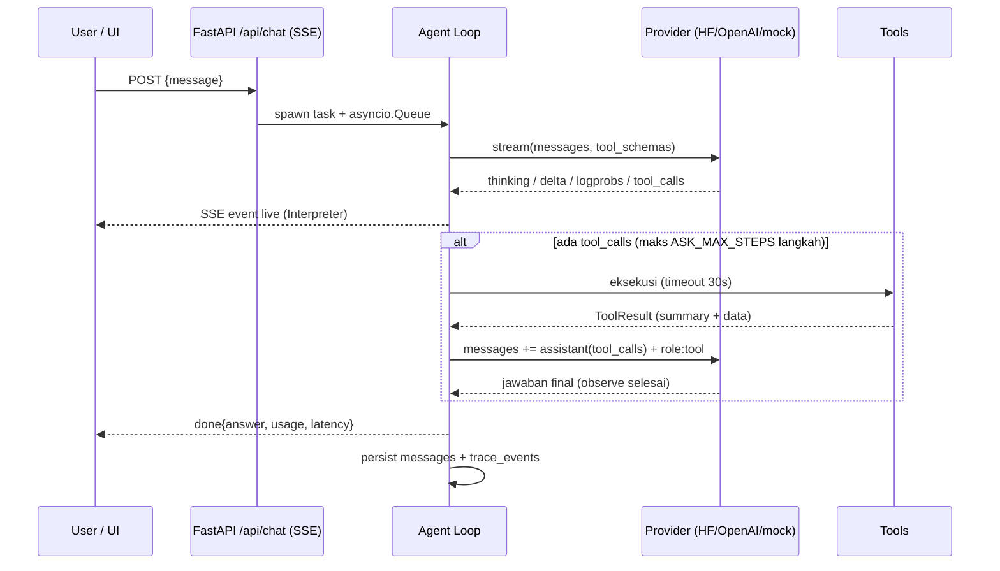

# Ask Anything

Platform AI chatbot **agentic** — bukan hanya menjawab: agent ini bisa *browsing*
web, men-generate **diagram alir (flowchart)** maupun **diagram graph** (Mermaid,
dirender live di UI), dan — yang membuatnya berbeda — **seluruh proses LLM
terlihat**: thinking/reasoning, tool call + argumen mentah, hasil tool, logprobs
per-token, prompt assembly, sampai metrik usage. Semuanya tampil live di panel
**Mechanistic Interpreter**.

- **Backend**: FastAPI (monolith) dengan streaming SSE terbaru.
- **Frontend**: Next.js 16 (latest) + Tailwind, design system light/indigo
  (sidebar riwayat per tanggal, hero grid, prompt card, chips, Explore).
- **LLM fleksibel**: HuggingFace **lokal** (llama.cpp / server OpenAI-compatible
  apa pun) **maupun OpenAI API**, plus mode `mock` untuk demo offline.
  Default: `huggingface`.
- **Model offline sekali klik**: katalog GGUF untuk laptop **8 GB**, diunduh ke
  `models/`, lalu dijalankan (thinking on/off) tanpa keluar dari UI.
- **Daftar model otomatis**: tombol **Muat model** mengisi dropdown model dari
  `GET <base>/models` endpoint yang sedang dikonfigurasi (OpenAI, llama.cpp,
  vLLM, gateway) — plus opsi ketik manual bila endpoint tak memberi daftar.
- **URL endpoint fleksibel**: base URL boleh ditulis
  `https://host/v1/chat/completions` seperti pada contoh curl — otomatis
  dinormalkan.
- **Siap produksi**: `Dockerfile` multi-stage (backend + frontend dalam satu
  container, satu port publik) untuk deploy di **Coolify** / VPS mana pun.

```
┌──────────────┐   SSE (/api/chat)   ┌──────────────────────────────┐
│  Next.js UI  │ ◄────────────────── │  FastAPI backend (monolith)  │
│  + Mermaid   │ ──────────────────► │  agent loop + tools + trace  │
└──────────────┘      POST           │        │            │       │
                                     │   providers         tools   │
                                     │  hf / openai / mock  search │
                                     │        │             fetch  │
                                     │        ▼             diagram│
                                     │  llama-server(8081)  calc   │
                                     └──────────────────────────────┘
```

## Quick start (satu perintah)

Prasyarat: **Python ≥ 3.10**, **Node ≥ 18** (+npm). Sisanya diurus launcher:
cek dependensi → install yang kurang → jalankan backend+frontend → health check.

```bash
# Linux / macOS
python3 run.py            # atau ./run.sh

# Windows
run.bat

# Tanpa GPU / tanpa download model (server HF lokal di-emulasi):
python3 run.py --demo

# Dengan model GGUF asli dari HuggingFace (butuh llama.cpp ter-install):
python3 run.py --gguf ~/models/qwen3-8b-q4_k_m.gguf
```

- UI: http://localhost:3000 · API: http://localhost:8000/docs
- Launcher menampilkan checklist dependensi (`[ OK ] python/node/npm/backend/frontend`)
  dan status keterjangkauan LLM server.
- Tanpa server LLM & tanpa `--demo`, backend tetap jalan dan UI menawarkan
  tombol **"Pakai mode mock"** di banner peringatan.

## Deploy ke Coolify (Docker)

Repo membawa `Dockerfile` **single-container**: FastAPI (uvicorn, internal
`127.0.0.1:8000`) + Next.js production (`0.0.0.0:$PORT`, default `3000`),
dijalankan `docker/entrypoint.sh` di bawah `tini`. Next me-rewrite `/api`,
`/slides`, `/docs-images` ke backend sehingga browser cukup bicara ke satu
origin — dan Coolify hanya perlu me-route satu port.

```bash
docker build -t ask-anything .
docker run --rm -p 3000:3000 -e ASK_PROVIDER=mock \
  -v ask-anything-data:/app/data ask-anything
# UI → http://localhost:3000 · health → http://localhost:3000/api/health
```

Di Coolify: **New Application → Build Pack `Dockerfile`** (lokasi `/Dockerfile`,
context `.`), port `3000`, volume ke `/app/data`, lalu set env
`ASK_PROVIDER=openai` + `ASK_OPENAI_API_KEY` (default aplikasi `huggingface`
menunjuk llama-server lokal yang tidak ada di VPS).

📘 Langkah lengkap, tabel env, persistence SQLite, dan troubleshooting:
[`docs/DEPLOY-COOLIFY.md`](docs/DEPLOY-COOLIFY.md).

## Dokumentasi (user & developer) + screenshot aplikasi asli

| Audiens | Markdown | Halaman in-app |
|---|---|---|
| **Pengguna** | [`docs/PANDUAN-PENGGUNA.md`](docs/PANDUAN-PENGGUNA.md) | `/panduan` |
| **Developer** | [`docs/PANDUAN-DEVELOPER.md`](docs/PANDUAN-DEVELOPER.md) | `/developer` |
| **Penyetelan provider per mode** | [`docs/PENYESUAIAN-PROVIDER.md`](docs/PENYESUAIAN-PROVIDER.md) | – |
| **Deploy / DevOps** | [`docs/DEPLOY-COOLIFY.md`](docs/DEPLOY-COOLIFY.md) | – |

`PENYESUAIAN-PROVIDER.md` memuat langkah penyesuaian tiap mode (`huggingface`
lokal / `openai` + gateway / `mock`), cara memuat **daftar model** dari endpoint,
retry ladder payload, tabel troubleshooting, dan **log percobaan nyata** dengan
model asli (SmolLM2-135M-Instruct di llama.cpp, jawaban sungguhan).

Keduanya memuat **screenshot aplikasi yang benar-benar berjalan** (bukan
mockup) dari `docs/images/`: hero & galeri Explore, chat diagram + render
Mermaid, keempat tab *Mechanistic Interpreter* (Timeline/Prompt/Tokens/
Metrics), browsing dengan *graceful error*, calculator, settings provider,
riwayat sidebar, banner LLM offline, aksen warna, hingga viewport mobile.
Screenshot di-generate otomatis dari UI live:

```bash
python3 run.py --demo                                   # stack + emulator LLM
BASE_URL=http://127.0.0.1:3000 \
  python3 scripts/capture_screenshots.py main           # flow UI
python3 scripts/capture_screenshots.py pages            # halaman /panduan & /developer
```

## Model offline HuggingFace untuk laptop 8 GB

Tab **Model offline (HuggingFace)** di *Settings provider* memuat katalog GGUF
yang sudah disaring untuk **laptop 8 GB RAM**. Pilih satu → file otomatis
terunduh (progress bar, bisa resume) ke **folder project** `models/` → klik
**Pakai** untuk menjadikannya model aktif, atau **Jalankan** agar aplikasi
menyalakan `llama-server` sendiri. Toggle **Thinking** menentukan apakah model
boleh bernalar (`chat_template_kwargs.enable_thinking`) — reasoning-nya tampil
live di *Mechanistic Interpreter*.

| Model (id katalog) | Ukuran | RAM | Thinking | Catatan |
|---|---|---|---|---|
| **Qwen3 4B Instruct 2507** `qwen3-4b-instruct-2507-q4_k_m` ⭐ | 2.33 GiB | ≈3–4 GB | – | Rekomendasi 8 GB: cepat + tool-calling kuat |
| Qwen3 4B `qwen3-4b-q4_k_m` | 2.33 GiB | ≈3–4.5 GB | ✅ | Pilihan utama bila ingin panel thinking terisi |
| Gemma 3 4B IT `gemma-3-4b-it-q4_k_m` | 2.32 GiB | ≈3–4 GB | – | Multilingual; tool-calling terbatas |
| Llama 3.2 3B Instruct `llama-3.2-3b-instruct-q4_k_m` | 1.88 GiB | ≈2.5–3 GB | – | Paling ringan/cepat |
| Qwen3 1.7B Q8_0 `qwen3-1.7b-q8_0` | 1.71 GiB | ≈2–2.5 GB | ✅ | Ultra-ringan, kualitas Q8 |
| Qwen3 8B `qwen3-8b-q4_k_m` | 4.68 GiB | ≈6–7 GB | ✅ | Paling cerdas yang masih muat (pakai ctx ≤ 4096 + swap) |

`models/` ada di `.gitignore` — GGUF tidak pernah masuk git.

```bash
# lihat katalog
python3 run.py --list-offline-models

# unduh ke ./models lalu jalankan llama-server + backend + frontend sekaligus
python3 run.py --offline-model qwen3-4b-instruct-2507-q4_k_m

# varian model thinking dengan reasoning dimatikan
python3 run.py --offline-model qwen3-4b-q4_k_m --no-thinking
```

Tanpa `run.py` pun bisa manual (satu-satunya prasyarat: llama.cpp ter-install):

```bash
brew install llama.cpp        # mac  |  sudo apt install llama.cpp  |  build dari sumber
llama-server -m models/Qwen3-4B-Q4_K_M.gguf --host 0.0.0.0 --port 8081 --jinja -c 4096
```

GPU: `ASK_HF_GPU_LAYERS=99` (Apple Silicon otomatis via Metal). Mesin 16 GB
boleh langsung memakai `qwen3-8b-q4_k_m` atau quant Q5/Q6 dari repo yang sama.

### OpenAI API & gateway OpenAI-compatible

Set dari UI (tombol *Settings provider*) atau env:

```bash
ASK_PROVIDER=openai ASK_OPENAI_API_KEY=sk-... python3 run.py
```

Base URL boleh ditulis **dalam bentuk apa pun** yang ada di dokumentasi API —
aplikasi menormalkannya ke *base* lalu menambahkan `/chat/completions` sendiri:

```bash
curl https://ai.sumopod.com/v1/chat/completions \
  -H "Content-Type: application/json" \
  -H "Authorization: Bearer random_token" \
  -d '{"model":"qwen3.7-flash-2026-07-15",
       "messages":[{"role":"user","content":"Say hello in a creative way"}],
       "max_tokens":150,"temperature":0.7}'
```

curl di atas langsung bisa dipakai apa adanya:

```bash
ASK_PROVIDER=openai \
ASK_OPENAI_BASE_URL="https://ai.sumopod.com/v1/chat/completions" \
ASK_OPENAI_API_KEY="random_token" \
ASK_OPENAI_MODEL="qwen3.7-flash-2026-07-15" \
python3 run.py
```

Diterima apa adanya: `https://ai.sumopod.com`, `…/v1`, `…/v1/`,
`…/v1/models`, `…/v1/chat/completions` (juga tanpa skema, atau URL yang
ter-copy bersama markdown/kurung). Semuanya → `https://ai.sumopod.com/v1`,
sehingga tidak pernah ada `/chat/completions/chat/completions` (404). Bila
gateway menolak `stream_options`/`logprobs` (HTTP 400/422) **atau** server
menolak `logprobs`+`tools`+`stream` (llama.cpp menjawab **HTTP 500**), provider
turun bertingkat ke payload minimal — termasuk membuang
`chat_template_kwargs` bila template tidak mengenal `enable_thinking` — dan
mencatatnya sebagai event `note` di timeline Interpreter. Rung yang berhasil
diingat per endpoint, jadi turn berikutnya tidak mengulang request gagal.

Langkah penyetelan tiap mode (lokal / OpenAI+gateway / mock), cara memuat daftar
model, dan log percobaan dengan model sungguhan:
[`docs/PENYESUAIAN-PROVIDER.md`](docs/PENYESUAIAN-PROVIDER.md).

## Mechanistic Interpreter

Panel kanan UI (tombol `Mechanistic Interpreter →`) menampilkan **semua** yang
LLM & agent lakukan, per-event, dan juga tersimpan di SQLite sehingga riwayat
bisa di-replay:

| Tab | Isi |
|---|---|
| **Timeline** | Urutan event: `meta → thinking → tool_call → tool_result → … → done`, tiap baris bisa dibentangkan jadi JSON mentah |
| **Prompt** | Prompt assembly: system prompt + messages persis seperti dikirim ke LLM + daftar tools |
| **Tokens** | Logprobs streaming: token terpilih, probability bar, top alternatif (butuh provider yang mendukung — llama.cpp ya) |
| **Metrics** | provider/model, temperature, steps, latency, token usage, jumlah event/error |

Event yang sama juga dirender inline di chat: chip tool (`web_search ✓`),
kotak thinking 💭, dan diagram Mermaid auto-render.

## Tools agent

| Tool | Fungsi |
|---|---|
| `web_search` | Cari web — DuckDuckGo lite default (tanpa API key); Serper/Tavily opsional via env |
| `fetch_url` | Ambil & ekstrak teks sebuah halaman (readability ringan) |
| `create_diagram` | Generate Mermaid: `flowchart` (diagram alir), `graph` (relasi), `mindmap` — tervalidasi server-side |
| `calculator` | Aritmetika aman (AST) |

## Konfigurasi (env, prefix `ASK_`)

| Variabel | Default | Keterangan |
|---|---|---|
| `ASK_PROVIDER` | `huggingface` | `huggingface` \| `openai` \| `mock` |
| `ASK_HF_BASE_URL` | `http://127.0.0.1:8081/v1` | Server lokal/gateway OpenAI-compatible; boleh ditulis `…/v1/chat/completions` |
| `ASK_HF_MODEL` | `Qwen/Qwen3-8B-GGUF` | Label model / nama file GGUF |
| `ASK_HF_API_KEY` | – | Bearer token untuk server/gateway HF lokal |
| `ASK_THINKING` | `true` | `chat_template_kwargs.enable_thinking` untuk model lokal |
| `ASK_MODELS_DIR` | `models` | Folder project tempat GGUF diunduh |
| `ASK_HF_ENDPOINT` | `https://huggingface.co` | Mirror HF Hub (mis. `https://hf-mirror.com`) |
| `ASK_LLAMA_SERVER_BIN` / `ASK_LLAMA_EXTRA_ARGS` | – / – | Path & argumen tambahan `llama-server` |
| `ASK_HF_PORT` / `ASK_HF_CTX_SIZE` / `ASK_HF_GPU_LAYERS` | 8081 / 4096 / -1 | Runtime llama.cpp (`-1` = CPU saja) |
| `ASK_OPENAI_API_KEY` / `ASK_OPENAI_BASE_URL` / `ASK_OPENAI_MODEL` | – / api.openai.com / gpt-4o-mini | OpenAI / gateway kompatibel |
| `ASK_TEMPERATURE`, `ASK_MAX_STEPS`, `ASK_LOGPROBS` | 0.7 / 6 / true | Generasi & interpreter |
| `ASK_SEARCH_BACKEND` | `ddg` | `ddg` \| `serper` \| `tavily` (+key masing-masing) |
| `ASK_DB_PATH` | `data/ask_anything.db` | SQLite (di container: `/app/data/ask_anything.db`) |

Semua juga bisa diubah runtime dari UI → *Settings provider*.

## Cara kerja agent (detail)

> 📚 **Slide interaktif & metodologi lengkap**: buka
> [`docs/slides-cara-kerja.html`](docs/slides-cara-kerja.html) (jalan langsung
> di browser, navigasi `←`/`→`) atau via app di `/slides/slides-cara-kerja.html`,
> plus prose di [`docs/METODOLOGI.md`](docs/METODOLOGI.md).

### Loop ReAct dengan pagar pengaman

Agent berjalan sebagai loop **reason → act → observe → answer**:



Mekanisme inti (semua bisa dilihat di panel **Mechanistic Interpreter**):

1. **Prompt assembly** — history (termasuk pesan `tool` & `assistant_toolcalls`)
   dikonversi ke protokol OpenAI dan dikirim bersama system prompt + schema
   tools; tab *Prompt* menampilkan persis apa yang diterima LLM.
2. **Streaming parsing** — klien SSE menangani realitas wire-format: blok
   `<think>…</think>` yang terbelah antar chunk (state-machine parser),
   `tool_calls.arguments` yang datang dicicil (akumulasi per index),
   `reasoning_content`, logprobs per token, dan `usage`.
3. **Eksekusi tools** — setiap call di-emit (`tool_call` dengan argumen
   mentah), dijalankan via registry schema-driven, hasilnya (`tool_result`)
   dikembalikan ke model sebagai message `role:tool` supaya model
   *mengamati* sebelum menjawab; hint sistem meminta jawaban final.
4. **Pagar pengaman** — `max_steps` (loop liar), timeout tool 30 dtk, payload
   dipangkas 12k, error tool diberikan ke model sebagai data (graceful),
   klien putus → task di-cancel, DB tetap konsisten.
5. **Persist & replay** — setiap event ditulis ke `trace_events`
   (conversation_id, run_id, seq, type, payload) sehingga riwayat percakapan
   membuka kembali seluruh timeline, prompt, logprobs, dan metriknya.

### Pipeline tools

- **Browsing**: `web_search` (DDG lite → parse BS4 judul/URL/snippet; Serper/
  Tavily opsional) lalu `fetch_url` (ekstraksi teks ≤ 12k char). Gagal jaringan
  ≠ crash: error menjadi `tool_result` yang dikutip model secara jujur.
- **Diagram**: `create_diagram(kind=flowchart|graph|mindmap, nodes, edges)`
  menormalisasi id, escape label, memvalidasi edge, dan memproduksi Mermaid;
  frontend merender via `mermaid.render()`. Model juga boleh emit fence
  ` ```mermaid ` langsung — markdown renderer mendeteksinya otomatis.

## Struktur repo

```
run.py / run.bat / run.sh      # launcher general: cek+install dependensi, jalankan BE+FE
Dockerfile                     # image single-container (BE+FE) untuk Coolify/VPS
.dockerignore                  # buang .git/node_modules/.next/.venv/data dari build context
docker/entrypoint.sh           # supervisor: uvicorn + `next start`, trap TERM, probe LLM
backend/
  app/
    main.py                    # FastAPI app
    config.py                  # pydantic-settings (ASK_*)
    db.py                      # SQLite: conversations, messages, trace_events
    providers/                 # base / openai / huggingface / mock / url_utils
    hf_models.py               # katalog GGUF 8 GB + downloader (resume) ke models/
    local_llm.py               # supervisor llama-server (start/stop/status)
    tools/                     # web_search, fetch_url, diagrams, calculator
    agent/                     # loop.py (agent+tracing), prompts.py
    api/routes.py              # /api/chat (SSE), conversations, settings, hf/models, health
  tests/                       # pytest (62 test: URL, provider SSE, daftar model,
                             #         retry ladder, keep-alive SSE, agent, API)
scripts/fake_llama_server.py   # emulator llama-server (mode --demo & testing)
scripts/download_model.py      # CLI download model offline (dipakai run.py)
scripts/capture_screenshots.py # generator screenshot docs (Playwright, UI live)
docs/                          # METODOLOGI.md, slides, PANDUAN-PENGGUNA.md,
                               # PANDUAN-DEVELOPER.md, DEPLOY-COOLIFY.md, images/
frontend/                      # Next.js 16: sidebar, hero, chat, interpreter,
                               # mermaid, HFModelManager, halaman /panduan & /developer
models/                        # (gitignored) GGUF hasil download model offline
```

## Development & testing

```bash
.venv/bin/python -m pytest backend/tests -q   # 62 passed
cd frontend && npx tsc --noEmit && npx next build
python3 run.py --demo                          # E2E live

# image produksi (sama seperti yang di-build Coolify)
docker build -t ask-anything .
docker run --rm -p 3000:3000 -e ASK_PROVIDER=mock \
  -v ask-anything-data:/app/data ask-anything
```

Catatan: pencarian web asli (DuckDuckGo) butuh internet; di lingkungan offline
tool mengembalikan error yang tetap diproses agent secara graceful (terlihat di
Interpreter sebagai `tool_result` berstatus error).
