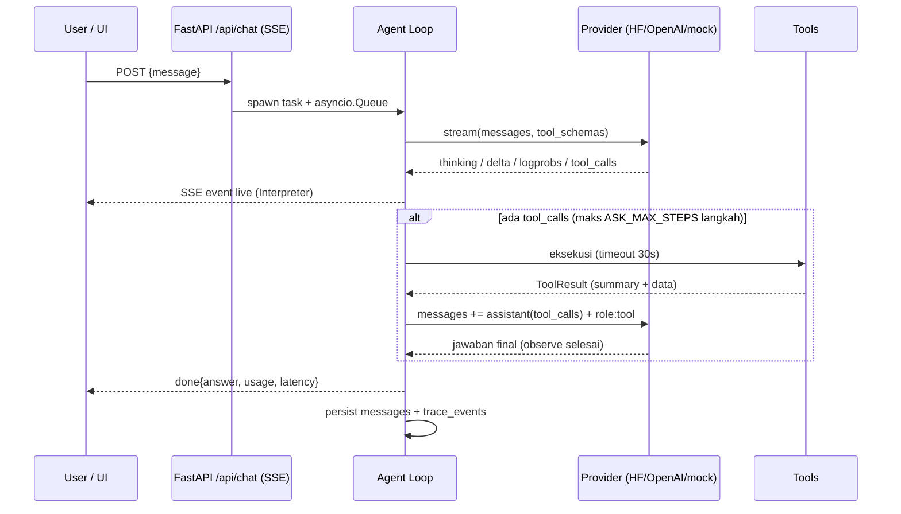

# Ask Anything

Platform AI chatbot **agentic** — bukan hanya menjawab: agent ini bisa *browsing*
web, men-generate **diagram alir (flowchart)** maupun **diagram graph** (Mermaid,
dirender live di UI), dan — yang membuatnya berbeda — **seluruh proses LLM
terlihat**: thinking/reasoning, tool call + argumen mentah, hasil tool, logprobs
per-token, prompt assembly, sampai metrik usage. Semuanya tampil live di panel
**Mechanistic Interpreter**.

- **Backend**: FastAPI (monolith) dengan streaming SSE terbaru.
- **Frontend**: Next.js 16 (latest) + Tailwind, design system light/indigo
  (sidebar riwayat per tanggal, hero grid, prompt card, chips, Explore).
- **Tiga mode LLM**: `huggingface` (**inference lokal** — model HuggingFace
  dijalankan `transformers` langsung di proses backend, tanpa llama.cpp),
  `openai` (OpenAI API **atau gateway OpenAI-compatible** apa pun), dan `mock`
  (demo offline). Default: `huggingface`.
- **Model offline dari HuggingFace**: cari model berdasarkan namanya
  (`deepseek-ai/DeepSeek-V4.1-Flash`, `qwen3`, …) → **Download** dengan progress
  ke folder project `models/` → **Pakai & muat**. Boleh menyimpan banyak model
  dan berganti kapan saja.
- **Diagnostik endpoint**: tombol **Test koneksi** menjalankan request sungguhan
  (`GET /models`, chat non-streaming seperti contoh `curl`, chat streaming) dan
  menampilkan status + pesan server apa adanya — 401, model tidak ada, dan
  payload ditolak tidak lagi terlihat sama.
- **Retry ladder + fallback**: payload diturun-kan bertahap
  (`stream_options`/`logprobs` → extras → `tools`), lalu fallback ke request
  **non-streaming** persis seperti contoh `curl` — jadi bila curl Anda jalan,
  chat pun jalan.
- **Daftar model otomatis**: tombol **Muat model** mengisi dropdown model dari
  `GET <base>/models` endpoint yang dikonfigurasi — plus opsi ketik manual.
- **URL endpoint fleksibel**: base URL boleh ditulis
  `https://host/v1/chat/completions` seperti pada contoh curl — otomatis
  dinormalkan.
- **Siap produksi**: `Dockerfile` multi-stage (backend + frontend dalam satu
  container, satu port publik) untuk deploy di **Coolify** / VPS mana pun.

```
┌──────────────┐   SSE (/api/chat)   ┌──────────────────────────────┐
│  Next.js UI  │ ◄────────────────── │  FastAPI backend (monolith)  │
│  + Mermaid   │ ──────────────────► │  agent loop + tools + trace  │
└──────────────┘      POST           │        │            │       │
                                     │   providers         tools   │
                                     │  hf / openai / mock  search │
                                     │        │             fetch  │
                                     │        ▼             diagram│
                                     │  models/<repo>       calc   │
                                     │  (transformers, in-process) │
                                     └──────────────────────────────┘
```

## Quick start (satu perintah)

Prasyarat: **Python ≥ 3.10**, **Node ≥ 18** (+npm). Sisanya diurus launcher:
cek dependensi → install yang kurang → jalankan backend+frontend → health check.

```bash
# Linux / macOS
python3 run.py            # atau ./run.sh

# Windows
run.bat

# Cari model di HuggingFace
python3 run.py --search qwen3

# Unduh model ke ./models, pasang torch+transformers, jadikan model aktif
python3 run.py --model Qwen/Qwen3-1.7B

# Pasang stack inference lokal saja (torch + transformers, ±1–2 GB)
python3 run.py --install-local

# Tanpa download model: server OpenAI-compatible tiruan (hf_mode=server)
python3 run.py --demo

# Provider OpenAI / gateway (set ASK_OPENAI_API_KEY dulu)
python3 run.py --provider openai
```

- UI: http://localhost:3000 · API: http://localhost:8000/docs
- Launcher menampilkan checklist dependensi (`[ OK ] python/node/npm/backend/frontend`)
  dan status keterjangkauan LLM server.
- Tanpa server LLM & tanpa `--demo`, backend tetap jalan dan UI menawarkan
  tombol **"Pakai mode mock"** di banner peringatan.

## Deploy ke Coolify (Docker)

Repo membawa `Dockerfile` **single-container**: FastAPI (uvicorn, internal
`127.0.0.1:8000`) + Next.js production (`0.0.0.0:$PORT`, default `3000`),
dijalankan `docker/entrypoint.sh` di bawah `tini`. Next me-rewrite `/api`,
`/slides`, `/docs-images` ke backend sehingga browser cukup bicara ke satu
origin — dan Coolify hanya perlu me-route satu port.

```bash
docker build -t ask-anything .
docker run --rm -p 3000:3000 -e ASK_PROVIDER=mock \
  -v ask-anything-data:/app/data ask-anything
# UI → http://localhost:3000 · health → http://localhost:3000/api/health
```

Di Coolify: **New Application → Build Pack `Dockerfile`** (lokasi `/Dockerfile`,
context `.`), port `3000`, volume ke `/app/data`, lalu set env
`ASK_PROVIDER=openai` + `ASK_OPENAI_API_KEY`. Default aplikasi `huggingface`
(mode `local`) butuh model di `models/` + torch/transformers, yang tidak
ter-install di image — jadi untuk VPS pakai provider `openai`.

📘 Langkah lengkap, tabel env, persistence SQLite, dan troubleshooting:
[`docs/DEPLOY-COOLIFY.md`](docs/DEPLOY-COOLIFY.md).

## Dokumentasi (user & developer) + screenshot aplikasi asli

| Audiens | Markdown | Halaman in-app |
|---|---|---|
| **Pengguna** | [`docs/PANDUAN-PENGGUNA.md`](docs/PANDUAN-PENGGUNA.md) | `/panduan` |
| **Developer** | [`docs/PANDUAN-DEVELOPER.md`](docs/PANDUAN-DEVELOPER.md) | `/developer` |
| **Penyetelan provider per mode** | [`docs/PENYESUAIAN-PROVIDER.md`](docs/PENYESUAIAN-PROVIDER.md) | – |
| **Deploy / DevOps** | [`docs/DEPLOY-COOLIFY.md`](docs/DEPLOY-COOLIFY.md) | – |

`PENYESUAIAN-PROVIDER.md` memuat langkah penyesuaian tiap mode (`huggingface`
lokal / `openai` + gateway / `mock`), cara memuat **daftar model** dari endpoint,
retry ladder payload + fallback non-streaming, diagnostik **Test koneksi**,
tabel troubleshooting, dan **log percobaan nyata** (chat sungguhan lewat SSE).

Keduanya memuat **screenshot aplikasi yang benar-benar berjalan** (bukan
mockup) dari `docs/images/`: hero & galeri Explore, chat diagram + render
Mermaid, keempat tab *Mechanistic Interpreter* (Timeline/Prompt/Tokens/
Metrics), browsing dengan *graceful error*, calculator, settings provider,
riwayat sidebar, banner LLM offline, aksen warna, hingga viewport mobile.
Screenshot di-generate otomatis dari UI live:

```bash
python3 run.py --demo                                   # stack + emulator LLM
BASE_URL=http://127.0.0.1:3000 \
  python3 scripts/capture_screenshots.py main           # flow UI
python3 scripts/capture_screenshots.py pages            # halaman /panduan & /developer
```

## Model offline langsung dari HuggingFace (tanpa llama.cpp)

Tab **Model offline (HuggingFace)** di *Settings*:

1. **Cari** model berdasarkan nama — boleh repo id lengkap
   (`deepseek-ai/DeepSeek-V4.1-Flash`) maupun kata kunci (`qwen3`, `gemma`).
   Hasil pencarian HuggingFace Hub muncul lengkap dengan jumlah parameter,
   perkiraan ukuran, dan jumlah unduhan.
2. **Download** — hanya file yang benar-benar dibutuhkan (config, tokenizer,
   `*.safetensors`; README/gambar/ONNX/GGUF dilewati). Progress per repo
   (persen, MiB, kecepatan, file ke-berapa) tampil live, bisa di-resume, dan
   **beberapa model boleh diunduh bersamaan**.
3. File tersimpan di **folder project** `models/<organisasi>/<nama>/` — bukan di
   cache tersembunyi, jadi gampang di-backup/dipindah.
4. **Pakai & muat** — model di-load `transformers` **di proses backend** dan
   langsung melayani chat. Tidak ada `llama-server`, tidak ada port tambahan.
   Status engine (device, dtype, jumlah parameter) terlihat di kartu
   *Inference lokal*; tombol **Lepas dari memori** mengosongkan RAM/VRAM.

Repo **gated/privat** (mis. DeepSeek) butuh token: isi di *Token HuggingFace*
pada tab yang sama, atau set `ASK_HF_TOKEN`.

Toggle **Thinking** meneruskan `enable_thinking` ke chat template model —
reasoning-nya tampil live di *Mechanistic Interpreter*.

Panduan ukuran (fp16/bf16, tanpa kuantisasi — inference lokal memakai bobot
asli dari Hub):

| Model | ≈RAM/VRAM | Catatan |
|---|---|---|
| `Qwen/Qwen3-0.6B` | ≈1.5 GB | paling ringan, cepat di CPU |
| `Qwen/Qwen3-1.7B` | ≈4 GB | nyaman di laptop 8 GB |
| `Qwen/Qwen3-4B` | ≈9 GB | butuh 16 GB atau GPU |
| `deepseek-ai/DeepSeek-V4.1-Flash` | besar | repo gated — perlu `ASK_HF_TOKEN` |

`models/` ada di `.gitignore` — bobot model tidak pernah masuk git.

```bash
# cari model
python3 run.py --search qwen3

# yang sudah terunduh
python3 run.py --list-models

# unduh + pasang torch/transformers + jadikan aktif + jalankan stack
python3 run.py --model Qwen/Qwen3-1.7B

# reasoning dimatikan
python3 run.py --model Qwen/Qwen3-1.7B --no-thinking
```

Device dipilih otomatis (CUDA → MPS → CPU); bisa dipaksa lewat `ASK_HF_DEVICE`
dan `ASK_HF_DTYPE` (`auto`/`float16`/`bfloat16`/`float32`). Karena bobotnya
penuh (bukan quant GGUF), pilih ukuran model sesuai RAM/VRAM yang tersedia.

### OpenAI API & gateway OpenAI-compatible

Set dari UI (tombol *Settings provider*) atau env:

```bash
ASK_PROVIDER=openai ASK_OPENAI_API_KEY=sk-... python3 run.py
```

Base URL boleh ditulis **dalam bentuk apa pun** yang ada di dokumentasi API —
aplikasi menormalkannya ke *base* lalu menambahkan `/chat/completions` sendiri:

```bash
curl https://ai.sumopod.com/v1/chat/completions \
  -H "Content-Type: application/json" \
  -H "Authorization: Bearer random_token" \
  -d '{"model":"qwen3.7-flash-2026-07-15",
       "messages":[{"role":"user","content":"Say hello in a creative way"}],
       "max_tokens":150,"temperature":0.7}'
```

curl di atas langsung bisa dipakai apa adanya:

```bash
ASK_PROVIDER=openai \
ASK_OPENAI_BASE_URL="https://ai.sumopod.com/v1/chat/completions" \
ASK_OPENAI_API_KEY="random_token" \
ASK_OPENAI_MODEL="qwen3.7-flash-2026-07-15" \
python3 run.py
```

Diterima apa adanya: `https://ai.sumopod.com`, `…/v1`, `…/v1/`,
`…/v1/models`, `…/v1/chat/completions` (juga tanpa skema, atau URL yang
ter-copy bersama markdown/kurung). Semuanya → `https://ai.sumopod.com/v1`,
sehingga tidak pernah ada `/chat/completions/chat/completions` (404). Bila
gateway menolak `stream_options`/`logprobs` (HTTP 400/422), menolak `tools`,
atau menjawab **HTTP 500** untuk `logprobs`+`tools`+`stream`, provider turun
bertingkat ke payload minimal — termasuk membuang `chat_template_kwargs` bila
template tidak mengenal `enable_thinking`. Bila **semua** bentuk streaming
ditolak, provider fallback ke request **non-streaming** (bentuk contoh `curl`)
sehingga jawaban tetap keluar. Setiap langkah tercatat sebagai event `note` di
timeline Interpreter, dan rung yang berhasil diingat per endpoint.

Error dari server selalu dilaporkan apa adanya (`error.message` + hint), termasuk
error yang dikirim **di dalam** stream (`data: {"error": …}` dengan HTTP 200) dan
stream 200 yang kosong — keduanya dulu berakhir sebagai bubble kosong.

Langkah penyetelan tiap mode (lokal / OpenAI+gateway / mock), cara memuat daftar
model, dan log percobaan dengan model sungguhan:
[`docs/PENYESUAIAN-PROVIDER.md`](docs/PENYESUAIAN-PROVIDER.md).

## Mechanistic Interpreter

Panel kanan UI (tombol `Mechanistic Interpreter →`) menampilkan **semua** yang
LLM & agent lakukan, per-event, dan juga tersimpan di SQLite sehingga riwayat
bisa di-replay:

| Tab | Isi |
|---|---|
| **Timeline** | Urutan event: `meta → thinking → tool_call → tool_result → … → done`, tiap baris bisa dibentangkan jadi JSON mentah |
| **Prompt** | Prompt assembly: system prompt + messages persis seperti dikirim ke LLM + daftar tools |
| **Tokens** | Logprobs streaming: token terpilih, probability bar, top alternatif (hanya mode `openai`/`hf_mode=server`; inference lokal tidak mengirim logprobs) |
| **Metrics** | provider/model, temperature, steps, latency, token usage, jumlah event/error |

Event yang sama juga dirender inline di chat: chip tool (`web_search ✓`),
kotak thinking 💭, dan diagram Mermaid auto-render.

## Tools agent

| Tool | Fungsi |
|---|---|
| `web_search` | Cari web — DuckDuckGo lite default (tanpa API key); Serper/Tavily opsional via env |
| `fetch_url` | Ambil & ekstrak teks sebuah halaman (readability ringan) |
| `create_diagram` | Generate Mermaid: `flowchart` (diagram alir), `graph` (relasi), `mindmap` — tervalidasi server-side |
| `calculator` | Aritmetika aman (AST) |

## Konfigurasi (env, prefix `ASK_`)

| Variabel | Default | Keterangan |
|---|---|---|
| `ASK_PROVIDER` | `huggingface` | `huggingface` \| `openai` \| `mock` |
| `ASK_HF_MODE` | `local` | `local` = inference di proses backend · `server` = URL OpenAI-compatible |
| `ASK_HF_MODEL` | – | Repo id model offline yang aktif, mis. `Qwen/Qwen3-1.7B` |
| `ASK_MODELS_DIR` | `models` | Folder project tempat model diunduh |
| `ASK_HF_ENDPOINT` | `https://huggingface.co` | Mirror HF Hub (mis. `https://hf-mirror.com`) |
| `ASK_HF_TOKEN` | – | Token Hub untuk repo gated/privat (mis. DeepSeek) |
| `ASK_HF_DEVICE` / `ASK_HF_DTYPE` | – / `auto` | Paksa device (`cpu`/`cuda`/`mps`) & dtype |
| `ASK_HF_THREADS` / `ASK_HF_TRUST_REMOTE_CODE` | 0 / false | Thread torch · izinkan kode kustom repo |
| `ASK_HF_BASE_URL` / `ASK_HF_API_KEY` | `http://127.0.0.1:8081/v1` / – | Hanya untuk `hf_mode=server`; boleh ditulis `…/v1/chat/completions` |
| `ASK_THINKING` | `true` | `enable_thinking` untuk model lokal / `chat_template_kwargs` untuk server |
| `ASK_OPENAI_API_KEY` / `ASK_OPENAI_BASE_URL` / `ASK_OPENAI_MODEL` | – / api.openai.com / gpt-4o-mini | OpenAI / gateway kompatibel |
| `ASK_TEMPERATURE`, `ASK_MAX_STEPS`, `ASK_LOGPROBS` | 0.7 / 6 / true | Generasi & interpreter |
| `ASK_SEARCH_BACKEND` | `ddg` | `ddg` \| `serper` \| `tavily` (+key masing-masing) |
| `ASK_DB_PATH` | `data/ask_anything.db` | SQLite (di container: `/app/data/ask_anything.db`) |

Semua juga bisa diubah runtime dari UI → *Settings provider*.

## Cara kerja agent (detail)

> 📚 **Slide interaktif & metodologi lengkap**: buka
> [`docs/slides-cara-kerja.html`](docs/slides-cara-kerja.html) (jalan langsung
> di browser, navigasi `←`/`→`) atau via app di `/slides/slides-cara-kerja.html`,
> plus prose di [`docs/METODOLOGI.md`](docs/METODOLOGI.md).

### Loop ReAct dengan pagar pengaman

Agent berjalan sebagai loop **reason → act → observe → answer**:



Mekanisme inti (semua bisa dilihat di panel **Mechanistic Interpreter**):

1. **Prompt assembly** — history (termasuk pesan `tool` & `assistant_toolcalls`)
   dikonversi ke protokol OpenAI dan dikirim bersama system prompt + schema
   tools; tab *Prompt* menampilkan persis apa yang diterima LLM.
2. **Streaming parsing** — klien SSE menangani realitas wire-format: blok
   `<think>…</think>` yang terbelah antar chunk (state-machine parser),
   `tool_calls.arguments` yang datang dicicil (akumulasi per index),
   `reasoning_content`, logprobs per token, dan `usage`.
3. **Eksekusi tools** — setiap call di-emit (`tool_call` dengan argumen
   mentah), dijalankan via registry schema-driven, hasilnya (`tool_result`)
   dikembalikan ke model sebagai message `role:tool` supaya model
   *mengamati* sebelum menjawab; hint sistem meminta jawaban final.
4. **Pagar pengaman** — `max_steps` (loop liar), timeout tool 30 dtk, payload
   dipangkas 12k, error tool diberikan ke model sebagai data (graceful),
   klien putus → task di-cancel, DB tetap konsisten.
5. **Persist & replay** — setiap event ditulis ke `trace_events`
   (conversation_id, run_id, seq, type, payload) sehingga riwayat percakapan
   membuka kembali seluruh timeline, prompt, logprobs, dan metriknya.

### Pipeline tools

- **Browsing**: `web_search` (DDG lite → parse BS4 judul/URL/snippet; Serper/
  Tavily opsional) lalu `fetch_url` (ekstraksi teks ≤ 12k char). Gagal jaringan
  ≠ crash: error menjadi `tool_result` yang dikutip model secara jujur.
- **Diagram**: `create_diagram(kind=flowchart|graph|mindmap, nodes, edges)`
  menormalisasi id, escape label, memvalidasi edge, dan memproduksi Mermaid;
  frontend merender via `mermaid.render()`. Model juga boleh emit fence
  ` ```mermaid ` langsung — markdown renderer mendeteksinya otomatis.

## Struktur repo

```
run.py / run.bat / run.sh      # launcher general: cek+install dependensi, jalankan BE+FE
Dockerfile                     # image single-container (BE+FE) untuk Coolify/VPS
.dockerignore                  # buang .git/node_modules/.next/.venv/data dari build context
docker/entrypoint.sh           # supervisor: uvicorn + `next start`, trap TERM, probe LLM
backend/
  app/
    main.py                    # FastAPI app
    config.py                  # pydantic-settings (ASK_*)
    db.py                      # SQLite: conversations, messages, trace_events
    providers/                 # base / openai / hf_local / huggingface / mock /
                               # url_utils / discovery / diagnostics
    hf_hub.py                  # pencarian HuggingFace Hub + downloader multi-model
    local_inference.py         # engine transformers (load/unload/stream, tool call)
    streamtags.py              # parser blok <think> / tool-call pada token stream
    tools/                     # web_search, fetch_url, diagrams, calculator
    agent/                     # loop.py (agent+tracing), prompts.py
    api/routes.py              # /api/chat (SSE), conversations, settings, hf/models, health
  tests/                       # pytest (100 test: URL, provider SSE, retry ladder
                             #   + fallback non-streaming, diagnostik endpoint,
                             #   Hub downloader, inference lokal dengan model nyata)
scripts/fake_llama_server.py   # server OpenAI-compatible tiruan (--demo & testing)
scripts/download_model.py      # CLI download model offline (dipakai run.py)
scripts/capture_screenshots.py # generator screenshot docs (Playwright, UI live)
docs/                          # METODOLOGI.md, slides, PANDUAN-PENGGUNA.md,
                               # PANDUAN-DEVELOPER.md, DEPLOY-COOLIFY.md, images/
frontend/                      # Next.js 16: sidebar, hero, chat, interpreter,
                               # mermaid, HFModelManager, halaman /panduan & /developer
models/                        # (gitignored) model HuggingFace hasil download
```

## Development & testing

```bash
.venv/bin/python -m pytest backend/tests -q   # 100 passed
cd frontend && npx tsc --noEmit && npx next build
python3 run.py --demo                          # E2E live

# image produksi (sama seperti yang di-build Coolify)
docker build -t ask-anything .
docker run --rm -p 3000:3000 -e ASK_PROVIDER=mock \
  -v ask-anything-data:/app/data ask-anything
```

Catatan: pencarian web asli (DuckDuckGo) butuh internet; di lingkungan offline
tool mengembalikan error yang tetap diproses agent secara graceful (terlihat di
Interpreter sebagai `tool_result` berstatus error).
