# Panduan Admin — Ask Anything

> Untuk **pengelola platform**: mengatur akun dan peran, menentukan apa yang boleh
> dipakai member, memilih provider LLM, serta merawat kedua papan task agar jelas
> dan terarah.
>
> Versi interaktif: **`/panduan/admin`** · Titik masuk: [PANDUAN-PENGGUNA.md](PANDUAN-PENGGUNA.md)

---

## Daftar isi

1. [Tanggung jawab admin](#1-tanggung-jawab-admin)
2. [Akun & peran](#2-akun--peran)
3. [Pipeline & akses per peran](#3-pipeline--akses-per-peran)
4. [Settings provider & model offline](#4-settings-provider--model-offline)
5. [Dua papan task](#5-dua-papan-task)
6. [Mengelola papan sehari-hari](#6-mengelola-papan-sehari-hari)
7. [Merawat detail task](#7-merawat-detail-task)
8. [Menjalankan program internship](#8-menjalankan-program-internship)
9. [Mechanistic Interpreter untuk audit](#9-mechanistic-interpreter-untuk-audit)
10. [Tampilan, aksen & mobile](#10-tampilan-aksen--mobile)
11. [Operasional & pemeliharaan](#11-operasional--pemeliharaan)
12. [Troubleshooting](#12-troubleshooting)
13. [Data & privasi](#13-data--privasi)

---

## 1. Tanggung jawab admin

Sebagai admin Anda memegang empat kendali yang tidak dimiliki member:

- **Siapa yang boleh masuk** — akun & peran
- **Apa yang boleh mereka pakai** — pipeline & akses per peran
- **Model apa yang menjalankan chat** — settings provider
- **Pekerjaan apa yang harus dikerjakan** — kedua papan task

> Semua pembatasan ditegakkan di server. Menyembunyikan tombol bukan strategi
> keamanan di aplikasi ini — backend membalas `403` untuk request yang tidak
> berhak, termasuk yang dikirim manual.

---

## 2. Akun & peran

Buka `/admin` → tab **Users**. Tabelnya memuat akun, peran, jumlah task yang
ditugaskan, sesi aktif, dan waktu login terakhir.

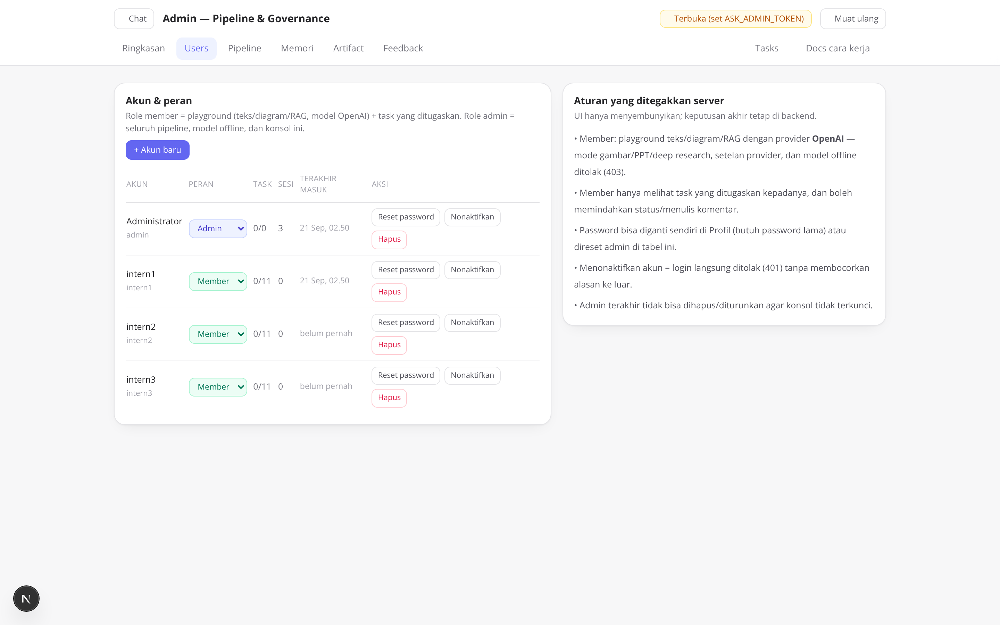

*Tab Users: daftar akun + peran, jumlah task yang ditugaskan, sesi aktif, waktu
login terakhir, dan aksi kelola.*

- **+ Akun baru** — buat akun member/admin dengan password awal; opsi "wajib
  ganti password" memaksa pemiliknya mengganti saat pertama login.
- **Reset password** — untuk pemilik yang lupa; semua sesi user itu diputus
  supaya password baru benar-benar berlaku. Anda tidak pernah bisa melihat
  password lama — yang tersimpan hanyalah hash.
- **Nonaktifkan / Hapus** — nonaktif menolak login (`401`) tetapi menyimpan
  riwayat & task; hapus bersifat permanen. **Admin terakhir** tidak bisa dihapus
  maupun diturunkan perannya.

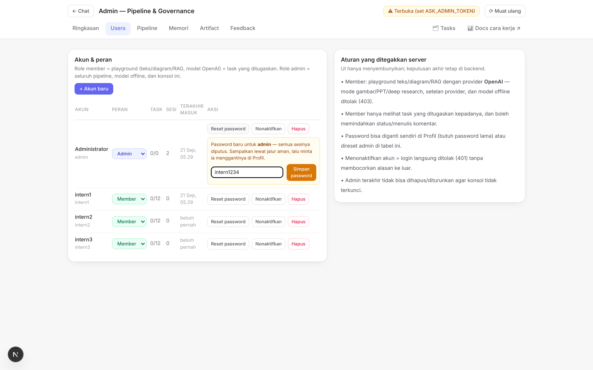

*Reset password inline di tab Users — cara admin menolong peserta yang lupa
password.*

### Akun hasil seed

Saat pertama dijalankan backend membuat akun awal dan mencetaknya di log:
`admin / admin123` dan `intern1…intern3 / intern123`. Bisa diubah lewat env
`ASK_ADMIN_PASSWORD`, `ASK_SEED_MEMBERS`, `ASK_MEMBER_PASSWORD`. **Ganti password
bawaan sebelum dipakai bersama.**

> Mode `ASK_AUTH_MODE=open` (demo/test) tidak mewajibkan login: semua request
> dianggap admin anonim sehingga demo & test otomatis tetap jalan. Mode default
> adalah `required` — jangan jalankan `open` di lingkungan yang bisa diakses
> orang lain.

---

## 3. Pipeline & akses per peran

Tab **Pipeline** → **Akses per peran** adalah tempat batas member diatur:
provider chat (`openai` = tanpa model offline), cakupan task
(`assigned`/`all`), izin model offline, settings provider, konsol admin, upload
RAG, ubah status task — plus mode & tool per peran.

Rumusnya: **gate global × gate peran = izin efektif**. Mematikan sebuah mode
secara global mematikannya untuk semua orang, apa pun saklar perannya. Perubahan
berlaku untuk run berikutnya **tanpa restart**.

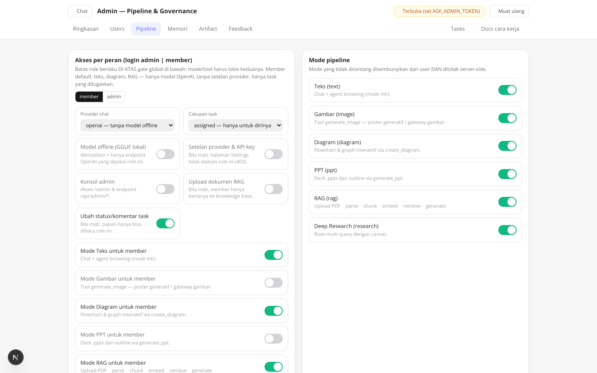

*Pipeline → Akses per peran: saklar member (kiri) terhadap gate global mode
(kanan); member memakai OpenAI dengan teks/diagram/RAG.*

| Kalau ingin… | Lakukan |
| --- | --- |
| Member boleh membuat gambar untuk satu task | Aktifkan mode `gambar` + tool `generate_image` pada baris member, lalu matikan lagi setelah task selesai. |
| Member melihat seluruh papan (bukan hanya task sendiri) | Ubah cakupan task member dari `assigned` ke `all`. |
| Menghentikan seluruh browsing sementara | Matikan tool `web_search` dan `fetch_url` pada gate global. |
| Membekukan biaya API mendadak | Ganti provider ke `mock` di Settings — aplikasi tetap hidup dan demo tetap jalan. |

---

## 4. Settings provider & model offline

Tombol `Settings provider` (bawah sidebar) membuka dialog pemilihan LLM:

- `huggingface` — model offline dari folder `models/`, atau server
  OpenAI-compatible bila `hf_mode=server`
- `openai` — API/gateway OpenAI-compatible
- `mock` — demo offline deterministik

Base URL, model, dan temperature bisa diubah runtime tanpa restart. Tombol
`Test koneksi` menjalankan request sungguhan ke endpoint lalu menampilkan status
+ pesan server apa adanya — cara tercepat mengetahui kenapa sebuah API error.


*Dialog Settings provider: pilihan provider, base URL, model, dan slider
temperature.*


*Bila model lokal belum dimuat atau endpoint tidak terjangkau, banner kuning
muncul dengan tombol "Buka Settings" dan sekali-klik "Pakai mode mock".*

> Model offline yang *gated* (mis. sebagian repo DeepSeek) butuh persetujuan di
> HuggingFace. Isi Token HuggingFace di tab Model offline atau set `ASK_HF_TOKEN`.

---

## 5. Dua papan task

Papan task punya **dua trek terpisah** yang statistiknya tidak dicampur. Id task
sekaligus menjadi dasar nama branch git.

| Papan | Contoh id | Isi | Siapa melihat apa |
| --- | --- | --- | --- |
| **Platform** | `ASK-003` | Rencana produk aplikasi Ask Anything itu sendiri. | admin: semua task; member: hanya yang ditugaskan |
| **Internship** | `INT-014` | Proyek peserta: membangun chatbot AI agent production-ready dari nol. | admin: seluruh 36 task per fase; member: hanya task miliknya |

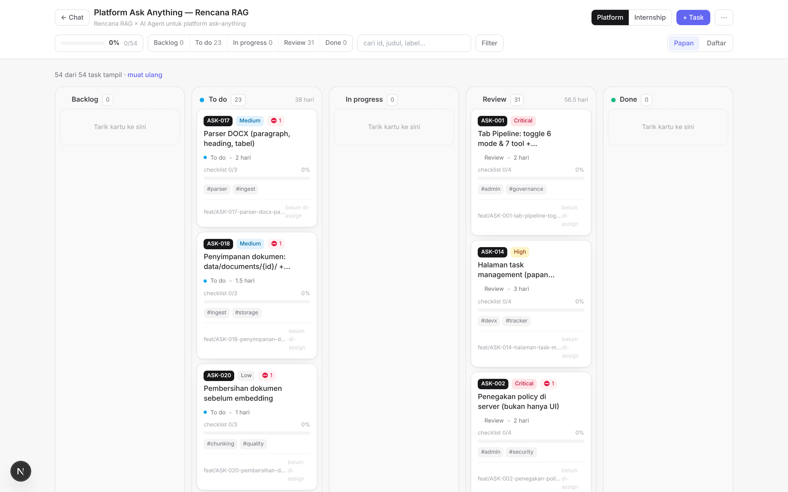

*Papan Platform: tombol Platform | Internship memindahkan trek, kolom mengikuti
status, kartu memuat id task yang dipakai sebagai nama branch.*

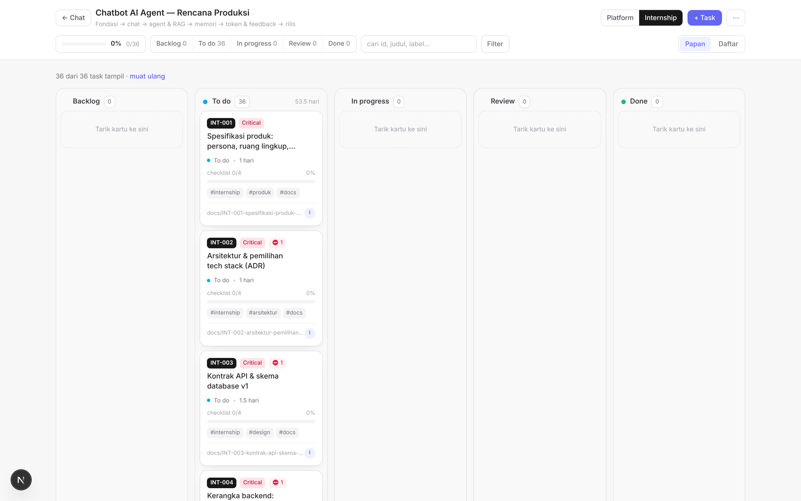

*Papan Internship: 36 task / 53.5 hari dengan breadcrumb fase (Fondasi → chat →
agent & RAG → memori → token & feedback → rilis) di bawah judul papan.*

---

## 6. Mengelola papan sehari-hari

Header papan sengaja diringkas jadi satu baris: judul + breadcrumb fase di kiri,
pemindah trek dan aksi di kanan. Kontrol yang jarang dipakai disembunyikan sampai
diminta.

- **Chip status** (Backlog / To do / In progress / Review / Done) — klik untuk
  menyaring satu kolom saja.
- **Kotak cari** — cocokkan id, judul, atau label.
- **Tombol Filter** — panel lipat berisi saringan fase, prioritas, assignee, dan
  label. Badge angka menunjukkan berapa filter yang sedang aktif, jadi Anda tidak
  pernah bingung kenapa papan tampak kosong.
- **Papan / Daftar** — kanban untuk memindahkan status, tampilan daftar untuk
  meninjau banyak task sekaligus.
- **+ Task** dan menu **⋯** — membuat task, memuat rencana (seed), dan
  menyinkronkan informasi git.

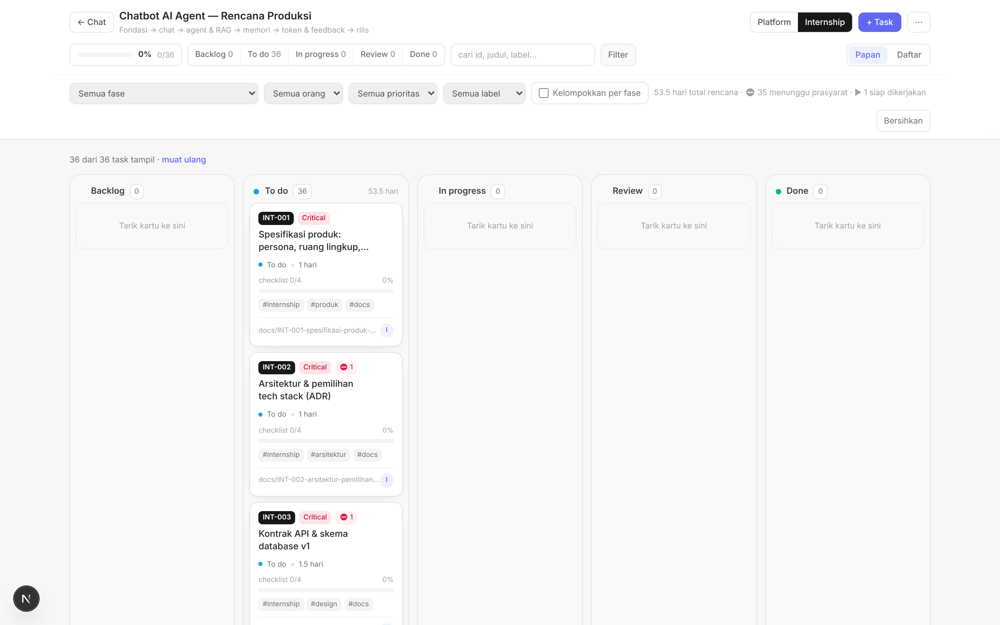

*Panel Filter dilipat secara default; dibuka hanya saat dibutuhkan, dengan badge
jumlah filter aktif pada tombolnya.*

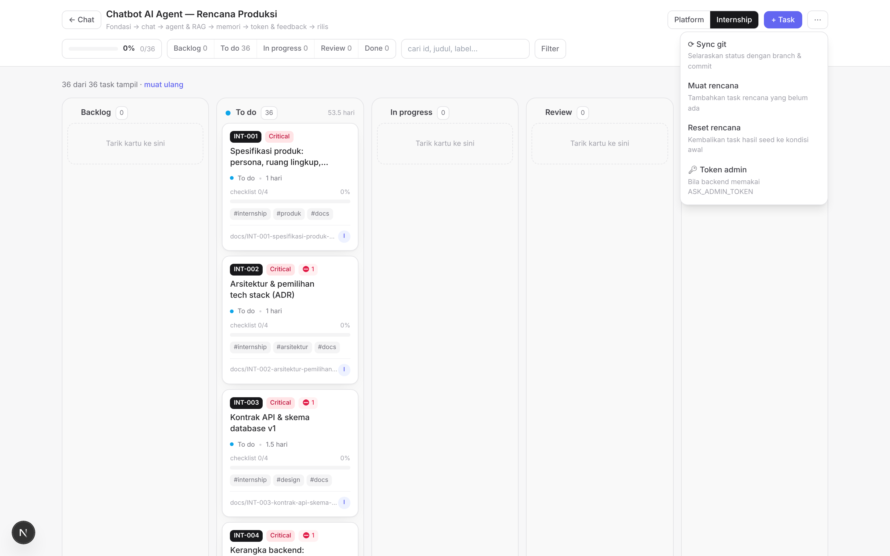

*Menu ⋯ (Aksi papan) menampung aksi jarang pakai: muat rencana, sinkronkan git,
dan pemeliharaan papan.*

---

## 7. Merawat detail task

Panel detail bertab supaya isi yang padat tetap terbaca. Tugas Anda sebagai admin
adalah memastikan **ketiga tab pertama benar-benar terisi** sebelum task
diberikan ke peserta — task tanpa workflow dan wireframe akan dikerjakan sambil
menebak.

| Tab | Isi | Kriteria "sudah cukup" |
| --- | --- | --- |
| **Ringkasan** | Deskripsi, kriteria penerimaan, dependensi, estimasi, label, perintah branch. | Checklist bisa dinilai objektif oleh reviewer — bukan "selesai dengan rapi". |
| **Workflow** | Langkah bernomor: aktor (Intern / Pembimbing / Reviewer), aksi, hasil. | Peserta tahu langkah pertama tanpa bertanya. |
| **Wireframe** | Sketsa ASCII layar, dokumen, atau struktur berkas keluaran. | Bentuk hasil tidak ambigu sebelum kode ditulis. |
| **Aktivitas** | Komentar & jejak status/commit. | Keputusan penting tercatat, bukan hanya di chat. |

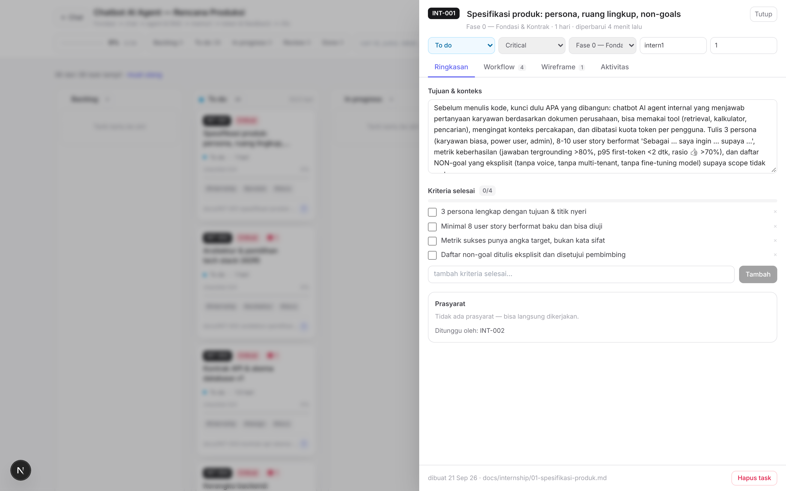

*Tab Ringkasan: deskripsi, kriteria penerimaan, dan metadata yang bisa diedit
admin (prioritas, fase, estimasi, assignee).*

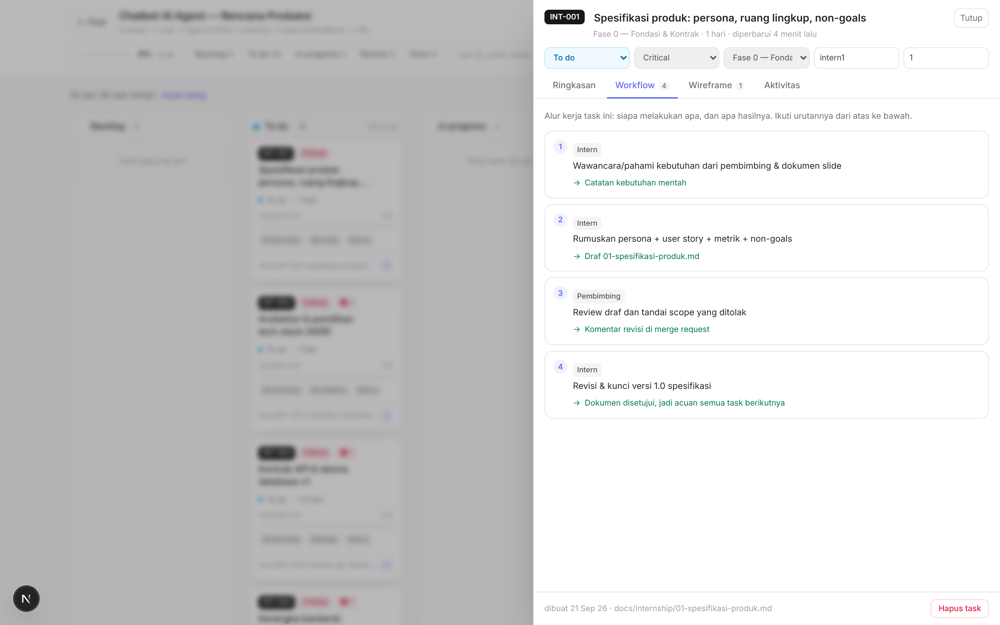

*Tab Workflow pada INT-001: empat langkah dengan aktor Intern/Pembimbing dan
hasil yang diharapkan. Badge pada tab = jumlah langkah.*

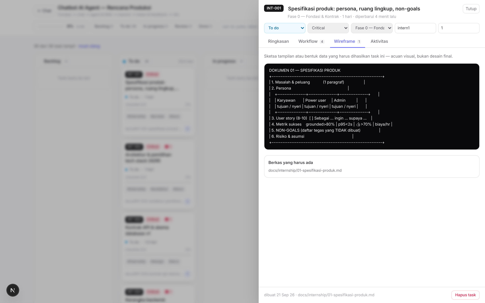

*Tab Wireframe: blok ASCII yang menggambarkan dokumen keluaran beserta daftar
berkas yang harus ada.*

Rincian struktur data `workflow` dan `wireframe` ada di
[TASK-MANAGEMENT.md](TASK-MANAGEMENT.md).

---

## 8. Menjalankan program internship

Rencana internship membangun **prototipe chatbot LLM** (Python + Streamlit +
SQLite) di `projects/ai-agent`: 29 task dalam 6 sprint, total estimasi 41 hari
kerja. Fokusnya lapisan LLM — bukan infrastruktur — dan memetakan lima epic:
konteks & memori, orkestrasi & tooling, guardrail, observability, performa.

Hanya task **Sprint 0** yang berada di kolom *To do*; sprint berikutnya menunggu
di *Backlog* dan ditarik saat sprint sebelumnya ditutup. Gerbang Sprint 0: **PRD
rampung dan disetujui** sebelum kode fitur ditulis.

| Sprint | Task | Fokus |
| --- | --- | --- |
| **i0** PRD & Kerangka | `INT-001…004` | PRD (persona, 10 user story, metrik berangka, 5 ADR) + kerangka Streamlit & mock provider. |
| **i1** Chat, Sesi & Token | `INT-005…009` | Provider LLM + mock, UI streaming, CRUD sesi, hitung token (tiktoken), sliding window + ringkasan. |
| **i2** RAG, Tool & Router | `INT-010…015` | Ingest + chunking, embedding numpy, jawaban bersitasi, function calling registry, router hemat biaya, memori jangka panjang. |
| **i3** Guardrail | `INT-016…019` | Moderasi input (prompt injection), redaksi PII, validator output JSON + retry, system prompt terkelola. |
| **i4** Observability | `INT-020…023` | Tracing span per tahap, dasbor token/biaya/TTFT, feedback 👍/👎 beralasan, set evaluasi 20 soal. |
| **i5** Performa & Rilis | `INT-024…029` | Semantic cache, rate limit & kuota, fallback model, Docker + volume persisten, test, demo & runbook. |

Rincian per task (prasyarat, hari, epic) ada di
[`docs/internship/03-rencana-sprint.md`](internship/03-rencana-sprint.md) yang
dihasilkan dari rencana lewat `python scripts/gen_internship_docs.py`.

Akun peserta dibuat otomatis dari env `ASK_INTERN_USERNAME` /
`ASK_INTERN_EMAIL` / `ASK_INTERN_NAME`. Bila `ASK_INTERN_PASSWORD` kosong,
password acak dibuatkan sekali: dicetak di log startup dan ditulis ke
`<folder data>/intern-credentials.txt` — serahkan, lalu hapus berkas itu. Akun
wajib mengganti password saat login pertama, dan login menerima username
maupun email.

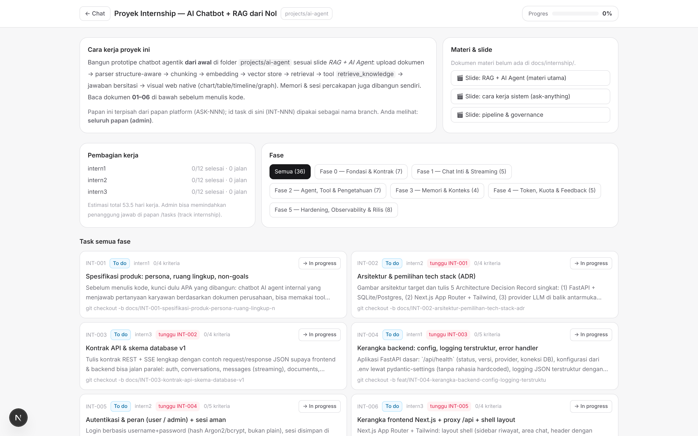

*Halaman `/internship` versi admin: progres keseluruhan, pembagian kerja per
peserta, filter sprint, daftar task, dan kartu Materi & slide.*

### Ritme yang disarankan

1. **Sebelum sprint** — tarik task sprint berikutnya dari *Backlog* ke *To do*,
   pastikan assignee-nya benar.
2. **Harian** — periksa kolom *Review* lebih dulu; task yang menumpuk di sana
   memblokir dependensinya.
3. **Saat review** — nilai dengan checklist kriteria penerimaan, bukan kesan
   umum. Kembalikan ke *In progress* dengan komentar spesifik bila belum lolos.
4. **Akhir sprint** — demo 5-10 menit dari aplikasi yang berjalan, catat angka
   metriknya, lalu buka sprint berikutnya. Task yang tidak selesai dipindahkan
   secara sadar, bukan dibiarkan menggantung.

> Kartu **Materi & slide** membaca dokumen langsung dari backend (folder
> `docs/internship/`). Menambahkan berkas markdown baru di sana membuatnya muncul
> otomatis di `/internship` tanpa perubahan kode.

---

## 9. Mechanistic Interpreter untuk audit

Bagi admin, Interpreter bukan sekadar alat belajar — ia adalah jejak audit. Setiap
run tersimpan lengkap dan bisa direplay dari riwayat.

| Pertanyaan | Tab yang menjawab |
| --- | --- |
| Kenapa jawaban ini lambat? | **Log** (durasi per langkah) dan **Metrik** (latensi total). |
| Apakah agent benar-benar memanggil tool itu? | **Tools** — argumen dan payload hasil mentah. |
| Apakah klaimnya punya sumber? | **Sumber** — status cited / appended / no-evidence. |
| Berapa token yang terpakai? | **Metrik** — usage prompt/completion per run. |
| Apa persisnya yang dikirim ke provider? | **LLM** — messages dan schema tools apa adanya. |

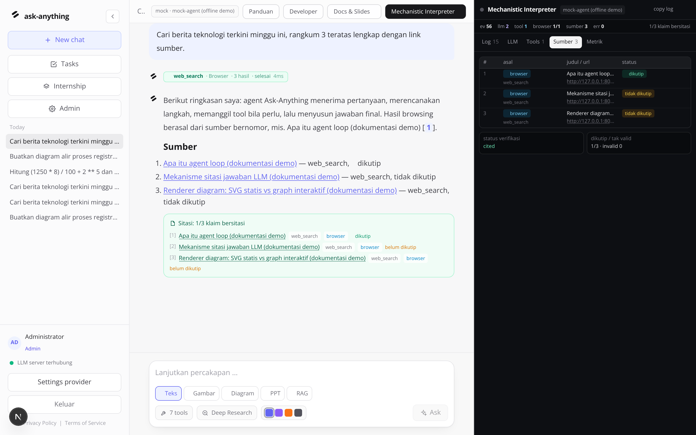

*Tab Sumber: registri sitasi bernomor + status verifikasi. Bila browser belum
menghasilkan apa pun, tab ini mengatakannya — bukan menampilkan tabel kosong.*


*Satu baris dibuka: payload JSON mentah event itu, apa adanya.*

---

## 10. Tampilan, aksen & mobile

Navbar bisa di-collapse (`Ctrl/Cmd+B`) dan ruang yang dilepaskan langsung dipakai
kolom chat serta kanvas diagram. Empat aksen warna tersedia di composer, dan
seluruh layar tetap terpakai pada lebar ponsel.

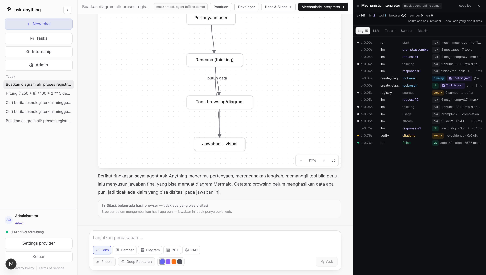

*Chat dan Interpreter berdampingan — layout paling berguna saat mengaudit run.*

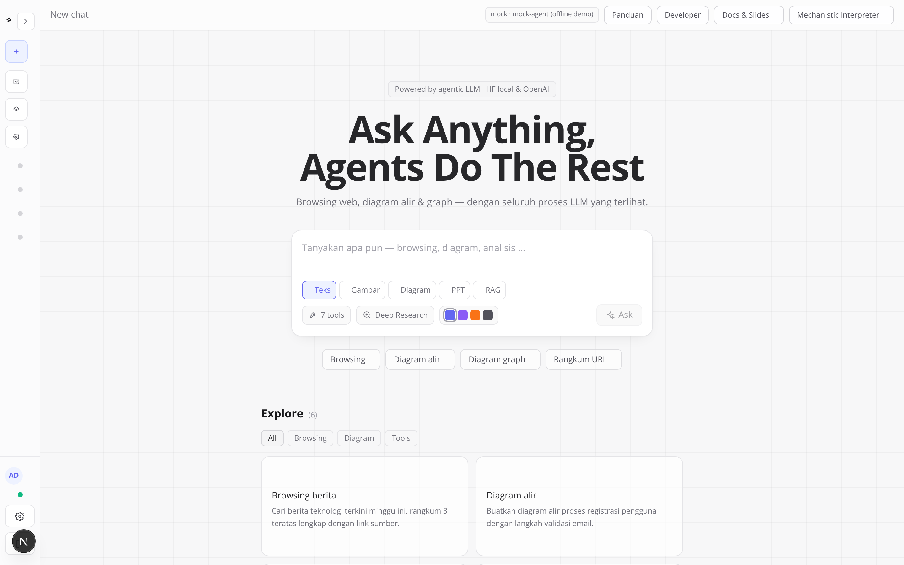

*Navbar collapsed: riwayat menjadi rail titik yang tetap bisa dipilih dengan
keyboard.*


*Aksen orange: tombol, chip, dan ring mengikuti variabel aksen yang dipilih.*


*Tampilan mobile (390×844): sidebar disembunyikan, composer dan Explore tetap
nyaman dipakai.*

---

## 11. Operasional & pemeliharaan

### Variabel lingkungan yang sering dipakai

| Env | Gunanya |
| --- | --- |
| `ASK_AUTH_MODE` | `required` (default) atau `open` untuk demo/test. |
| `ASK_DB_PATH` | Lokasi database SQLite (default `data/ask_anything.db`). |
| `ASK_ADMIN_PASSWORD` | Password admin awal saat seeding. |
| `ASK_SEED_MEMBERS` | Daftar akun member yang dibuat otomatis. |
| `ASK_HF_TOKEN` | Token HuggingFace untuk repo model yang *gated*. |
| `ASK_SEARCH_DDG_URL` | Endpoint gateway pencarian (bisa diarahkan ke gateway internal). |

### Memperbarui screenshot dokumentasi

Seluruh gambar di panduan ini adalah screenshot aplikasi yang benar-benar
berjalan, diambil otomatis. Jalankan ulang setiap kali UI berubah supaya dokumen
tidak kedaluwarsa diam-diam:

```bash
# sekali saja: siapkan Chromium + font
bash scripts/setup_chromium.sh
source ~/.tooling/chrome/env.sh

# ambil ulang screenshot (urut: main → roles → pages)
python scripts/capture_screenshots.py main
python scripts/capture_screenshots.py roles
python scripts/capture_screenshots.py pages
```

---

## 12. Troubleshooting

| Gejala | Penyebab umum | Solusi |
| --- | --- | --- |
| Banner kuning "Belum ada model offline yang dimuat" | Provider huggingface mode lokal belum punya model. | Settings → Model offline → cari → Download → Pakai & muat. |
| Indikator sidebar merah "LLM server offline" | Base URL provider tidak reachable. | Periksa Settings provider → base URL, atau jalankan Test koneksi. |
| API error tanpa penjelasan | Key salah / nama model tidak ada / payload ditolak gateway. | Settings → Test koneksi: request nyata dijalankan, status + pesan server ditampilkan. |
| Download model gagal "repo privat/gated" | Repo HuggingFace butuh persetujuan. | Isi Token HuggingFace di tab Model offline, atau set `ASK_HF_TOKEN`. |
| Tool `web_search` berstatus error | Tidak ada akses internet dari backend. | Normal di lingkungan offline; konfigurasi Serper/Tavily bila punya key. |
| Papan task member kosong | Belum ada task yang ditugaskan. | Tetapkan Assignee di detail task, atau muat rencana lewat menu ⋯. |
| Member melaporkan `403` pada fitur yang ia butuhkan | Policy peran membatasi fitur itu. | Pipeline → Akses per peran; buka izinnya bila tugas memang memerlukannya. |
| `/admin` menolak akses | Akun bukan role admin. | Naikkan peran di tab Users (admin terakhir tidak bisa diturunkan). |
| Chip token di tab LLM kosong | Provider tidak mengirim logprobs. | Pakai provider yang mendukung logprobs, atau mode mock. |

---

## 13. Data & privasi

- Semua percakapan & trace tersimpan lokal di SQLite (`data/ask_anything.db`,
  bisa diubah via `ASK_DB_PATH`).
- Tidak ada telemetri dari aplikasi; permintaan LLM hanya menuju provider yang
  Anda pilih.
- Hapus riwayat: `DELETE /api/conversations/{id}` atau hapus file DB saat
  aplikasi mati.
- Password disimpan sebagai hash PBKDF2 (tidak pernah dikembalikan API); sesi
  berupa cookie HttpOnly `ask_session`. Ganti/reset password memutus sesi lain,
  akun nonaktif ditolak login.
- Percakapan hanya bisa dibuka pemiliknya — termasuk oleh admin. Kalau Anda butuh
  meninjau isi percakapan peserta, mintalah mereka membagikannya, jangan mengakses
  DB diam-diam.
- Bila provider aktif adalah layanan cloud, isi percakapan dikirim ke sana.
  Komunikasikan ini ke pengguna — chip provider di header adalah indikator yang
  terlihat semua orang.

---

Kembali ke [PANDUAN-PENGGUNA.md](PANDUAN-PENGGUNA.md) ·
Panduan peserta: [PANDUAN-MEMBER.md](PANDUAN-MEMBER.md)
