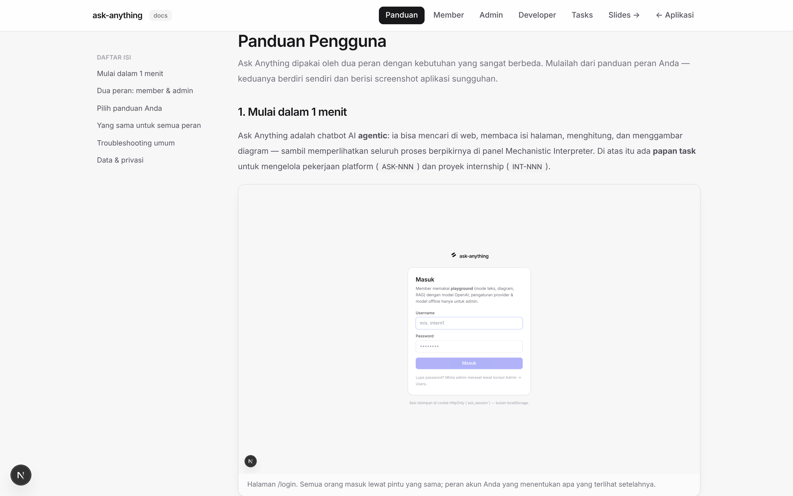
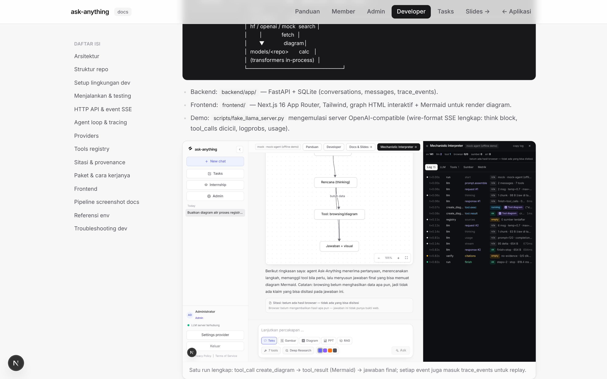

# Docs Developer — Ask Anything

> Peta lengkap codebase untuk kontributor: aliran data SSE, schema tracing,
> cara menambah provider/tool, setup dev, testing, dan pipeline screenshot
> dokumentasi. Versi interaktif: halaman in-app **`/developer`**.
> Pendamping user-facing: [`PANDUAN-PENGGUNA.md`](PANDUAN-PENGGUNA.md) (pemilih peran),
> [`PANDUAN-MEMBER.md`](PANDUAN-MEMBER.md), dan [`PANDUAN-ADMIN.md`](PANDUAN-ADMIN.md).

---

## Daftar isi

1. [Arsitektur](#1-arsitektur)
2. [Struktur repo](#2-struktur-repo)
3. [Setup lingkungan dev](#3-setup-lingkungan-dev)
4. [Menjalankan & testing](#4-menjalankan--testing)
5. [HTTP API & event SSE](#5-http-api--event-sse)
6. [Agent loop & tracing](#6-agent-loop--tracing)
7. [Providers](#7-providers)
8. [Tools registry](#8-tools-registry)
9. [Frontend](#9-frontend)
10. [Pipeline screenshot docs](#10-pipeline-screenshot-docs)
11. [Referensi env](#11-referensi-env-prefix-ask_)
12. [Sitasi & provenance tool](#12-sitasi--provenance-tool)
13. [Task management & konvensi branch](#13-task-management--konvensi-branch)
14. [Troubleshooting dev](#14-troubleshooting-dev)

> **Butuh detail per paket & cara kerjanya?** Baca
> [`TEKNIS.md`](TEKNIS.md) — inventaris setiap dependency (versi, alasan
> dipilih, bagaimana ia bekerja di kode ini), plus uraian algoritma layout graph,
> parser Mermaid toleran, retry ladder provider, pipeline sitasi, dan batas
> ukuran/timeout yang berlaku.

---

## 1. Arsitektur

Monolith **FastAPI** berbicara **SSE** dengan frontend **Next.js 16**. Agent
loop hidup di backend; provider (HuggingFace lokal / OpenAI / mock) dan tools
(search, fetch, diagram, calculator) di-plug lewat registry schema-driven.

```
┌──────────────┐   SSE (/api/chat)   ┌──────────────────────────────┐
│  Next.js UI  │ ◄────────────────── │  FastAPI backend (monolith)  │
│  + Mermaid   │ ──────────────────► │  agent loop + tools + trace  │
└──────────────┘      POST           │        │            │       │
                                     │   providers         tools   │
                                     │  hf / openai / mock  search │
                                     │        │             fetch  │
                                     │        ▼             diagram│
                                     │  models/<repo>       calc   │
                                     │  (transformers in-process)  │
                                     └──────────────────────────────┘
```

- **Backend** `backend/app/`: FastAPI + SQLite (`conversations`, `messages`,
  `trace_events`).
- **Frontend** `frontend/`: Next.js App Router + Tailwind; diagram dirender
  dua mode — parser Mermaid toleran + layout layered + `GraphView` (HTML
  interaktif) sebagai default, `Mermaid.tsx` (SVG statis) sebagai pembanding.
- **Demo/test** `scripts/fake_llama_server.py`: server OpenAI-compatible tiruan dengan
  wire-format SSE lengkap (`<think>` terbelah chunk, `tool_calls.arguments`
  dicicil per index, logprobs, usage) — dipakai `run.py --demo` dan test
  integrasi provider.


*Satu run: `tool_call create_diagram` → `tool_result` (Mermaid) → jawaban
final; setiap event juga persist ke `trace_events` untuk replay.*

## 2. Struktur repo

```
run.py / run.bat / run.sh      # launcher: cek+install dependensi, jalankan BE+FE
Dockerfile                     # image produksi (BE+FE satu container) → Coolify/VPS
.dockerignore                  # build context bersih (no .git/node_modules/.next/data)
docker/entrypoint.sh           # supervisor: uvicorn + `next start`, trap TERM, probe LLM
backend/
  app/
    main.py                  # FastAPI app + mount /slides & /docs-images
    config.py                # pydantic-settings (prefix ASK_*)
    db.py                    # SQLite: conversations, messages, trace_events
    providers/               # base / openai / hf_local / huggingface / mock /
                             # url_utils / discovery / diagnostics
    hf_hub.py                # pencarian HuggingFace Hub + downloader multi-model
    local_inference.py       # engine transformers: load/unload/stream + tool call
    streamtags.py            # parser blok think/tool-call pada token stream
    tools/                   # base (provenance Tool.source/ToolResult.hits),
                             # web_search, fetch_url, diagrams, calculator
    sources.py               # registri sumber + verifikasi/penjaminan sitasi
    agent/                   # loop.py (agent+tracing), prompts.py
    api/routes.py            # /api/chat, conversations, settings, hf/models, health
  tests/                     # pytest (103): URL, parser SSE, retry ladder +
                             # fallback, diagnostik endpoint, Hub downloader,
                             # inference lokal dengan model nyata
models/                      # (gitignored) model HuggingFace hasil download
scripts/
  fake_llama_server.py       # server OpenAI-compatible tiruan (--demo & testing)
  download_model.py          # CLI cari/unduh model (run.py --search/--model)
  capture_screenshots.py     # generator screenshot docs (Playwright)
  smoke_ui.py                # pemeriksaan UI end-to-end (collapse, kanvas,
                             # provenance, sitasi, tab interpreter)
  fake_search_server.py      # gateway pencarian+halaman demo lokal (uji E2E &
                             # screenshot tanpa internet; data fiktif)
docs/                        # METODOLOGI.md, slides, PANDUAN-*, DEPLOY-COOLIFY.md, images/
frontend/                    # Next.js 16: sidebar, hero, chat, interpreter, docs
```

## 3. Setup lingkungan dev

```bash
# backend
python3 -m venv .venv && .venv/bin/pip install -r backend/requirements.txt
ASK_PROVIDER=mock .venv/bin/python -m uvicorn backend.app.main:app --port 8000

# frontend
cd frontend && npm install && npx next dev -p 3000

# atau satu perintah (cek+install otomatis; --demo = emulator LLM di :8081)
python3 run.py --demo
```

Catatan dev-server Next 16: resource dev (`/_next/*`) diblokir untuk origin
cross-site. Repo menyetel `allowedDevOrigins: ["127.0.0.1", "*.e2b.app",
"**.e2b.app"]` di `next.config.ts` agar UI hydrate saat diakses via loopback
atau host preview sandbox. Tanpa ini UI ter-render SSR tetapi **tidak
interaktif** (state kosong) — gejala yang mudah salah diagnosis.

## 4. Menjalankan & testing

```bash
.venv/bin/python -m pytest backend/tests -q   # pytest backend
cd frontend && npm test                        # vitest (jsdom): parser, layout, GraphView, DiagramBlock
cd frontend && npx tsc --noEmit && npx next build
python3 run.py --demo                          # E2E live (emulator LLM)
```

| File test | Cakupan |
|---|---|
| `test_providers.py` | Parser SSE protokol OpenAI: `<think>` terbelah antar chunk, akumulasi `tool_calls.arguments`, logprobs, usage. |
| `test_api.py` | `/api/chat` end-to-end via TestClient: urutan event SSE + persist trace (`prompt`, `tool_call`, `logprobs`). |
| `test_tools.py` | Validasi Mermaid, keamanan calculator (AST whitelist), ekstraksi `fetch_url`. |
| `test_tools.py` | Kalkulator, `create_diagram` (edge endpoint tak dikenal → dibuat otomatis), parsing hasil `web_search` (DDG dukung tabel lite), ekstraksi teks `fetch_url`. |
| `test_tool_args.py` | Perbaikan argumen tool: JSON dalam string/fence, kutip tunggal, trailing comma, literal Python, JSON bersarang sebagai string, argumen tak terbaca → `_raw` (bukan senyap kosong); create_diagram dengan nodes string/alias/edge string/sumber Mermaid jadi; jalur fallback & deteksi blokir `web_search`; pembukaan tautan `uddg=`. |
| `test_sources_citations.py` | Provenance tool (`browser`/`diagram`/`compute`), `ok`/`hits`, registri sumber (dedup, `read`, penolakan payload diagram), verifikasi `[n]` + nomor invalid, `finalize_answer` (`cited`/`appended`/`no-evidence`), event `llm_request`/`llm_response`/`sources`/`citations`, **live == replay**, endpoint pencarian yang bisa dikonfigurasi. |

Test frontend (`cd frontend && npm test`, vitest + Testing Library di jsdom):

| File test | Cakupan |
|---|---|
| `lib/graph/parseMermaid.test.ts` | Terjemahan Mermaid → model graph: bentuk node, label pipe/teks, rantai & `&`, subgraph, mindmap, serta toleransi (baris prosa, kurung tak seimbang, edge menggantung) — parser tidak boleh melempar exception. |
| `lib/graph/layout.test.ts` | Layout layered: urutan rank TD/LR, bebas tumpukan, aman siklus, deterministik, bounding box subgraph. |
| `components/GraphView.test.tsx` | Interaksi: klik node → inspektur relasi, drag node vs pan latar, zoom tombol/wheel, toggle arah, keyboard (Enter/Esc). Proporsi: rantai panjang di kanvas lebar diputar otomatis ke LR, arah sumber dipertahankan bila kanvasnya tinggi, tombol TD/LR mengunci arah, lantai skala baca + badge penjelasannya. |
| `components/DiagramBlock.test.tsx` | Mode render: default Graph, persistensi preferensi localStorage, badge baris dilewati, fallback satu klik saat Mermaid error. |
| `components/DiagramBlock.canvas.test.tsx` | Ukuran kartu (`clamp(420px,68vh,760px)`/min 380px), susunan `flex-col` dengan kanvas `flex-1` (kanvas tidak terjepit di samping toolbar), tombol layar penuh: jalur **native**, jalur **ditolak** (iframe) → focus mode + alasan, `Esc` keluar, badge provenance. |
| `components/Sidebar.test.tsx` | Collapse/expand: 268px ↔ 64px, `aria-expanded`, persist `aa:nav-collapsed`, riwayat tetap bisa dipilih saat rail, `Ctrl+B`, status LLM. |
| `components/ChatView.test.tsx` | Chip tool berlencana provenance (+ `0 hasil`/`gagal`/durasi), bar Sitasi dengan status dikutip per sumber, kolom lebar 1180px (bukan `max-w-3xl`), **kartu diagram dari `meta.diagrams`** (tetap muncul walau jawaban tanpa fence), dedupe fence, dan **sumber diteruskan ke markdown saat streaming**. |
| `lib/live.test.ts` | Reducer streaming dengan fixture event `/api/chat` asli: sumber tersedia sebelum jawaban selesai, laporan sitasi final, diagram dari `tool_result` tanpa fence di jawaban, dedupe `tool_result`+`agent_done`, event tak dikenal diabaikan. |
| `lib/diagrams.test.ts` | Normalisasi & dedupe sumber Mermaid, deteksi fence, pembacaan artefak dari payload tool dan `meta.diagrams` (defensif terhadap data rusak). |
| `components/Interpreter.test.tsx` | Tab **Log** jadi default & baris terstruktur, payload mentah per baris, tab LLM membuka request/raw completion/`tool_calls`, tab Tools menampilkan argumen+hasil+durasi+status, tab Sumber (tabel + status verifikasi), Metrik, copy log, lebar panel. |
| `lib/log.test.ts` | `buildLog`: satu baris per langkah, delta & thinking jadi hitungan, status `empty`/`failed`, durasi, urutan `stream` sebelum `response`, `logToText` berkolom. |
| `lib/sources.test.ts` | Peta provenance, `outcomeOf`, `splitCitations` (`[1]`, `[2,3]`, link markdown bukan sitasi), label/tone sitasi, `hasSourcesBlock`. |
| `lib/markdown.test.tsx` | `[n]` → chip tertaut (juga untuk beberapa nomor), nomor tak dikenal ditandai merah tapi tidak dihapus, provenance diteruskan ke DiagramBlock, fence non-mermaid tidak jadi diagram. |

Rangkuman saat ini: **pytest 128 lulus / 15 skip** (skip = butuh torch atau
jaringan), **vitest 141 lulus**, `tsc --noEmit` bersih, `next build` 4 route.
Verifikasi UI end-to-end: `python3 scripts/smoke_ui.py` (30 pemeriksaan).

**Deploy produksi** — `Dockerfile` di root repo membangun satu image berisi
backend + frontend (Next production server sebagai pintu masuk publik, uvicorn
internal di `127.0.0.1:8000`), dengan `docker/entrypoint.sh` sebagai supervisor
sekaligus penerus sinyal `TERM`. Langkah Coolify, tabel env, volume SQLite, dan
troubleshooting deploy: [`DEPLOY-COOLIFY.md`](DEPLOY-COOLIFY.md).

## 5. HTTP API & event SSE

| Method | Path | Kegunaan |
|---|---|---|
| POST | `/api/chat` | Stream satu run agent (SSE). Body `{message, conversation_id?}`. |
| GET | `/api/conversations` | Daftar percakapan (sidebar). |
| GET | `/api/conversations/{id}` | Messages + trace lengkap (replay Interpreter). |
| DELETE | `/api/conversations/{id}` | Hapus percakapan. |
| GET/POST | `/api/settings` | Baca/ubah runtime settings (provider, base url, model, api key, thinking, temperature, max_steps, logprobs). Base URL dinormalkan saat disimpan; field key yang tidak dikirim tidak berubah, `""` = hapus key; `provider` tak dikenal → 422. |
| POST | `/api/models` | Daftar model sebuah endpoint (`provider`/`base_url`/`api_key` opsional → default setting aktif). Menormalkan bentuk `data[].id`, `models[].model`, dan list string; tidak pernah 500 (`{ok:false,error}`). Sumber: `providers/discovery.py`. |
| POST | `/api/models/test` | **Diagnostik endpoint**: `GET /models` + chat non-streaming (bentuk curl) + chat streaming, masing-masing dengan status/latensi/pesan server + hint. Sumber: `providers/diagnostics.py`. |
| GET | `/api/hf/search?q=` | Cari model di HuggingFace Hub; repo id persis di-resolve langsung. |
| GET | `/api/hf/models` | Model di `models/` + semua progres unduhan + status engine inference. |
| GET | `/api/hf/downloads` | Progres unduhan (di-poll UI tiap 1,2 dtk). |
| POST | `/api/hf/models/download` | Unduh/lanjutkan repo; body `{repo_id}` (di body karena repo id mengandung `/`). |
| POST | `/api/hf/models/cancel` | Batalkan unduhan. |
| POST | `/api/hf/models/use` | Jadikan model aktif + muat; body `{repo_id, thinking?, load?}`. |
| POST | `/api/hf/models/delete` | Hapus folder model dari disk. |
| GET/POST | `/api/hf/runtime`, `/api/hf/runtime/stop` | Status engine transformers / lepas model dari memori. |
| GET | `/api/health` | Status backend + `llm_reachable`/`llm_status` + `local_llm` (banner & indikator sidebar). |
| GET | `/docs` | Swagger UI FastAPI. Static mount: `/slides/*`, `/docs-images/*`. |

### Event SSE (urutan khas satu run)

| `type` | Payload penting | Konsumsi UI |
|---|---|---|
| `start` | `conversation_id` | page.tsx: set active id |
| `meta` | provider, model, temperature, max_tokens, max_steps, logprobs, tools | Interpreter → Metrik |
| `prompt` | `system`, `messages`, `tools` (schema lengkap), `message_count` | Interpreter → LLM |
| `thinking` | `text` (stream) | kotak 💭 + baris `thinking` (diringkas) |
| `delta` | `text` (stream) | jawaban markdown |
| `logprobs` | `items[{token, prob, top[]}]` | chip token di Interpreter → LLM |
| `llm_request` | `messages` persis, `tools`, `sampling`, `message_count` | Interpreter → LLM (baris `request #n`) |
| `llm_response` | `text` mentah, `thinking`, `finish_reason`, `tool_calls[]`, `chars`, `duration_ms` | Interpreter → LLM + baris `response #n` |
| `tool_call` | `id`, `name`, `arguments`, `source`, `args_preview` | chip provenance + Log `tool.exec` |
| `tool_result` | `id`, `name`, `source`, `label`, `summary`, `ok`, `hits`, `new_sources`, `error`, `duration_ms`, `data` | chip hasil + Log `tool.result` + tab Tools |
| `sources` | `total`, `items[]`, `block` | Interpreter → Sumber |
| `citations` | `status`, `total`, `cited[]`, `uncited[]`, `invalid[]`, `detail`, `sources[]` | bar Sitasi + Log `citations` |
| `usage` | prompt/completion/total tokens | Metrik |
| `note` | `message`, `status`, `tool` | Log oranye (`note:no-results`, `note:max_steps`), retry ladder provider |
| `done` | `answer`, `latency_ms`, `steps`, `stopped_reason` | selesai + persist |

Setiap event yang di-*trace* membawa `t_ms` (milidetik relatif ke awal run) dan
`step` — dipakai Log sebagai gutter waktu tanpa menghitung jam dinding.
| `error` | `message` | banner inline + Timeline |
| (frame) | `: keep-alive` tiap 10 dtk saat stream diam | diabaikan klien; menahan proxy menutup koneksi |

```bash
curl -N localhost:8000/api/chat -H 'Content-Type: application/json' \
     -d '{"message":"Buatkan diagram alur proses registrasi pengguna"}'
```

## 6. Agent loop & tracing

1. `routes.py` membuat conversation (bila baru) + `asyncio.Queue`; task agent
   dijalankan terpisah sehingga **klien putus = task di-cancel**.
2. `loop.py` merakit messages (history SQLite → protokol OpenAI, termasuk
   `role:tool` & `assistant_toolcalls`), emit event `prompt`, lalu stream dari
   provider.
3. Bila model emit `tool_calls` (maks `ASK_MAX_STEPS`): emit `tool_call` →
   eksekusi via registry (timeout 30 dtk) → emit `tool_result` →
   `messages += assistant(tool_calls) + role:tool` + hint sistem → stream lagi.
4. Setiap event persist ke `trace_events(conversation_id, run_id, seq, type,
   payload, ts)` sehingga riwayat bisa direplay penuh.
5. Pagar pengaman: payload di-cap 12k (`_cap`), error tool diberikan ke model
   sebagai data (graceful), DB tetap konsisten bila klien putus.

**Kontrak replay:** `db.list_trace()` **meratakan** `payload` ke level atas
sehingga bentuk event replay identik dengan wire SSE (`{type, ...fields}`).
UI membaca field top-level (`text`, `items`, `summary`, `arguments`, …) untuk
event live maupun replay — jangan kembalikan payload nested.


*Replay dari SQLite: payload JSON mentah per event tetap utuh.*

## 7. Providers

Semua provider mengimplementasikan `BaseProvider.stream()` yang yield
`StreamEvent` (`thinking` / `delta` / `logprobs` / `tool_calls` / `usage` /
`done`). `HuggingFaceProvider` mewarisi `OpenAIProtocolProvider` — parser SSE
bersama: state-machine `<think>` yang terbelah chunk, akumulasi
`tool_calls.arguments` per index, logprobs, usage.

`providers/url_utils.normalize_openai_base_url()` menerima base URL dalam bentuk
apa pun (`host`, `…/v1`, `…/v1/models`, `…/v1/chat/completions`, tanpa skema,
bahkan ter-copy bersama markdown/kurung) dan selalu menghasilkan
`scheme://host[:port][/prefix/v1]`. Endpoint dirakit lewat
`chat_completions_url()` / `models_url()` sehingga provider, health check, dan
UI tidak pernah menghasilkan `/chat/completions/chat/completions`.

`HuggingFaceProvider` menambahkan `chat_template_kwargs.enable_thinking`
(dari `ASK_THINKING`) ke payload — switch reasoning untuk template Qwen3.
Bila gateway membalas 400/404/422, `OpenAIProtocolProvider` mencoba ulang satu
kali dengan payload minimal (tanpa `stream_options`/`logprobs`) dan mengirim
event `note` ke timeline.

Menambah provider baru:

1. Buat `backend/app/providers/foo_provider.py` (subclass `BaseProvider`, atau
   `OpenAIProtocolProvider` bila kompatibel).
2. Daftarkan di `providers/__init__.py:build_provider()` + nama provider di
   `config.py` dan pilihan di `SettingsModal`.
3. Tambah test parser di `backend/tests/test_providers.py`.

## 8. Tools registry

| Tool | Fungsi | Catatan keamanan |
|---|---|---|
| `web_search` | DuckDuckGo lite (default) / Serper / Tavily; parse BS4 judul+URL+snippet. | Timeout & cap payload; error → `tool_result`. |
| `fetch_url` | Ekstrak teks halaman (readability ringan) ≤ 12k char. | Hanya teks, tanpa eksekusi konten. |
| `create_diagram` | Mermaid `flowchart` / `graph` / `mindmap` dari nodes+edges. | Validasi server-side: id dinormalisasi, label di-escape, endpoint edge yang belum dideklarasikan **dibuat otomatis** (bukan dibuang), argumen hampir-JSON diperbaiki (`tools/args.py`), sumber `mermaid` jadi diterima apa adanya. |
| `calculator` | Aritmetika via AST whitelist (`+ - * / // % **`). | Tidak ada `eval()`; node di luar whitelist = error. |

Menambah tool baru:

```python
# backend/app/tools/foo.py
from .base import Tool, ToolContext, ToolResult

async def run_foo(args: dict, ctx: ToolContext) -> ToolResult:
    ...  # args tervalidasi JSON-Schema
    return ToolResult(summary="...", data={...})

FOO = Tool(name="foo", description="...", parameters={...}, run=run_foo)
# daftarkan di tools/__init__.py (ALL_TOOLS) — schema otomatis dikirim ke LLM
```

## 9. Frontend

| File | Tanggung jawab |
|---|---|
| `app/page.tsx` | Orkestrasi state: conversations, messages, trace, live-stream (termasuk `source`/`hits`/`duration_ms` tiap tool), settings, aksen. Header memakai `shrink-0`+`truncate` agar tidak menimpa saat Interpreter membuka. |
| `app/panduan/page.tsx`, `app/panduan/member/page.tsx`, `app/panduan/admin/page.tsx`, `app/developer/page.tsx` | Halaman dokumentasi in-app (komponen di `components/docs/DocShell.tsx`). |
| `lib/api.ts` | Klien SSE (parser baris `data:`), CRUD conversations, settings, health. |
| `components/Sidebar.tsx` | Navbar **collapsible**: rail 64px ↔ 268px, persist `aa:nav-collapsed`, `Ctrl/Cmd+B`, riwayat jadi rail titik (tetap tombol, tetap bisa keyboard) saat collapsed. |
| `components/ChatView.tsx` | Render pesan di kolom **lebar** (`max-w-[1180px]`), chip tool **berlencana provenance** (Browser / Tool diagram / Kalkulator, + status `0 hasil`/`gagal`/durasi), bar Sitasi, kotak thinking, live answer. |
| `components/Interpreter.tsx` | Panel **log** (tab Log/LLM/Tools/Sumber/Metrik), bisa diseret 380–980px (persist), tombol copy log. |
| `lib/log.ts` | `buildLog(events)` — pemetaan murni TraceEvent→baris log (delta & thinking diringkas jadi hitungan, status dari field `ok`/`hits`), `logToText()` untuk salin/unduh. |
| `lib/sources.ts` | Peta provenance tool + kelas hasil (`ok/empty/failed/running`), pemecah marker `[n]`, label & tone sitasi. Cermin dari `app/sources.py`. |
| `lib/live.ts` | Reducer murni status live (`LiveState`) dari event SSE: thinking/delta, chip tool, **sumber bernomor** (`sources`/`citations`), dan **artefak diagram** (`tool_result`/`agent_done`). Dipisah dari `app/page.tsx` supaya jalur streaming bisa diuji tanpa DOM. |
| `lib/diagrams.ts` | Artefak diagram: normalisasi sumber Mermaid, dedupe (diagram yang sudah jadi fence di jawaban tidak dirender dua kali), pembacaan `meta.diagrams`/payload tool. |
| `lib/useFullscreen.ts` | Fullscreen API + **fallback focus mode** (`fixed inset-0`) dengan alasan yang dilaporkan, Esc selalu keluar. |
| `lib/markdown.tsx` | Markdown → blok; fence ```mermaid → `DiagramBlock`; marker `[n]` → chip tertaut; meneruskan `diagramOrigin` ke kartu. |
| `components/DiagramBlock.tsx` | Kartu diagram dua mode (Graph default / Mermaid), preferensi localStorage, badge baris dilewati, fallback saat Mermaid error, salin sumber, **tombol layar penuh**, **badge provenance** (`dari tool create_diagram` vs `ditulis model di jawaban`). Kartu `flex-col` setinggi `clamp(420px,68vh,760px)` dengan kanvas `flex-1` — toolbar di atas, kanvas memakai seluruh sisa ruang (bukan berdampingan sehingga terjepit). |
| `components/GraphView.tsx` | Renderer graph HTML interaktif: node `<button>` (fokus/klik/drag), edge SVG, pan/zoom/fit, arah **auto** (pilih TD/LR yang paling mengisi kanvas; bisa dikunci TD/LR), panel inspektur relasi. `height: number \| "100%"` + `fill` + `fitSignal`, `ResizeObserver` → refit saat kontainer berubah (fullscreen, collapse, drag), plus **lantai skala baca** (`0.5`, ditandai badge “diperbesar agar terbaca · geser”) supaya diagram besar tidak tampil sekecil perangko. |
| `lib/graph/parseMermaid.ts`, `lib/graph/layout.ts` | Parser Mermaid toleran (tidak pernah melempar) → model graph; layout layered deterministik (rank + barycenter + koordinat). |
| `components/Mermaid.tsx` | `mermaid.render()` (`securityLevel: strict`) untuk fence ```mermaid & hasil tool (mode pembanding). |
| `next.config.ts` | Rewrite `/api`, `/slides`, `/docs-images` ke backend (same-origin untuk browser & preview) + `allowedDevOrigins`. |

Gambar dokumentasi disajikan backend via mount `/docs-images` (direktori
`docs/images`) dan diproxy Next sehingga halaman docs tetap same-origin.

## 10. Pipeline screenshot docs

Semua PNG di `docs/images/` (dipakai markdown docs, `/panduan`, `/developer`)
diambil dari aplikasi yang **benar-benar berjalan**:

```bash
# 1) jalankan stack + emulator LLM
python3 run.py --demo

# 2) install tooling capture (sekali)
pip install playwright brotli
playwright install chromium        # bila jaringan mengizinkan

# 3) capture flow UI lalu halaman docs
BASE_URL=http://127.0.0.1:3000 python3 scripts/capture_screenshots.py main
python3 scripts/capture_screenshots.py pages
```

- Stage `main`: hero, Explore, **navbar collapsed → expand**, kanvas diagram
  (+ **layar penuh** + badge provenance), Interpreter per tab (Log/LLM/Sumber/
  Metrik/Tools), **browsing bersitasi**, **browsing 0 hasil**, kalkulator,
  layout lebar + interpreter berdampingan, settings, sidebar, slides, aksen,
  viewport mobile.
- Sebelum memotret: jalankan `python3 scripts/smoke_ui.py` — kalau pemeriksaan
  UI lulus, screenshot yang dihasilkan pasti menunjukkan perilaku yang benar.
- Stage `pages`: screenshot `/panduan` & `/developer` (viewport-only agar
  tidak multi-MB).
- Lingkungan tanpa akses CDN browser: set **`CHROME_EXE`** saja — skrip
  otomatis menambahkan `lib/` dan `fonts.conf` di samping binary ke
  `LD_LIBRARY_PATH` / `FONTCONFIG_FILE` (layout hasil ekstrak paket npm
  `@sparticuz/chromium`). Override manual tetap tersedia: `CHROME_LIBS`,
  `CHROME_FONTS`.
- **Tanpa `FONTCONFIG_FILE` yang benar screenshot tetap ter-layout tapi teksnya
  hilang** (glyph tidak ketemu). Kalau hasil capture “kosong”, cek ini lebih
  dulu sebelum menyalahkan UI.
- Alur “browser” difoto lewat gateway demo lokal (`SEARCH_DEMO_URL`, default
  `http://127.0.0.1:8099/lite/` dari `scripts/fake_search_server.py`) supaya
  pipeline sitasi bisa terlihat di mesin tanpa internet. Data halaman itu
  fiktif dan caption dokumen mengatakannya; set `SEARCH_DEMO_URL=` (kosong)
  untuk memakai internet sungguhan.


*Halaman `/panduan` — dokumen ini dalam bentuk interaktif.*


*Halaman `/developer` — arsitektur & referensi kontributor.*

## 11. Referensi env (prefix `ASK_`)

| Variabel | Default | Keterangan |
|---|---|---|
| `ASK_PROVIDER` | `huggingface` | `huggingface` \| `openai` \| `mock` |
| `ASK_HF_BASE_URL` | `http://127.0.0.1:8081/v1` | Server lokal/gateway OpenAI-compatible; boleh ditulis `…/v1/chat/completions` |
| `ASK_HF_MODE` | `local` | `local` = inference di proses backend · `server` = URL OpenAI-compatible |
| `ASK_HF_MODEL` | – | Repo id model offline yang aktif, mis. `Qwen/Qwen3-1.7B` |
| `ASK_HF_API_KEY` | – | Bearer token server/gateway HF lokal |
| `ASK_THINKING` | `true` | `chat_template_kwargs.enable_thinking` (reasoning model lokal) |
| `ASK_MODELS_DIR` | `models` | Folder project tempat model HuggingFace diunduh |
| `ASK_HF_ENDPOINT` | `https://huggingface.co` | Mirror HF Hub untuk download |
| `ASK_HF_TOKEN` | – | Token Hub untuk repo gated/privat (mis. DeepSeek) |
| `ASK_HF_DEVICE` / `ASK_HF_DTYPE` | – / `auto` | Paksa device (`cpu`/`cuda`/`mps`) & dtype inference lokal |
| `ASK_HF_THREADS` / `ASK_HF_TRUST_REMOTE_CODE` | 0 / false | Thread torch · izinkan kode kustom repo |
| `ASK_LLAMA_EXTRA_ARGS` | – | Argumen tambahan, mis. `--reasoning-format auto` |

| `ASK_OPENAI_API_KEY` / `ASK_OPENAI_BASE_URL` / `ASK_OPENAI_MODEL` | – / api.openai.com / gpt-4o-mini | Provider OpenAI / gateway kompatibel |
| `ASK_TEMPERATURE`, `ASK_MAX_STEPS`, `ASK_LOGPROBS` | 0.7 / 6 / true | Generasi & interpreter |
| `ASK_SEARCH_BACKEND` | `ddg` | `ddg` \| `serper` \| `tavily` (+ key masing-masing) |
| `ASK_SEARCH_DDG_URL` | `https://lite.duckduckgo.com/lite/` | Endpoint pencarian gaya lite — bisa ke gateway internal/self-host atau `scripts/fake_search_server.py` untuk uji E2E tanpa internet |
| `ASK_DB_PATH` | `data/ask_anything.db` | Lokasi SQLite |
| `ASK_TASKS_AUTOSEED` | `true` | Isi papan `/tasks` dengan rencana RAG saat tabel task kosong |
| `ASK_REPO_DIR` | root proyek | Folder repo git untuk sinkronisasi branch/commit task |

Semua juga bisa diubah runtime via `POST /api/settings` (dialog Settings).

## 12. Sitasi & provenance tool

Dua kontrak kecil yang membuat jawaban bisa diverifikasi — dan UI jujur saat
buktinya tidak ada.

**Provenance dideklarasikan, tidak disimpulkan.** `tools/base.py`:

```python
@dataclass
class Tool:
    name: str; description: str; parameters: dict; run: Callable
    source: str = "compute"     # "browser" | "diagram" | "compute"
    evidence: bool = False      # payload = bukti eksternal yang wajib disitasi

@dataclass
class ToolResult:
    summary: str; data: dict
    ok: bool = True             # False → kegagalan tertangani (chip merah)
    hits: int | None = None     # None: bukan pencarian · 0: kosong · >0: ada
```

Tiga nilai `hits` itu penting dan tidak boleh disatukan: `None` (diagram &
kalkulator memang tidak punya "jumlah hasil"), `0` (browser hidup tapi tidak
menemukan apa pun → chip kuning “0 hasil — belum ada data”), `>0` (hijau).
`tool_source(name)` untuk tool tak dikenal selalu `compute` — tool fiktif tidak
boleh mengaku sebagai bukti web. Frontend punya cermin yang sama di
`lib/sources.ts::sourceOf()`.

**Registri sitasi** (`app/sources.py`) dalam empat tahap:

| Tahap | Fungsi | Catatan |
|---|---|---|
| kumpul | `register_tool_result()` menyerap `web_search.results[]` (`read=False`) & `fetch_url` (`read=True`) | dedup per URL; nomor **stabil** — halaman yang tadinya cuma hasil lalu dibaca penuh tidak mengubah `[n]` yang sudah ditulis |
| umpan balik | `prompt_block()` disisipkan sebagai `system` **setelah** payload tool | bila kosong: instruksinya melarang model mengarang nomor |
| verifikasi | `report()` memindai `\[\d+(?:[,;-]\d+)*\]` → `cited` / `uncited` / `invalid` | nomor di luar daftar **ditandai**, tidak disembunyikan |
| jaminan | `finalize_answer()` | `cited` · `appended` (blok `## Sumber` disisipkan) · `no-evidence` · `na` |

Payload `create_diagram` / `calculator` **tidak pernah** masuk registri:
menyitat keluaran sendiri bukan bukti. Karena itu kartu diagram justru
memajang badge “dari tool create_diagram”.

Hasilnya ikut disimpan di `messages.meta` (`sources`, `citations`,
`diagram_origin`) supaya replay riwayat menampilkan bar Sitasi yang sama seperti
saat run berlangsung, dan di-emit sebagai event `sources` + `citations`.

```python
# uji cepat tanpa jaringan: transport httpx tiruan
ctx = ToolContext(settings=Settings(search_ddg_url="http://127.0.0.1:9/lite/"),
                  http=httpx.AsyncClient(transport=httpx.MockTransport(handler)))
res = await get_tool("web_search").run({"query": "q"}, ctx)
assert res.hits == 1
```

Lihat `backend/tests/test_sources_citations.py` (17 test) untuk kontrak ini,
dan `frontend/lib/{sources,log}.test.ts` (23 test) untuk sisi UI-nya.

---

## 13. Task management & konvensi branch

Halaman **`/tasks`** memetakan seluruh rencana RAG jadi papan kerja
(`backend/app/tasks_plan.py` → tabel `tasks`/`task_comments` → API
`/api/tasks/*` → `frontend/components/tasks/*`). Aturan yang penting diingat:

* **Id task = nama branch.** `ASK-012` → `feat/ASK-012-halaman-task-management…`.
  Prefiks mengikuti label (`bug`→`fix/`, `docs`→`docs/`, `test`→`test/`,
  `performance`→`perf/`, default `feat/`). Jangan mengubah id yang sudah dipakai
  branch; buat id baru untuk task baru.
* **Sync git** (`POST /api/tasks/sync`) menaikkan status dari bukti nyata:
  berkas `evidence` ada → minimal *Review*; branch memuat `ASK-NNN` → *In progress*;
  commit menyebut `ASK-NNN` disimpan shanya, dan kata `close`/`fix`/`selesai`
  menutup task jadi *Done*. Status **tidak pernah turun otomatis**.
* **Seed idempoten**: `POST /api/tasks/seed` tidak menimpa task yang sudah ada;
  `?reset=true` menghapus hanya task hasil seed lalu membuatnya ulang.
* Komentar & perpindahan status tercatat sebagai aktivitas di panel detail, jadi
  kronologi pekerjaan bisa diaudit tanpa membuka riwayat GitLab.

Detail lengkap: [`TASK-MANAGEMENT.md`](TASK-MANAGEMENT.md).

## 14. Troubleshooting dev

| Masalah | Penyebab | Fix |
|---|---|---|
| UI ter-render tetapi state kosong / tidak interaktif | Next 16 memblokir dev-resources cross-origin → hydration gagal. | Tambahkan host ke `allowedDevOrigins` (`next.config.ts`), restart dev server. |
| Interpreter replay kosong | Event replay tidak flat (payload nested). | Jaga kontrak replay: `db.list_trace()` meratakan payload. |
| Playwright gagal download Chromium | CDN diblokir jaringan. | Pakai `CHROME_EXE` binary alternatif (docstring script). |
| Screenshot tanpa teks | Fontconfig tidak menemukan font. | Set `CHROME_FONTS` ke `fonts.conf` dengan `<dir>` font tersedia. |
| `web_search` error di sandbox offline | Egress diblokir. | Diharapkan (graceful); pakai Serper/Tavily bila punya akses. |
| Port 8081 bentrok | Server lain sudah memakai port itu (`hf_mode=server`/`--demo`). | Ubah `ASK_HF_BASE_URL` atau matikan proses lama. |
| `Memori tidak cukup` saat memuat model | Model terlalu besar untuk RAM/VRAM. | Pilih model lebih kecil, atau `ASK_HF_DEVICE=cpu` + `ASK_HF_DTYPE=bfloat16`. |
| Container (Docker) restart terus | `wait -n` di entrypoint: begitu uvicorn **atau** `next start` mati, seluruh container dimatikan agar orchestrator me-restart bersih. | Cari baris `[ask-anything] proses anak berhenti (exit N)` di log untuk tahu proses mana yang gagal. |
| `/api/*` 404 di container produksi | Target rewrite Next (`BACKEND_URL`) di-bake saat `next build`. | Jangan ubah `BACKEND_PORT` tanpa rebuild `--build-arg BACKEND_PORT=…`. |
| `[FAIL] backend did not become healthy` | Dulu: sub-sistem opsional (torch rusak, `python-multipart` hilang) melempar saat startup sehingga uvicorn mati sebelum membuka port. | Sekarang tidak lagi mematikan server — lihat `GET /api/health` → `warnings`. `run.py` melakukan preflight `import app.main`, mencetak ekor `data/backend.log`, dan menyebut perbaikan konkret. |
| `python-multipart` tidak ada | Endpoint upload PDF butuh paket itu; FastAPI memvalidasinya saat *dekorasi route*. | `pip install python-multipart` (atau `python run.py --install-only`). Tanpa paket itu backend tetap jalan; `POST /api/rag/upload` membalas 503 berisi petunjuk. |
| `/api/health` memuat `warnings` | Ada sub-sistem opsional yang gagal disiapkan (mis. `OSError WinError 1114` pada `c10.dll`). | Ikuti hint di catatan itu (`python run.py --install-local` untuk torch). Chat sendiri tetap jalan lewat provider `openai`/`mock`. |
| `Address already in use` / port 8000 dipakai | Instance lama masih hidup. | Hentikan proses lama, atau `python run.py --backend-port 8010`. |
