# Panduan Member — Ask Anything

> Untuk **peserta internship**. Berisi semua yang Anda butuhkan: masuk, memakai
> playground, membaca task sampai ke **workflow** & **wireframe**, dan
> menyelesaikannya lewat branch git. Anda tidak perlu membuka Panduan Admin.
>
> Versi interaktif: **`/panduan/member`** · Titik masuk: [PANDUAN-PENGGUNA.md](PANDUAN-PENGGUNA.md)

---

## Daftar isi

1. [Untuk siapa halaman ini](#1-untuk-siapa-halaman-ini)
2. [Masuk & akun Anda](#2-masuk--akun-anda)
3. [Mengenal layar playground](#3-mengenal-layar-playground)
4. [Chat pertama Anda](#4-chat-pertama-anda)
5. [Membaca jawaban agent](#5-membaca-jawaban-agent)
6. [Menelusuri proses dengan Interpreter](#6-menelusuri-proses-dengan-interpreter)
7. [Riwayat percakapan](#7-riwayat-percakapan)
8. [Papan task Anda](#8-papan-task-anda)
9. [Membaca detail task](#9-membaca-detail-task)
10. [Alur kerja harian](#10-alur-kerja-harian)
11. [Halaman /internship & materi](#11-halaman-internship--materi)
12. [Tips prompt yang efektif](#12-tips-prompt-yang-efektif)
13. [Batas akses member](#13-batas-akses-member)
14. [Troubleshooting](#14-troubleshooting)

---

## 1. Untuk siapa halaman ini

Dokumen ini ditulis untuk akun berperan **member** — peserta internship yang
memakai Ask Anything sebagai dua hal sekaligus: **playground** untuk memahami
cara kerja chatbot agentik, dan **papan task** tempat pekerjaan Anda dikelola.

> Kalau sebuah tombol membalas `403`, itu bukan bug — fitur tersebut memang
> khusus admin. Daftar lengkapnya ada di [bab 13](#13-batas-akses-member).

---

## 2. Masuk & akun Anda

Buka aplikasi tanpa sesi → Anda diarahkan ke `/login`, lalu dikembalikan ke
halaman yang dituju (`?next=…`). Sesi disimpan sebagai cookie **HttpOnly**
`ask_session` — tidak ada token di localStorage.

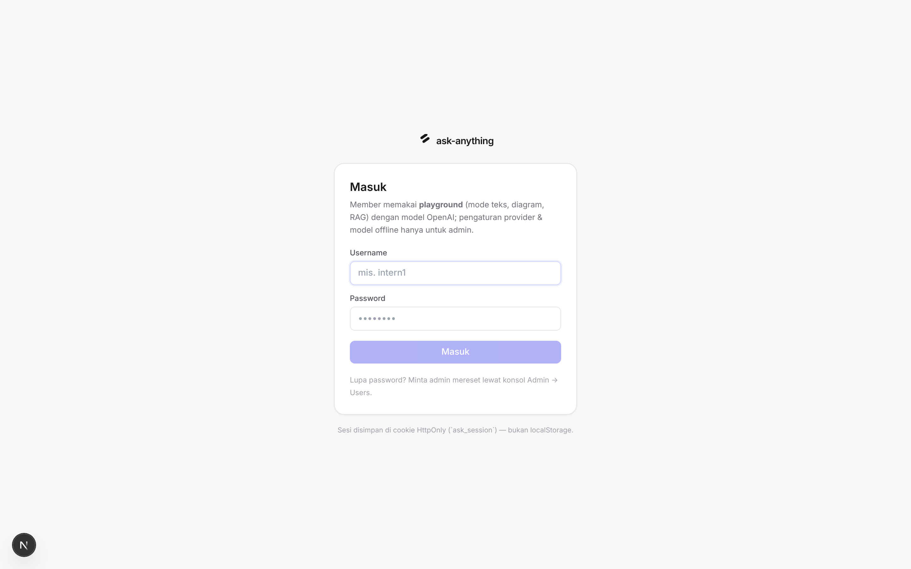

*Satu pintu masuk untuk admin maupun member. Salah password → pesan jelas,
percobaan beruntun dibatasi (`429`).*

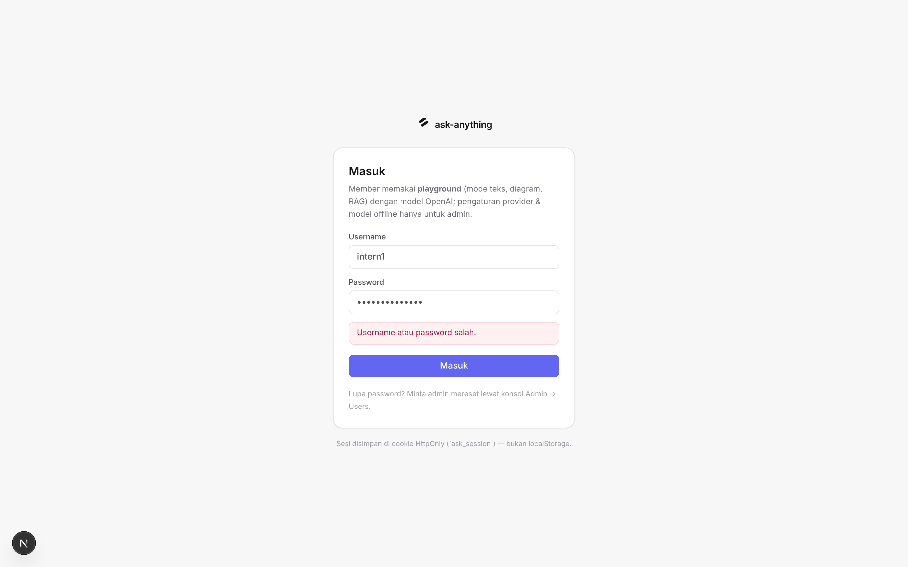

*Login gagal menampilkan sebabnya (password salah / akun nonaktif) tanpa
membocorkan informasi akun lain.*

### Akun awal

Akun peserta hasil seed berbentuk `intern1…intern3` dengan password `intern123`.
**Ganti password bawaan pada hari pertama.** Bila admin membuat akun untuk Anda
dengan opsi "wajib ganti password", aplikasi akan memaksa penggantian saat login
pertama.

### Ganti nama & password sendiri

Klik **Profil & password** di bawah sidebar. Nama tampilan bebas; ganti password
wajib mengisi password lama dan minimal 6 karakter. Setelah sukses, **semua sesi
lain milik akun Anda diputus**. Lupa password? Minta admin meresetnya — tidak ada
reset lewat email.

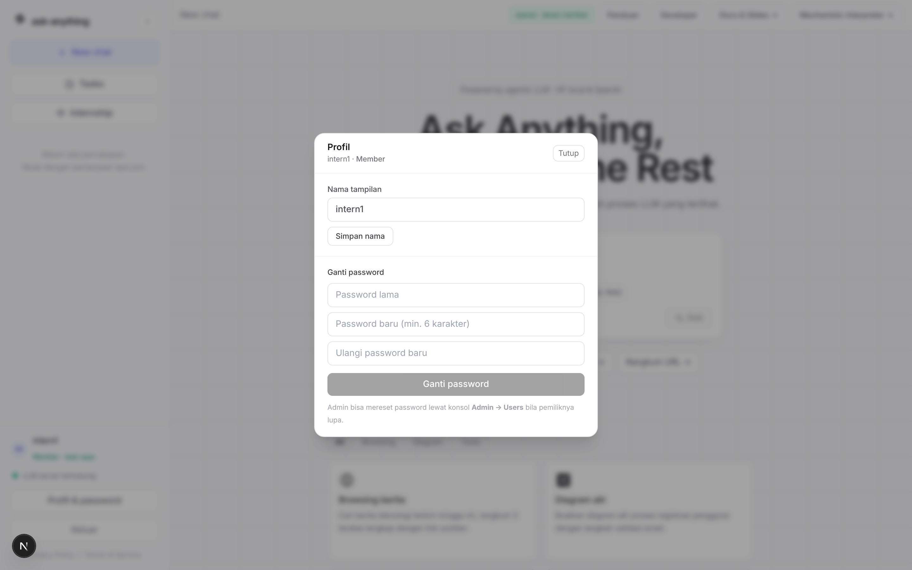

*Modal Profil: ubah nama tampilan dan ganti password (butuh password lama).*

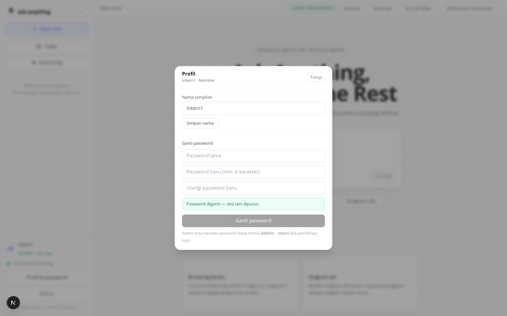

*Bukti sukses ganti password — sesi lain diputus supaya password baru
benar-benar berlaku.*

---

## 3. Mengenal layar playground

UI otomatis menyesuaikan peran Anda: badge `openai · akses member` di header
(provider dikunci policy), mode gambar/PPT/deep research tidak aktif, dan tombol
bawah sidebar menjadi **Profil & password** — bukan *Settings provider*.

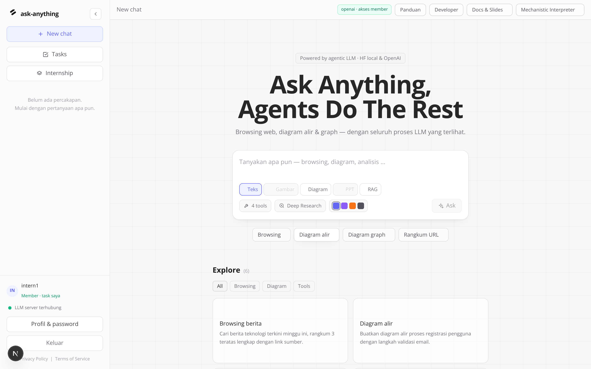

*Playground member: mode teks, diagram, dan RAG — label `openai` menandakan hanya
provider OpenAI yang dipakai.*

- **Navbar kiri** — bisa di-collapse jadi rail ikon (64 px) atau di-expand
  (268 px) lewat tombol `‹` atau `Ctrl/Cmd+B`. Berisi `New chat`, riwayat per
  tanggal, pintasan **Tasks** & **Internship**, dan indikator status LLM. Pilihan
  Anda tersimpan setelah refresh.
- **Header** — judul percakapan aktif, chip provider+model, tautan
  `Docs & Slides`, dan tombol `Mechanistic Interpreter →`.
- **Composer** — tempat menulis pertanyaan; kirim dengan `Enter`
  (`Shift+Enter` untuk baris baru). Baris bawahnya memuat pemilih mode, badge
  jumlah tool aktif, dan empat titik aksen warna.
- **Chip contoh & galeri Explore** — klik untuk mengisi composer dengan prompt
  siap pakai per kategori.

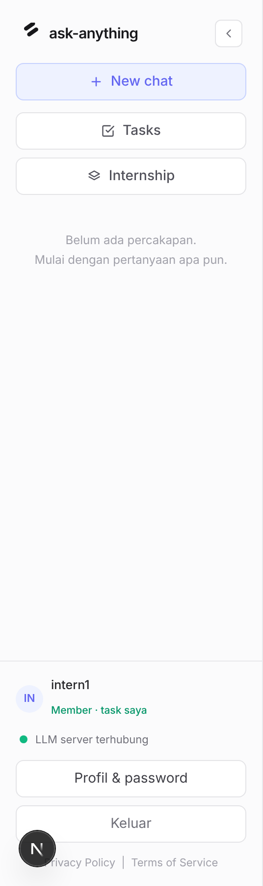

*Sidebar member: identitas (`intern1 · Member · task saya`), status LLM,
Profil & password, dan Keluar.*

---

## 4. Chat pertama Anda

1. Klik chip contoh (mis. `Diagram alir →`) atau ketik pertanyaan sendiri.
2. Periksa baris bawah composer: badge `tools` menunjukkan tool yang aktif untuk
   agent.
3. Tekan `Enter`. Tombol berubah menjadi `Thinking…` selama agent bekerja.
4. Jawaban muncul bertahap (streaming), dan panel Mechanistic Interpreter
   merekam prosesnya.


*Composer terisi prompt contoh setelah klik chip. Badge tools = `web_search`,
`fetch_url`, `create_diagram`, `calculator`.*


*Hasil permintaan diagram: chip tool `create_diagram ✓`, jawaban teks, diagram
yang dirender live sebagai graph interaktif, dan panel Interpreter yang merekam
seluruh event.*

---

## 5. Membaca jawaban agent

Satu balasan agent bisa memuat beberapa lapisan informasi:

| Elemen UI | Artinya |
| --- | --- |
| `💭 kotak thinking` | Reasoning mentah model sebelum memutuskan langkah (muncul saat streaming). |
| Chip tool + lencana asal, mis. `🔀 create_diagram · Tool diagram` | Agent memanggil tool itu. Lencana menyatakan asalnya: 🌐 Browser (bukti web, wajib disitasi), 🔀 Tool diagram (konten dibuat alat, bukan sumber), 🧮 Kalkulator. |
| Marker sitasi `[1]` + bar `Sitasi` | Setiap klaim dari browser menaut ke sumber bernomor; bar di bawah jawaban mendaftar URL, tool asal, dan status dikutip. |
| Kartu `graph interaktif` | Diagram dirender sebagai graph HTML: zoom, pan, drag node; toggle ke mode Mermaid tersedia. |

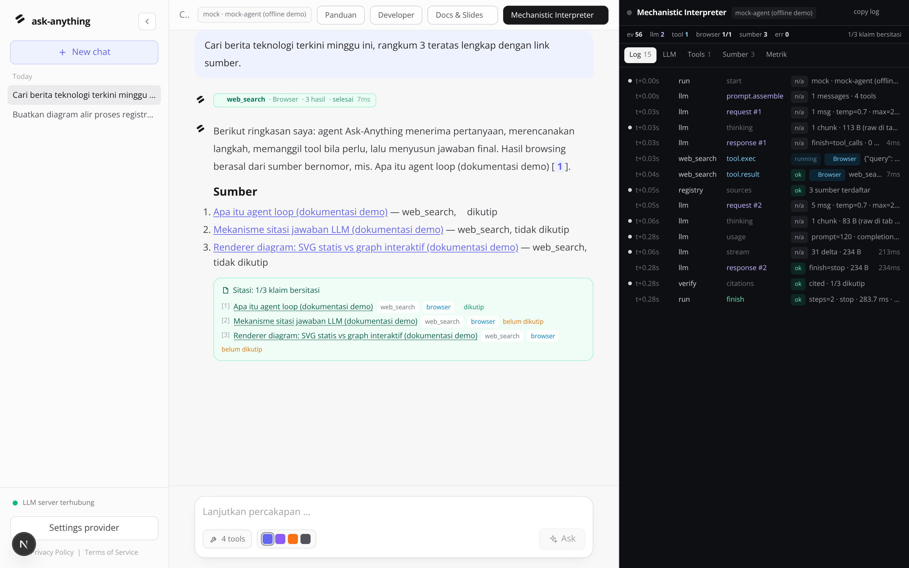

*Satu run browsing: chip `web_search · Browser`, marker `[1]` yang bisa diklik,
daftar Sumber, dan bar Sitasi.*

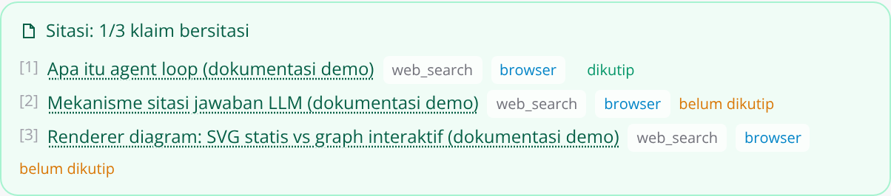

*Bar Sitasi: nomor, judul tertaut URL, tool asal, lencana browser, status dikutip
per sumber.*


*Tool `calculator`: ekspresi dikirim ke tool, hasilnya dikutip agent di jawaban
final (lencana 🧮, bukan bukti web).*

Bila jaringan gagal, error **tidak** mematikan percakapan: status error diberikan
ke model sebagai data, dan model menjawab jujur menyebutkan kegagalannya — bukan
mengarang sumber.


*Graceful degradation: `web_search` gagal (lingkungan offline), error tampil
sebagai `tool_result`, agent tetap merangkum dengan menyebut keterbatasannya.*

---

## 6. Menelusuri proses dengan Interpreter

Panel kanan (tombol `Mechanistic Interpreter →`) adalah alat belajar paling
berguna bagi peserta: semua yang dilakukan LLM & agent terekam per-event dan bisa
direplay dari riwayat.

| Tab | Isi | Kapan dipakai |
| --- | --- | --- |
| **Log** | Satu baris per langkah: `t+` relatif, actor, aksi, status, lencana provenance, durasi. Tiap baris bisa dibuka jadi JSON mentah. | Melihat urutan eksekusi & mencari langkah yang lambat atau gagal. |
| **LLM** | Blackbox per langkah: messages persis yang dikirim, schema tools, raw completion, `tool_calls`, `finish_reason`. | Memahami apa yang sebenarnya diterima dan dikeluarkan model. |
| **Tools** | Tiap pemanggilan: argumen JSON dari model, payload hasil mentah, ok/error, durasi. | Mengecek tool benar-benar dijalankan, bukan sekadar disebut. |
| **Sumber** | Tabel sitasi bernomor: asal, judul/URL, status dikutip, hasil verifikasi. | Memastikan klaim punya dasar yang bisa diklik. |
| **Metrik** | Provider/model, temperature, steps, latensi, token usage, jumlah tool/error. | Mengukur biaya & performa — relevan untuk task kuota token. |

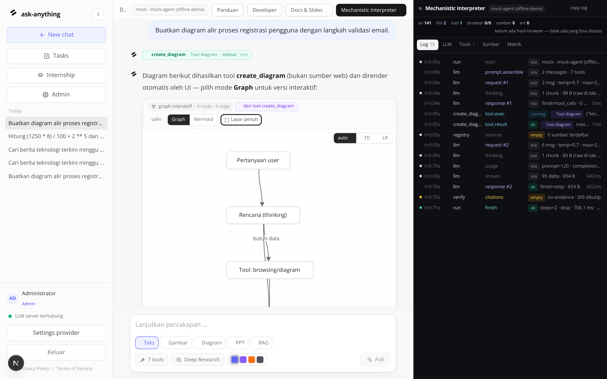

*Tab Log: setiap langkah satu baris — timestamp relatif, actor, aksi, status,
provenance, durasi.*


*Tab LLM: system prompt, messages persis yang diterima model, raw completion, dan
`tool_calls` yang diminta.*


*Tab Metrik: angka mentah run — provider, model, temperature, steps, latensi,
usage.*

---

## 7. Riwayat percakapan

Setiap percakapan tersimpan otomatis beserta seluruh trace event-nya. Klik judul
di sidebar untuk membuka kembali pesan **dan** replay Interpreter-nya. Percakapan
hanya bisa dibuka pemiliknya — pembatasan ditegakkan server.


*Riwayat dikelompokkan per tanggal (Today / Yesterday / …) dan indikator status
LLM.*

---

## 8. Papan task Anda

Papan dibuka di trek **Internship** (id `INT-NNN`) dan hanya memuat task yang
ditugaskan kepada Anda — badan papan menampilkan penanda **"menampilkan task
untuk Anda"**. Filter yang sama berlaku di API (`tasks_scope=assigned`), jadi
task orang lain tidak bisa ditarik lewat request manual.

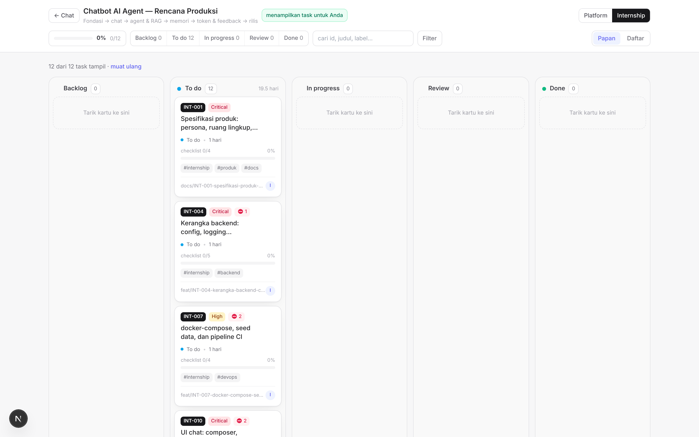

*Papan versi member: hanya task yang ditugaskan ke akun tersebut, lengkap dengan
badge cakupan.*

### Cara membaca kartu

- **Id task** (mis. `INT-014`) — sekaligus dasar nama branch git.
- **Chip prioritas** dan, bila ada, lencana **⛔ n** = jumlah task yang harus
  selesai lebih dulu. Kartu terkunci sampai dependensinya *Done*.
- **checklist 0/4** + bar progres — kriteria penerimaan yang harus dicentang.
- **Label** (`#internship`, `#backend`, …) untuk menyaring cepat.
- **Estimasi** dalam hari, dan inisial assignee di pojok.

---

## 9. Membaca detail task

Klik kartu mana pun untuk membuka panel detail. Panel ini **bertab** supaya
isinya yang padat tidak menumpuk jadi satu dinding teks:

| Tab | Isi | Gunanya |
| --- | --- | --- |
| **Ringkasan** | Deskripsi, kriteria penerimaan (checklist), dependensi, estimasi, label, dan perintah branch siap salin. | Menjawab "apa yang harus jadi" — checklist inilah kontrak task. |
| **Workflow** | Langkah bernomor: siapa aktornya (Intern / Pembimbing / Reviewer), apa aksinya, dan hasil yang diharapkan. | Menjawab "bagaimana urutan mengerjakannya". |
| **Wireframe** | Sketsa ASCII layar/berkas yang harus dihasilkan. | Menjawab "seperti apa bentuk hasilnya" sebelum menulis kode. |
| **Aktivitas** | Komentar & jejak perubahan status. | Melapor progres dan mencatat keputusan. |

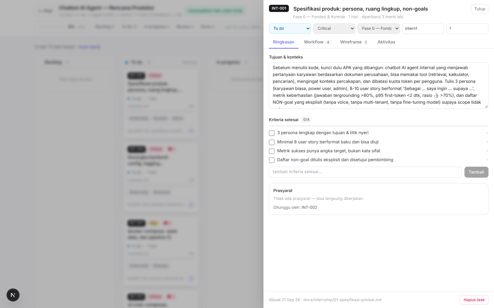

*Tab Ringkasan: deskripsi, checklist kriteria penerimaan, dan metadata task.*

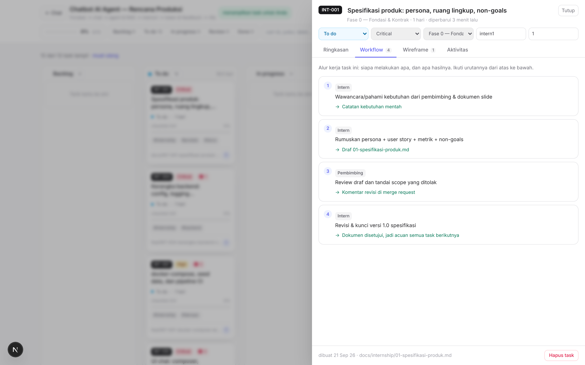

*Tab Workflow: langkah bernomor dengan aktor dan hasil yang diharapkan. Badge di
tab menunjukkan jumlah langkah.*

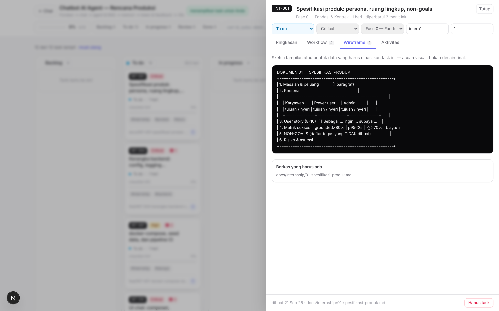

*Tab Wireframe: sketsa ASCII bentuk keluaran task — layar, dokumen, atau struktur
berkas.*

### Apa yang boleh Anda ubah

| Bagian task | Member | Admin |
| --- | --- | --- |
| Status (Backlog → To do → In progress → Review → Done) | boleh | boleh |
| Checklist kriteria penerimaan | boleh centang | boleh |
| Komentar (catatan progres, link bukti) | boleh | boleh |
| Prioritas, fase, estimasi, assignee, deskripsi | terkunci | boleh |
| Hapus task | tidak | boleh |

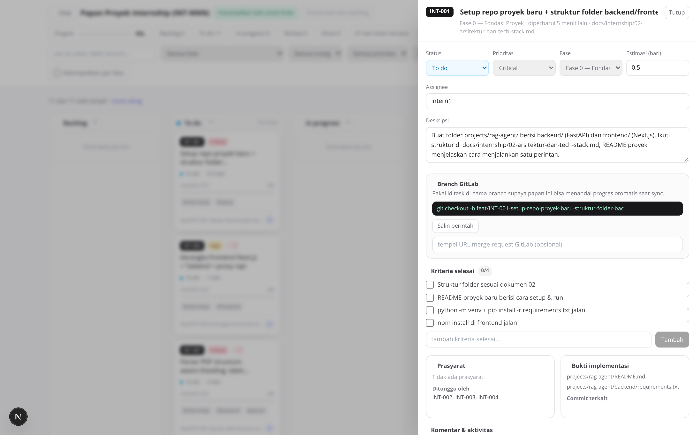

*Detail task bagi member: status, checklist, dan komentar terbuka;
penugasan/prioritas/fase/hapus terkunci.*

---

## 10. Alur kerja harian

1. Ambil task *To do* milik Anda yang **tidak terkunci dependensi**.
2. Baca ketiga tab sampai jelas: Ringkasan (kontrak) → Workflow (urutan) →
   Wireframe (bentuk hasil). Bila masih ambigu, tanyakan di komentar *sebelum*
   menulis kode.
3. Salin perintah branch dari panel detail dan buat branch-nya.
4. Pindahkan status ke *In progress* dan tulis komentar untuk setiap keputusan
   penting.
5. Centang kriteria penerimaan satu per satu sambil mengerjakan — bukan sekaligus
   di akhir.
6. Buka PR/MR, tempel tautannya di komentar, pindahkan ke *Review*.
7. Setelah lolos review dan seluruh checklist tercentang → *Done*.

```bash
# contoh: task INT-014
git checkout main && git pull
git checkout -b int-014-tool-registry
# ... kerjakan sesuai tab Workflow ...
git add -A && git commit -m "INT-014: tool registry + skema argumen"
git push -u origin int-014-tool-registry
```

> Tulis pesan commit berawalan id task (`INT-014: …`). Papan mencocokkan commit ke
> task lewat awalan itu, sehingga jejak kerja Anda muncul otomatis di tab
> Aktivitas.

---

## 11. Halaman /internship & materi

Halaman `/internship` adalah rumah proyek Anda: progres per sprint, task milik
Anda, dan kartu **Materi & slide**. Kartu materi membaca dokumen langsung dari
repo (folder `docs/internship/`), jadi yang tampil selalu versi terbaru.

Mulai dari `00-panduan-kerja.md` (cara bekerja), lalu `01-template-prd.md`
(pekerjaan Sprint 0), `02-arsitektur-prototipe.md` (stack yang sudah dikunci),
`03-rencana-sprint.md` (seluruh task per sprint), dan `04-definition-of-done.md`
(kapan sebuah task boleh disebut selesai).

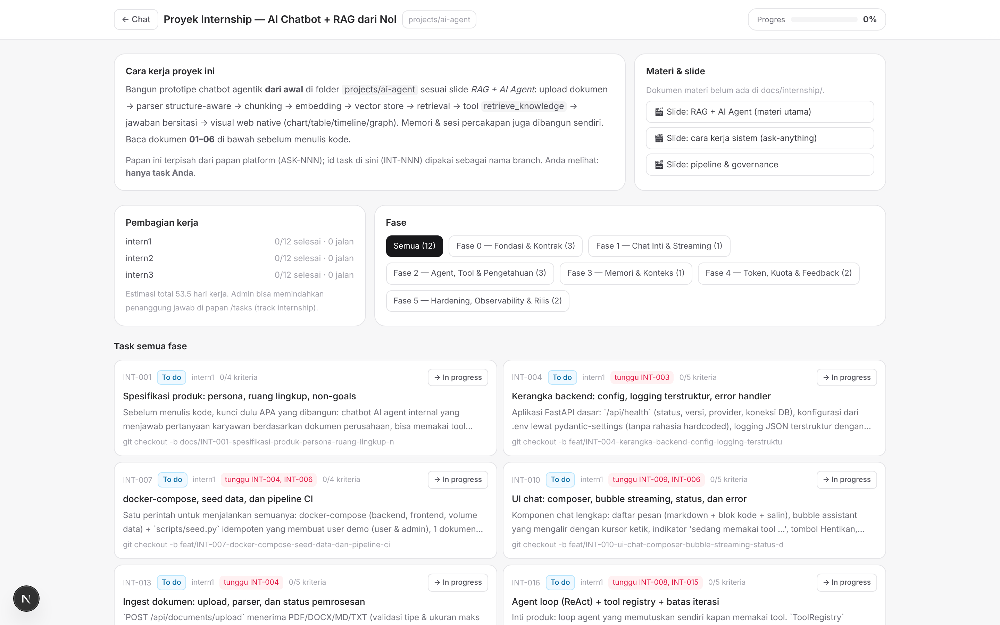

*Versi member: hanya task `INT-NNN` miliknya, dengan aksi cepat memindahkan
status dan membaca materi.*

Sebelum menulis kode, baca slide `slides-rag-agent.html` dan
`slides-cara-kerja.html`. Keduanya menjelaskan konsep yang dipakai task fase awal.


*Slide interaktif "cara kerja agent" — navigasi dengan `←` / `→`.*

---

## 12. Tips prompt yang efektif

- Sebutkan kata kunci kemampuan: `cari/berita` memicu browsing,
  `diagram/alur/graph/mindmap` memicu pembuatan diagram, `hitung` memicu
  calculator.
- Minta sumber: "lengkap dengan link sumber" membuat agent menyertakan URL hasil
  search.
- Untuk diagram relasi, sebutkan node-nya: "graph relasi antar microservice:
  gateway, auth, billing…".
- Gabungkan: "Jelaskan cara kerja DNS lalu buat diagram alurnya" — penjelasan +
  visual dalam satu run.
- Lanjutkan percakapan untuk memperbaiki diagram: riwayat dikirim sebagai konteks
  langkah berikutnya.

---

## 13. Batas akses member

Hal-hal berikut sengaja ditolak server dengan `403`. Bila sebuah task memang
membutuhkannya, minta admin membuka izinnya di Pipeline → Akses per peran.

- Mode **gambar**, **PPT**, dan **deep research** pada composer.
- Tool `generate_image` dan `generate_ppt`.
- Upload dokumen ke indeks RAG (memakai indeks yang ada tetap boleh).
- Settings provider, serta mengunduh/memuat model offline.
- Konsol `/admin` dan papan task penuh (kedua trek, semua assignee).
- Membuat, menghapus, atau menugaskan task.

---

## 14. Troubleshooting

| Gejala | Penyebab umum | Solusi |
| --- | --- | --- |
| Papan task saya kosong | Belum ada task yang ditugaskan ke akun Anda. | Minta admin menetapkan Assignee pada task yang relevan. |
| Kartu task tidak bisa dipindahkan | Dependensinya belum *Done* (lencana ⛔ pada kartu). | Selesaikan task prasyarat lebih dulu, atau diskusikan urutannya dengan pembimbing. |
| Tab Workflow / Wireframe kosong | Task itu memang belum punya rincian tersebut. | Minta pembimbing melengkapinya sebelum Anda mulai — jangan menebak. |
| `403` saat mengubah provider atau mode gambar | Role member dibatasi policy (bukan bug). | Lihat [bab 13](#13-batas-akses-member); minta admin bila tugas memang membutuhkannya. |
| Selalu diarahkan ke `/login` | Sesi kedaluwarsa atau cookie diblokir. | Masuk ulang; pastikan cookie pihak pertama tidak diblokir browser. |
| Indikator sidebar merah "LLM server offline" | Endpoint provider tidak terjangkau. | Laporkan ke admin — member tidak bisa mengubah settings provider. |
| Tool `web_search` berstatus error | Tidak ada akses internet dari server. | Normal di lingkungan offline; agent tetap menjawab dengan menyebut error. |
| Diagram tidak muncul | Model tidak menghasilkan Mermaid yang valid. | Ulangi dengan prompt eksplisit "diagram alir"; mode Graph tetap merender bagian yang terbaca. |

---

Kembali ke [PANDUAN-PENGGUNA.md](PANDUAN-PENGGUNA.md) ·
Panduan pengelola: [PANDUAN-ADMIN.md](PANDUAN-ADMIN.md)
