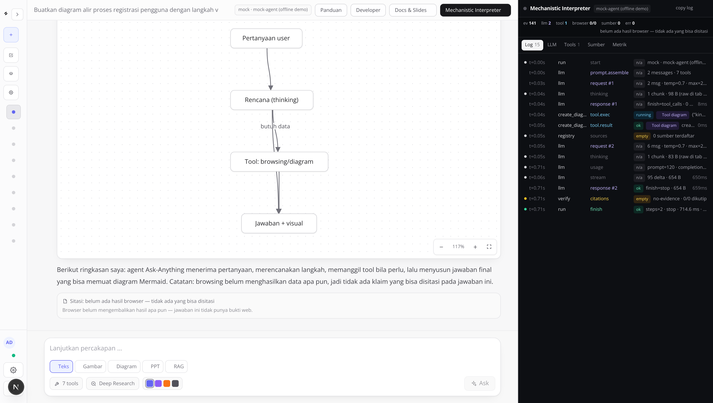
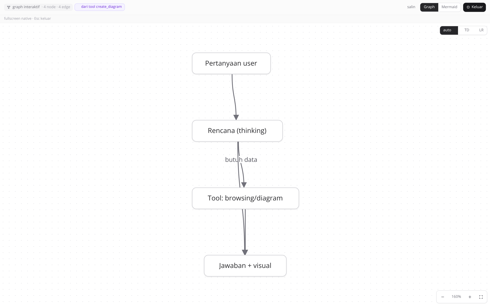
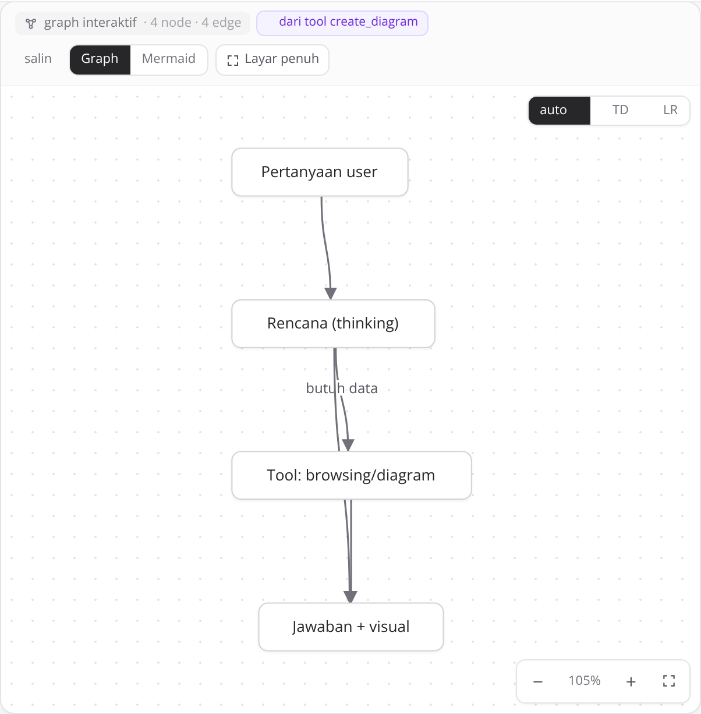
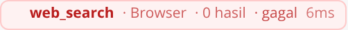

# Panduan Pengguna — Ask Anything

> Tata cara lengkap memakai **Ask Anything**: masuk dengan akun **admin** atau
> **member**, chat AI agentic dengan browsing, diagram, kalkulasi, panel
> **Mechanistic Interpreter** yang memperlihatkan seluruh proses LLM, sampai
> **mengerjakan task** di papan platform (`ASK-NNN`) maupun papan proyek
> internship (`INT-NNN`). Semua gambar di dokumen ini adalah **screenshot
> aplikasi sungguhan** yang diambil otomatis oleh [`scripts/capture_screenshots.py`](../scripts/capture_screenshots.py)
> (Playwright/Chromium) dari stack yang berjalan — bukan mockup.
>
> Versi interaktif halaman ini tersedia di dalam aplikasi: **`/panduan`**.

---

## Daftar isi

1. [Mulai dalam 1 menit](#1-mulai-dalam-1-menit)
2. [Masuk ke aplikasi: login & dua peran](#2-masuk-ke-aplikasi-login--dua-peran)
3. [Mengenal layar utama](#3-mengenal-layar-utama)
4. [Navbar collapsible & ruang chat lega](#4-navbar-collapsible--ruang-chat-lega)
5. [Chat pertama Anda](#5-chat-pertama-anda)
6. [Membaca jawaban agent: provenance & sitasi](#6-membaca-jawaban-agent-provenance--sitasi)
7. [Browsing & penanganan error](#7-browsing--penanganan-error)
8. [Mechanistic Interpreter](#8-mechanistic-interpreter)
9. [Riwayat percakapan](#9-riwayat-percakapan)
10. [Settings provider (khusus admin)](#10-settings-provider-khusus-admin)
11. [Tampilan, aksen & mobile](#11-tampilan-aksen--mobile)
12. [Mengerjakan task: papan platform & internship](#12-mengerjakan-task-papan-platform--internship)
13. [Proyek internship: chatbot + RAG dari nol](#13-proyek-internship-chatbot--rag-dari-nol)
14. [Konsol admin: akun, peran & governance](#14-konsol-admin-akun-peran--governance)
15. [Materi belajar lanjutan](#15-materi-belajar-lanjutan)
16. [Tips prompt yang efektif](#16-tips-prompt-yang-efektif)
17. [Troubleshooting](#17-troubleshooting)
18. [Data & privasi](#18-data--privasi)

---

## 1. Mulai dalam 1 menit

Ask Anything bukan chatbot biasa: ia **agent** yang bisa mencari di web,
membaca isi halaman, menghitung dengan aman, dan menggambar diagram
(flowchart / graph / mindmap) — sambil menyiarkan seluruh proses berpikirnya
ke panel Interpreter.

Prasyarat: **Python ≥ 3.10** dan **Node ≥ 18**. Sisanya diurus launcher.

```bash
# Linux / macOS
python3 run.py            # atau: ./run.sh

# Windows
run.bat

# Mode demo tanpa GPU / tanpa download model (LLM di-emulasi)
python3 run.py --demo

# Cari model di HuggingFace, lalu unduh + jadikan model aktif
python3 run.py --search qwen3
python3 run.py --model Qwen/Qwen3-1.7B
```

- UI: <http://localhost:3000> · Swagger API: <http://localhost:8000/docs>
- Launcher mencetak checklist dependensi (`python`, `node`, `npm`, backend,
  frontend) plus status keterjangkauan server LLM.
- Halaman dokumentasi in-app: `/panduan` (halaman ini) dan `/developer`
  (arsitektur & kontribusi).

> **Tidak punya server LLM lokal?** Klik tombol **“Pakai mode mock”** pada
> banner peringatan — seluruh fitur UI (termasuk Interpreter & diagram) tetap
> bisa dicoba secara offline dan deterministik.

## 2. Masuk ke aplikasi: login & dua peran

Ask Anything punya **dua peran** yang ditegakkan **di server** (bukan sekadar
disembunyikan di UI):

| Peran | Yang bisa dipakai | Yang ditolak (403) |
| --- | --- | --- |
| **admin** | Semua mode (teks, gambar, diagram, PPT, RAG, deep research), semua tool, **settings provider & model offline**, seluruh papan task, konsol `/admin` | — |
| **member** (peserta internship) | Playground **teks, diagram, RAG** dengan provider **OpenAI**; **task yang ditugaskan kepadanya** (boleh ubah status & komentar) | mode gambar/PPT/deep research, `generate_image`/`generate_ppt`, upload dokumen RAG, settings provider, unduh/muat **model offline**, konsol admin, papan penuh |

### 2.1 Halaman login

Buka <http://localhost:3000> — bila belum ada sesi, Anda langsung diarahkan ke
`/login` (bukan layar error). Halaman inilah pintu masuk satu-satunya.


- Setelah login, Anda dikembalikan ke halaman yang tadi dituju (`?next=…`),
  jadi membuka `/tasks` langsung tetap bekerja.
- Sesi disimpan sebagai **cookie HttpOnly** `ask_session` — tidak ada token di
  localStorage, sehingga skrip halaman tidak bisa mencurinya.
- Salah password, akun nonaktif, atau percobaan beruntun → pesan yang jelas,
  dan percobaan berulang dibatasi (HTTP 429).


### 2.2 Akun hasil seed

Saat pertama kali dijalankan, backend membuat akun awal otomatis
(`app/users.ensure_seed_users`) dan mencetak ringkasannya di log:

```text
[auth] akun awal dibuat: admin (admin), intern1 (member), intern2 (member),
       intern3 (member) — ganti password di Profil / Admin → Users
```

| Akun | Password awal | Peran |
| --- | --- | --- |
| `admin` | `admin123` | admin |
| `intern1` … `intern3` | `intern123` | member |

Nilai ini bisa diubah lewat env `ASK_ADMIN_PASSWORD`, `ASK_SEED_MEMBERS`,
`ASK_MEMBER_PASSWORD`. **Ganti password bawaan sebelum dipakai bersama.**

### 2.3 Playground versi member

Setelah masuk sebagai member, UI otomatis menyesuaikan: badge **`openai · akses
member`** di header (provider dikunci policy), chip mode gambar/PPT/deep
research tidak aktif, dan tombol bawah berubah menjadi **Profil & password**
(tidak ada *Settings provider*).


Sidebar kanan bawah menunjukkan identitas & cakupan akses Anda — mis.
`intern1 · Member · task saya`. Bila Anda pemegang task, badge itu penanda bahwa
papan task hanya menampilkan **task untuk Anda**.


### 2.4 Ganti nama & password sendiri

Klik **Profil & password** di sidebar (member) atau ikon profil (admin).


1. **Nama tampilan** — bebas; hanya label, tidak mengubah username.
2. **Ganti password** — wajib mengisi password lama. Password baru minimal
   6 karakter dan harus sama pada kolom ulangi.
3. Setelah berhasil, **semua sesi lain milik akun itu diputus** supaya password
   baru benar-benar berlaku.


> Lupa password? Minta **admin** meresetnya di **Admin → Users** (lihat
> [bab 14](#14-konsol-admin-akun-peran--governance)). Tidak ada reset lewat email.

### 2.5 Mode tanpa login (demo/test)

Bila `ASK_AUTH_MODE=open`, backend tidak mewajibkan login: semua request
dianggap admin anonim, sehingga demo & test otomatis tidak perlu kredensial.
Halaman login tetap ada dan menampilkan akun contoh. Mode default adalah
`required` — jangan pakai `open` di deployment publik.

---

## 3. Mengenal layar utama


*Layar awal: sidebar riwayat (kiri), header status (atas), composer pertanyaan
(tengah), chip contoh prompt, dan galeri Explore.*

| Bagian | Fungsi |
|---|---|
| **Navbar kiri** | Bisa **di-collapse** jadi rail ikon (64px) atau **di-expand** (268px) lewat tombol `‹` di pojok atau `Ctrl/Cmd+B`. berisi `New chat`, riwayat berkelompok tanggal (`Today`, `Yesterday`, …), indikator status LLM (hijau/merah), dan `Settings provider`. Pilihan Anda tersimpan antar-sesi. |
| **Header** | Judul percakapan aktif, chip provider+model (mis. `huggingface · Qwen/Qwen3-1.7B`), tautan `Panduan`, `Developer`, `Docs & Slides`, dan tombol `Mechanistic Interpreter →`. |
| **Ruang chat** | Kolom percakapan **lebar** (sampai 1180px, minus padding) dan otomatis memanfaatkan ruang saat navbar di-collapse. |
| **Composer** | Kotak pertanyaan. Kirim dengan `Enter` atau tombol `Ask`; `Shift+Enter` untuk baris baru. Saat agent bekerja tombol menjadi `Thinking…`. |
| **Badge `4 tools`** | Daftar tool aktif: `web_search`, `fetch_url`, `create_diagram`, `calculator` (hover untuk tooltip). |
| **Chip contoh & Explore** | Prompt siap pakai per kategori (Browsing / Diagram / Tools); klik untuk mengisi composer. |


*Galeri Explore dengan tab kategori. Klik kartu untuk memakai promptnya.*

## 4. Navbar collapsible & ruang chat lega

Navbar kiri bisa diperkecil jadi **rail ikon 64px** atau dibuka penuh
**268px**. Ada tiga cara menoggle:

1. Tombol `‹` / `›` di pojok kanan-atas navbar;
2. Pintasan keyboard **`Ctrl+B`** (macOS: `Cmd+B`);
3. Lebar tersimpan otomatis, jadi pilihan Anda bertahan setelah refresh.


*Navbar collapsed: merek, `New chat`, riwayat sebagai titik (judul tetap terbaca
lewat tooltip saat kursor diarahkan, dan tetap bisa dipilih dengan keyboard),
indikator status LLM, dan Settings sebagai ikon. Kanvas diagram mengambil alih
ruang yang dilepaskan.*

Saat collapsed, seluruh lebar itu dikembalikan ke **ruang chat** — berguna untuk
diagram besar, tabel, dan panel Interpreter yang terbuka berdampingan.

| Layout | Kapan dipakai |
|---|---|
| Navbar expand + chat + Interpreter | Membaca log per langkah; tiga panel sekaligus muat di layar ≥1600px. |
| Navbar collapse + chat + Interpreter | Layar sedang/laptop: diagram & log tetap lebar. |
| Navbar collapse saja | Fokus membaca jawaban/kanban visual. |


*Ruang chat (max 1180px) dan Interpreter berdampingan; kartu diagram mengisi
seluruh kolom teks, tidak lagi dipotong kolom sempit.*


*Hal yang sama setelah `Ctrl+B`: kolom chat & kanvas melebar ~200px.*

### 3.1 Kanvas visualisasi: lebar & layar penuh

Kartu diagram memakai tinggi fleksibel `min(66vh, 620px)` (minimum 380px) dan
bisa dilayarkan penuh:

| Kontrol | Fungsi |
|---|---|
| **Layar penuh** (pojok kanan-atas kartu) | Kanvas jadi fullscreen. `Esc` atau tombol **Keluar** untuk kembali. |
| **Graph / Mermaid** | Renderer interaktif (tahan sumber rusak) vs renderer Mermaid asli. Preferensi tersimpan global. |
| `↓ TD` / `→ LR` | Arah layout graph. |
| `−` / `%` / `+` / pas-ke-layar | Zoom; dobel-klik latar juga memicu fit. |
| Drag node / drag latar | Atur posisi / geser kanvas. Scroll = zoom. |


*Mode layar penuh. Strip “fullscreen native · Esc keluar” menandakan Fullscreen
API asli dipakai. Bila browser menolaknya (mis. aplikasi dibuka di dalam iframe
tanpa izin), kartu otomatis pindah ke **focus mode** — overlay `fixed inset-0`
yang terlihat sama, dan strip itu menyebutkan alasannya, bukan diam-diam gagal.*

Kanvas juga men-*refit* otomatis saat kartunya berubah ukuran (navbar
di-collapse, panel di-drag, layar diputar), jadi diagram tidak tertinggal
sekecil ukuran awal.

## 5. Chat pertama Anda

1. Klik chip contoh (mis. `Diagram alir →`) atau ketik pertanyaan sendiri.
2. Periksa badge `4 tools` dan pilihan aksen warna di baris bawah composer.
3. Tekan `Enter` / `Ask`. Tombol berubah menjadi `Thinking…`.
4. Jawaban mengalir bertahap (streaming); panel **Mechanistic Interpreter**
   otomatis terbuka di kanan memperlihatkan prosesnya.


*Composer terisi prompt contoh setelah klik chip.*


*Satu run lengkap: chip tool `create_diagram · Tool diagram`, jawaban teks,
diagram yang dirender live di kartu berprofil tinggi, dan Interpreter (kanan)
yang merekam semua event sebagai baris log.*

## 6. Membaca jawaban agent: provenance & sitasi

Setiap keluaran agent diberi **lencana asal** supaya jelas mana bukti eksternal
dan mana konten buatan tool:

| Lencana | Tool | Artinya |
|---|---|---|
| 🌐 **Browser** | `web_search`, `fetch_url` | Diambil langsung dari web. **Wajib disitasi** — tiap URL masuk registri sumber bernomor. |
| 🔀 **Tool diagram** | `create_diagram` | Struktur dibuat model, sintaks Mermaid dibangkitkan backend secara deterministik. **Bukan** sumber web, jadi tidak bisa disitasi sebagai bukti. |
| 🧮 **Kalkulator** | `calculator` | Aritmetika lokal yang bisa diverifikasi ulang. Tidak butuh sitasi. |


*Kartu diagram menampilkan “dari tool create_diagram”. Bila sumber Mermaid
ditulis model langsung di dalam jawaban (bukan lewat tool), lencana berubah
menjadi “ditulis model di jawaban” — keduanya jujur menyebut bahwa itu bukan
bukti eksternal.*

Diagram dari tool muncul **dari payload tool**, bukan dari teks jawaban: kartu
tetap tampil walaupun model hanya menulis “sudah saya buatkan”. Kalau model
memang menyalin sumber Mermaid ke jawabannya, kartunya tidak dirender dua kali.

Kanvas diagram dibuat proporsional: kartunya setinggi `clamp(420px, 68vh,
760px)` dan kanvas memakai seluruh ruang yang tersisa — bukan lagi kanvas
sempit yang berbagi baris dengan tombol-tombol. Arah layoutnya **auto**
(memilih atas→bawah atau kiri→kanan sesuai bentuk kanvas, bisa dikunci lewat
tombol `↓ TD` / `→ LR`); bila diagram terlalu besar untuk ditampilkan utuh
dengan teks yang terbaca, kanvas diperbesar sampai batas baca dan menampilkan
penanda “diperbesar agar terbaca · geser” (geser/zoom tetap bisa dipakai).

*Klik **Layar penuh** pada kartu diagram untuk kanvas seluas layar — berguna
untuk diagram besar.*

### 5.1 Sitasi: wajib, dan bisa diklik

Setelah tool browser mengembalikan hasil, backend menyusun daftar sumber
bernomor dan mengumpankannya ke model; model menulis `[n]` tepat setelah
kalimat yang dibuktikannya. Angka itu lalu **diverifikasi**:

- `[1]` di jawaban jadi chip superscript yang tertaut ke URL sumbernya — sudah
  tertaut **selama jawaban mengalir**, begitu tool browser mendaftarkan
  sumbernya (dulu baru tertaut setelah run selesai);
- sebuah bar **Sitasi** di bawah jawaban mendaftar tiap sumber + status
  (`✓ dikutip` / `belum dikutip`) + dari tool mana ia datang;
- nomor yang tidak ada di daftar ditandai **merah** (“tidak valid”), bukan
  disembunyikan;
- kalau model lupa menyisipkan marker sama sekali, blok `## Sumber`
  **ditambahkan otomatis** supaya jawaban tetap dapat diperiksa, dan statusnya
  dilaporkan sebagai `appended`.


*Satu run browsing: chip `web_search · Browser`, jawaban dengan marker `[1]`
yang bisa diklik, daftar `## Sumber`, dan bar Sitasi “1/3 klaim bersitasi”
dengan status kutipan per sumber. Panel kanan memperlihatkan `sumber 3` dan
`citations → cited · 1/3 dikutip`.*


*Detail bar Sitasi: nomor, judul (talian ke URL), tool asal, lencana `browser`,
dan status dikutip.*

> **Jujur soal keterbatasan.** Bila browsing tidak menghasilkan apa pun, agent
> tidak mengarang sitasi. UI menampilkan `Browser · 0 hasil — belum ada data`
> dan bar Sitasi berbunyi “belum ada hasil browser — tidak ada yang bisa
> disitasi”. Lihat §6.

### 5.2 Mode diagram: Graph interaktif vs Mermaid

Setiap kartu diagram punya dua mode render (preferensi tersimpan otomatis di
browser):

| Mode | Perilaku |
|---|---|
| **Graph** (default) | Sumber Mermaid diterjemahkan menjadi komponen HTML: node adalah elemen asli yang bisa **diklik** (menyorot relasi + panel detail), **di-drag** untuk menata ulang, latar bisa di-**drag** (pan) dan di-**scroll** (zoom), tombol `− / + / fit`, serta toggle arah layout `↓ TD` / `→ LR`. Parser bersifat toleran: baris Mermaid yang rusak dilewati dan dicatat sebagai badge “N baris dilewati”, bukan error seluruh diagram. |
| **Mermaid** | Renderer Mermaid asli (SVG statis). Bila sumber rusak dan Mermaid gagal, muncul banner kuning dengan tombol **“Pakai mode Graph”** sebagai fallback satu klik. |

Interaksi cepat mode Graph: klik node = lihat relasi masuk/keluar (klik chip
relasi untuk lompat ke node tersebut); klik latar / `Esc` = tutup panel;
dobel-klik latar = pas-ke-layar; keyboard: `Tab` berpindah node, `Enter`
memilih.


*Tool `calculator`: ekspresi dikirim sebagai argumen tool, hasilnya dikutip
agent pada jawaban final.*

## 7. Browsing & penanganan error

Untuk informasi terkini agent memanggil `web_search` (DuckDuckGo lite tanpa
API key; Serper/Tavily opsional via env), dan dapat melanjutkan dengan
`fetch_url` untuk membaca satu halaman penuh (teks diekstrak, ≤ 12k karakter).

`web_search` tidak berhenti pada satu endpoint: bila endpoint utama kosong atau
menjawab dengan halaman anti-bot, ia mencoba endpoint DuckDuckGo berikutnya, dan
tautan hasil lewat `duckduckgo.com/l/?uddg=…` dibuka menjadi URL halaman asli
supaya sitasi tidak menunjuk tautan pelacak.

Ada **empat** hasil yang mungkin, dan semuanya ditampilkan apa adanya:

| Hasil | Ditampilkan sebagai | Sitasi |
|---|---|---|
| Hasil ditemukan | `Browser · N hasil` (hijau) | URL terdaftar sebagai sumber bernomor; jawaban diharapkan menulis `[n]`. |
| Kosong (query tidak ketemu) | `Browser · 0 hasil — belum ada data` (kuning) | Tidak ada yang bisa disitasi; bar Sitasi mengatakannya. |
| Gagal (jaringan/endpoint mati) | chip merah `gagal` + catatan `note:no-results`/error di log | Agent menjawab hanya dari yang terverifikasi, tanpa mengarang sumber. |
| Diblokir (anti-bot/rate limit) | chip merah `gagal` + ringkasan menyebut endpointnya, `blocked: true` di payload | Tidak ada sumber; agent menyebut browsing tidak menghasilkan data. |


*Status “0 hasil — belum ada data” pada chip tool: bukan bubble kosong, bukan
pula jawaban berbunga-bunga.*


*Lingkungan tanpa akses internet: `web_search` gagal, error masuk ke stream
sebagai `tool_result`, dan agent tetap merangkum dengan menyebut kegagalannya —
pola graceful degradation yang sengaja dirancang.*

### 6.1 Mengarahkan pencarian ke gateway lain

`ASK_SEARCH_DDG_URL` (atau **Settings → POST /api/settings**) menentukan ke mana
`web_search` mengirim permintaan. Selain untuk gateway pencarian internal
/self-host, ini memungkinkan demo & uji end-to-end di mesin tanpa internet:

```bash
python3 scripts/fake_search_server.py --port 8099       # server demo lokal (data fiktif)
ASK_SEARCH_DDG_URL=http://127.0.0.1:8099/lite/ python3 run.py
```

> Screenshot alur “browsing + sitasi” di dokumen ini dibuat dengan **server demo
> tersebut** — kontennya fiktif. Yang difoto adalah perilaku sistem (registry
> sumber → `[n]` → verifikasi), bukan fakta dari web.

## 8. Mechanistic Interpreter

Panel kanan (tombol `Mechanistic Interpreter →`) merekam **semua** event satu
run, dan tersimpan di SQLite sehingga riwayat bisa di-**replay** penuh. Tujuannya
spesifik: **membuka blackbox** — bukan menjelaskan prosesnya dalam paragraf.
Karena itu isinya baris, tabel, dan payload mentah; panel bisa diseret tepi
kirinya untuk melebar (380–980px, tersimpan).

Strip di atas tab selalu menampilkan angka: `ev`, `llm`, `tool`,
`browser berhasil/total`, `sumber`, `err`, dan status sitasi.

| Tab | Isi | Kapan dipakai |
|---|---|---|
| **Log** *(default)* | Satu baris per langkah: `t+0.04s · create_diag… · tool.exec · running · Tool diagram · {"kin…` — lengkap dengan durasi, status (`ok` / `0 hasil` / `gagal`) dan lencana provenance. Delta & thinking **diringkas jadi hitungan** (mis. `89 delta · 625 B`), bukan ditempel sebagai teks. Baris bisa dibuka untuk JSON mentahnya. Ada tombol **copy log**. | Memeriksa urutan eksekusi & mencari langkah yang lambat/gagal. |
| **LLM** | Permintaan dan respons **mentah per langkah**: messages persis yang dikirim, schema tools, raw completion, chain-of-thought `<think>`, `tool_calls` yang diminta model, `finish_reason`, plus chip logprob per token bila provider mengirimnya. | Debug perilaku model; melihat apa yang sebenarnya keluar. |
| **Tools** | Per pemanggilan: argumen JSON dari model, payload hasil, `ok`/`error`/`0 hasil`, durasi, provenance, jumlah sumber yang terdaftar, dan catatan provider. | Memastikan tool benar-benar berjalan seperti yang tercatat. |
| **Sumber** | Tabel sitasi: nomor, asal (`browser` + tool), judul/URL, status dikutip, dan hasil verifikasi (`cited` / `appended` / `no-evidence`) + penanda nomor tak valid. | Memeriksa apakah klaim benar-benar punya dasar. |
| **Metrik** | Provider/model, temperature, max_tokens, steps terpakai, `stopped_reason`, latensi, token usage, jumlah tool/browser hit/sumber/error/notes. | Mengukur biaya & performa. |


*Tab Log: setiap langkah satu baris — timestamp relatif, actor, aksi, status,
provenance, detail teknis, durasi.*


*Satu baris dibuka: payload JSON mentah event itu, apa adanya.*


*Tab LLM: system prompt, messages persis yang diterima model, raw completion,
dan tool_calls yang diminta — sisi “blackbox” dari run yang sama.*


*Tab Sumber: registri sitasi bernomor + status verifikasi. Bila browser belum
menghasilkan apa pun, tab ini mengatakannya, bukan menampilkan tabel kosong.*


*Tab Tools (dinamai ulang dari “Tokens”; logprob kini tampil di tab LLM sebagai
chip per token).*


*Tab Metrik: angka mentah run — provider, model, temperature, steps, latensi, usage.*

## 9. Riwayat percakapan

Setiap percakapan tersimpan otomatis di SQLite lokal **beserta trace
event-nya**. Klik judul di sidebar untuk membuka kembali pesan *dan* replay
Interpreter-nya (Log/LLM/Tools/Sumber/Metrik tetap lengkap — trace
menyimpan event yang sama seperti saat run berlangsung).


*Riwayat dikelompokkan per tanggal; indikator “LLM server terhubung”; tombol
Settings provider di bawah.*

## 10. Settings provider (khusus admin)

Tombol `Settings provider` membuka dialog pemilihan LLM — berlaku runtime
tanpa restart:

| Provider | Kapan dipakai |
|---|---|
| `huggingface` | Model offline dari folder `models/` yang dijalankan **langsung di backend** (transformers, tanpa llama.cpp). Bila `hf_mode=server`, memakai server OpenAI-compatible yang Anda jalankan sendiri. |
| `openai` | API OpenAI / Azure / proxy kompatibel (isi API key & base URL). |
| `mock` | Demo offline deterministik untuk uji UI & dokumen ini. |


*Dialog settings: tab **Provider & endpoint**, tab **Model offline
(HuggingFace)**, dan slider temperature.*

Base URL boleh ditulis dalam bentuk apa pun yang Anda temukan di dokumentasi
API — termasuk URL endpoint lengkap dari contoh curl:

```
https://ai.sumopod.com/v1/chat/completions   →   https://ai.sumopod.com/v1
```

Aplikasi menormalkannya sendiri lalu menambahkan `/chat/completions`, jadi tidak
pernah terjadi 404 karena path ganda. Isikan **API key** (Bearer token) bila
gateway Anda memerlukannya; key yang sudah tersimpan hanya ditampilkan sebagai
`ran…oken`. Tombol **Hapus** di samping kolom key menghapus key yang tersimpan.

### 10.0 Memilih model dari daftar endpoint

Tombol **Muat model** di samping kolom Base URL memanggil
`GET <base>/models` dan mengisi **dropdown Model** — jadi Anda tidak perlu
mengingat/mengetik nama model:

- Sebagian server melaporkan model sebagai path file (`/models/x.gguf`);
  dropdown menampilkan nama pendeknya tetapi tetap mengirim id asli ke API.
- Bila endpoint tidak terjangkau atau menolak key, pesannya muncul di bawah
  kolom (mis. `API key ditolak (401)`) — bukan dropdown kosong tanpa sebab.
- Model yang sedang aktif tetapi tidak ada di daftar tetap dipertahankan, dan
  opsi **✎ Ketik nama model lain…** selalu tersedia untuk gateway yang tidak
  menyediakan `/models`.

### 10.0.1 Test koneksi — mengetahui penyebab error API

Tombol **Test koneksi** menjalankan tiga request sungguhan ke endpoint yang
sedang diisi: `GET /models`, chat **non-streaming** (bentuk persis contoh
`curl`), dan chat **streaming** (yang dipakai aplikasi). Hasilnya ditampilkan
per-request: status HTTP, latensi, cuplikan jawaban atau pesan server apa
adanya, plus petunjuk. Dengan itu “API error” tidak lagi misterius — key
ditolak (401), nama model tidak terdaftar, dan payload yang ditolak gateway
terlihat berbeda.

Langkah penyetelan lengkap tiap mode (lokal / OpenAI+gateway / mock) ada di
[`PENYESUAIAN-PROVIDER.md`](PENYESUAIAN-PROVIDER.md).

### 10.1 Model offline langsung dari HuggingFace

Tab **Model offline (HuggingFace)** mencari model **berdasarkan namanya** di
HuggingFace Hub — tidak ada katalog tetap, jadi model baru apa pun bisa dipakai:

1. **Cari** — ketik repo id lengkap (`deepseek-ai/DeepSeek-V4.1-Flash`) atau
   kata kunci (`qwen3`, `gemma`). Hasilnya menampilkan jumlah parameter,
   perkiraan ukuran, dan popularitas.
2. **Download** — file diunduh ke folder project `models/<organisasi>/<nama>/`
   dengan progress bar (persen, MiB, kecepatan, file ke-berapa). Boleh
   mengunduh **beberapa model sekaligus**; bila koneksi putus, klik **Download**
   lagi untuk melanjutkan (resume per file).
3. **Pakai & muat** — model menjadi model aktif **dan** dimuat ke memori proses
   backend. Tidak ada server tambahan yang perlu dijalankan.

**Model ter-load otomatis setiap (re)start.** Setelah model pernah dipakai,
backend memilihkan dan memuatnya sendiri saat dimulai ulang — tanpa perlu
klik lagi. Urutannya: (1) model aktif bila foldernya ada di `models/`,
(2) model terakhir yang dipakai — termasuk model yang di-load dari folder di
**luar** `models/` (disimpan di `models/.active.json`), (3) model terunduh
paling baru yang lengkap di `models/`.

Selama model dimuat ke memori, layar menampilkan **loading screen** yang
sesuai: banner biru “Model offline … sedang dimuat ke memori” di halaman
utama, kartu berdetik di tab Model offline, dan **chat yang dikirim saat itu
otomatis menunggu** sampai model siap — tidak gagal, tidak perlu diulang.

**Muat model dari folder mana pun.** Model sudah Anda download manual ke
lokasi lain (`huggingface-cli download … --local-dir ~/…`, git, zip)? Di tab
yang sama ada kolom **Muat model dari folder**: tempel jalan foldernya
(harus memuat `config.json`) → klik **Muat**. Model langsung terdaftar,
jadi aktif, dan ikut di-load otomatis pada restart berikutnya.

Kartu **Inference lokal (transformers)** di bagian bawah menampilkan status
engine: model yang termuat, device (cpu/cuda/mps), dtype, dan jumlah parameter,
plus tombol **Lepas dari memori**. Toggle **Thinking (reasoning)** meneruskan
`enable_thinking` ke chat template model.

Repo **gated/privat** (mis. DeepSeek) membutuhkan token: buka *Token
HuggingFace* di tab yang sama dan tempel token dari
`huggingface.co/settings/tokens`.

Butuh PyTorch + transformers sekali di awal:

```bash
python3 run.py --install-local          # pasang torch + transformers
python3 run.py --search qwen3           # cari model
python3 run.py --list-models            # yang sudah terunduh
python3 run.py --model Qwen/Qwen3-1.7B  # unduh + jadikan aktif + jalankan
```

Folder `models/` masuk `.gitignore` — bobot model tidak pernah ikut ter-commit.


*Bila model lokal belum dimuat (atau endpoint tidak terjangkau), banner kuning
muncul dengan tombol “Buka Settings” dan sekali-klik “Pakai mode mock”.*

## 11. Tampilan, aksen & mobile

Empat aksen warna (indigo, violet, orange, zinc) tersedia di composer — klik
titik warna untuk mengganti aksen seluruh UI seketika. Layout responsif sampai
layar ponsel (sidebar disembunyikan, composer tetap penuh).


*Aksen orange diterapkan ke tombol, chip, dan ring.*


*Tampilan mobile 390×844.*

## 12. Mengerjakan task: papan platform & internship

Papan task adalah tempat pekerjaan **direncanakan, diambil, dan ditutup**.
Ada **dua papan terpisah** dengan penomoran berbeda:

| Papan | Id task | Isi | Siapa yang melihat |
| --- | --- | --- | --- |
| **Platform** | `ASK-NNN` | rencana produk ask-anything (54 task) | admin semuanya; member hanya yang ditugaskan |
| **Internship** | `INT-NNN` | proyek chatbot + RAG dari nol (33 task, 6 fase) | idem — admin semuanya, member task-nya sendiri |

> Id task = **nama branch Git**. Contoh: `ASK-003` → branch `ask-003-…`,
> `INT-007` → `int-007-…`. Salin dari kartu task, jangan diketik ulang.

### 12.1 Membuka papan

Dari sidebar: **Tasks** (papan terpilih otomatis — member mendarat di
**Internship**, admin di **Platform**) atau **Internship** untuk papan proyek.
Alamat eksplisit: `/tasks?track=platform` dan `/tasks?track=internship`.


Bagi **member**, papan hanya berisi task yang ditugaskan kepadanya — ada badge
**“menampilkan task untuk Anda”** sebagai penanda. Ini juga ditegakkan server:
`GET /api/tasks` memfilter berdasarkan `assignee` Anda (`tasks_scope=assigned`),
jadi tidak ada task orang lain yang bisa diintip lewat API.


### 12.2 Detail task: apa yang boleh Anda ubah

Klik kartu task untuk membuka panel detail.


| Bagian | Member (peserta) | Admin |
| --- | --- | --- |
| **Status** (Backlog → To do → In progress → Review → Done) | ✅ boleh | ✅ |
| **Checklist kriteria penerimaan** | ✅ boleh centang | ✅ |
| **Komentar** (mis. catatan progres, link bukti) | ✅ boleh | ✅ |
| Prioritas, fase, estimasi, assignee, deskripsi | 🔒 terkunci | ✅ |
| Hapus task (`ASK-…`/`INT-…`) | ❌ | ✅ |

Checklist itulah kontrak sebuah task: sebuah task dinilai **selesai** bila
kriteria penerimaannya tercentang dan buktinya (branch/commit/PR) bisa
ditelusuri. Sinkronisasi branch & commit GitLab ada di tombol **⟳ Sync git**
(admin) — ia mencocokkan status task dengan branch/commit yang ada.

### 12.3 Alur kerja harian yang disarankan

1. **Ambil task** berstatus *To do* pada papan **Internship** dengan milik Anda.
2. Baca **Deskripsi** + **Kriteria penerimaan** sampai jelas; baca materi di
   [bab 13](#13-proyek-internship-chatbot--rag-dari-nol) bila menyangkut desain.
3. Buat branch dari id task (`git checkout -b int-007-…` — perintah siap salin
   ada di kartu/detail task).
4. Kerjakan, lalu **pindahkan status** ke *In progress*; tambahkan komentar
   berisi keputusan penting.
5. Buka PR/MR, minta review; pindahkan ke *Review*.
6. Setelah review lolos dan bukti tertaut: centang semua kriteria → *Done*.

---

## 13. Proyek internship: chatbot + RAG dari nol

Papan **Internship** adalah proyek nyata: membangun **prototipe chatbot
agentik + RAG dari awal** di folder `projects/rag-agent`, mengikuti slide
[`docs/slides-rag-agent.html`](slides-rag-agent.html). Bedanya dengan papan
platform: di proyek ini **kode ditulis dari nol oleh peserta**, bukan menambah
fitur ke aplikasi ini. Rencana kerjanya dipecah 6 fase:

| Fase | Fokus |
| --- | --- |
| `i0` | Fondasi & spesifikasi: ERD, kontrak API, pilihan stack |
| `i1` | Ingest dokumen: upload, parser structure-aware (PDF/DOCX/MD) |
| `i2` | RAG: chunking, embedding, vector store, rerank |
| `i3` | Tool & agent: `retrieve_knowledge`, sitasi `[n]`, "tidak tahu" jujur |
| `i4` | Visual & memori: chart/tabel/timeline native, memori sesi |
| `i5` | Polesan: evaluasi, dokumentasi, demo |


Halaman `/internship` merangkum semuanya dalam satu layar: **progres** keseluruhan,
**pembagian kerja per peserta**, filter **per fase**, daftar task, serta
**materi & slide** yang bisa dibuka langsung dari daftar dokumen (dibaca dari
backend, jadi selalu versi terbaru di repo).


Materi utama yang sudah ada: slide [`slides-rag-agent.html`](slides-rag-agent.html)
(tombol **🎬** di kartu *Materi & slide*) dan kartu-kartu **Materi** yang dibaca
backend dari folder `docs/internship/` — begitu tim menambahkan berkas
`01-spesifikasi-produk.md` … `06-panduan-kerja-dan-review.md` (spesifikasi
produk, arsitektur & tech stack, ERD & kontrak API, kriteria sukses & evaluasi,
rencana sprint, panduan kerja & review), daftarnya muncul otomatis di halaman
`/internship` tanpa perubahan kode. Sebelum menulis kode, pastikan Anda sudah
membacanya (bila berkasnya belum ada, tanyakan ke admin/dev lead).

---

## 14. Konsol admin: akun, peran & governance

Buka `/admin` (hanya role admin). Ada enam tab: **Ringkasan**, **Users**,
**Pipeline**, **Memori**, **Artifact**, **Feedback**.

### 14.1 Users — akun, peran, reset password


- **+ Akun baru** — buat akun member/admin dengan password awal; opsi *wajib
  ganti password* membuat pemiliknya harus menggantinya di Profil.
- **Kolom Task** — `selesai/total` task yang ditugaskan; berguna untuk
  menyeimbangkan beban antar peserta.
- **Reset password** — ganti password user kapan saja (mis. lupa). Semua sesi
  user itu **diputus**, jadi password baru langsung berlaku.


- **Nonaktifkan** — akun tidak bisa login (ditolak 401), tetapi riwayat &
  task-nya tetap ada. **Hapus** — permanen; hanya untuk akun yang salah dibuat.

### 14.2 Pipeline → Akses per peran

Bagian paling penting untuk mengatur apa yang boleh dilakukan **member**.


- **Provider chat** — `openai` berarti role itu **tidak pernah** memakai model
  offline; `auto` mengikuti setelan server.
- **Cakupan task** — `assigned` (hanya task untuk dirinya) atau `all`.
- **Toggle** — model offline, setelan provider, konsol admin, upload RAG, dan
  izin mengubah status/komentar task.
- **Mode & tool per peran** — mis. matikan mode gambar untuk member tanpa
  mengubah izin admin.

Aturan pentingnya: **gate global × gate peran** = izin efektif. Tombol
*Tanpa model offline* milik member tidak menolong admin; dan mematikan mode
global (tab Pipeline bagian lain) mematikan mode itu untuk **semua** peran.
Perubahan berlaku untuk run berikutnya **tanpa restart**.

---

## 15. Materi belajar lanjutan

- **Slide interaktif** “cara kerja agent”: tombol `Docs & Slides →` di header
  atau `/slides/slides-cara-kerja.html` (navigasi `←`/`→`).
- **Metodologi** lengkap: [`docs/METODOLOGI.md`](METODOLOGI.md).
- **Developer**: [`docs/PANDUAN-DEVELOPER.md`](PANDUAN-DEVELOPER.md) atau
  halaman in-app `/developer`.
- **Proyek internship** (chatbot + RAG dari nol): slide
  [`slides-rag-agent.html`](slides-rag-agent.html); dokumen kerja bertahap
  diletakkan di `docs/internship/` dan otomatis tampil di halaman
  `/internship` → kartu **Materi & slide**.
- **Papan task**: [`docs/TASK-MANAGEMENT.md`](TASK-MANAGEMENT.md) menjelaskan
  konvensi id task, branch, dan alur review.


*Slide interaktif disajikan backend di `/slides` dan diproxy frontend.*

## 16. Tips prompt yang efektif

- Sebutkan kata kunci kemampuan: `cari/berita` → browsing,
  `diagram/alur/graph/mindmap` → diagram, `hitung` → calculator.
- Minta sumber eksplisit: *“…lengkap dengan link sumber”*.
- Untuk graph relasi, sebutkan node: *“graph relasi antar microservice:
  gateway, auth, billing, catalog, notification”*.
- Gabungkan tugas: *“Jelaskan cara kerja DNS lalu buat diagram alurnya”*.
- Lanjutkan percakapan untuk merevisi diagram — riwayat dikirim sebagai
  konteks langkah berikutnya.

## 17. Troubleshooting

| Gejala | Penyebab umum | Solusi |
|---|---|---|
| Model sudah di-download tetapi “tidak bisa digunakan” | (a) PyTorch/transformers belum ter-install, (b) foldernya berada di luar `models/` (mis. hasil `huggingface-cli` ke cache), atau (c) unduhan belum lengkap (tidak ada `config.json`). | (a) `python3 run.py --install-local`. (b) Settings → Model offline → **Muat model dari folder** → tempel jalan foldernya (harus ada `config.json`). (c) Unduh ulang; periksa status **Inference lokal** di tab Model offline — pesan error-nya apa adanya. |
| Banner kuning “Belum ada model offline yang dimuat” | Provider `huggingface` mode lokal belum punya model. | Settings → Model offline → cari → **Download** → **Pakai & muat**. |
| Indikator sidebar merah “LLM server offline” | Base URL provider tidak reachable. | Periksa Settings provider → base URL, atau ganti provider. |
| Tool `web_search` berstatus error | Tidak ada akses internet dari backend. | Normal di lingkungan offline (graceful). Konfigurasi Serper/Tavily bila punya key. |
| Tab Tokens kosong | Provider tidak mengirim logprobs. | Pakai mode `openai`/server yang mendukung, atau mode mock. |
| “API error” tanpa penjelasan | Key salah, nama model tidak ada, atau payload ditolak gateway. | Settings → **Test koneksi**; status + pesan server ditampilkan per-request. |
| Diagram tidak muncul | Model tidak menghasilkan Mermaid valid. | Ulangi dengan prompt eksplisit “diagram alir”; validasi server-side akan menolak Mermaid rusak dan memberikannya kembali ke model. Mode **Graph** tetap merender bagian sumber yang terbaca; tombol “salin” di kartu memudahkan menempelkan sumber ke editor Mermaid eksternal. |
| UI tampil tapi tidak interaktif | Dev-server Next 16 memblokir resource cross-origin. | Tambahkan host ke `allowedDevOrigins` di `next.config.ts` (sudah disetel untuk 127.0.0.1 & *.e2b.app), lalu restart. |
| Selalu diarahkan ke `/login` | Belum ada sesi (mode `required`). | Login dengan akun seed; bila akun memang belum dibuat, cek log backend baris `[auth] akun awal dibuat`. |
| Layar “Backend tidak bisa dihubungi” saat belum login | Versi lama frontend menampilkan error untuk HTTP 401. | Perbarui frontend — sekarang 401 dialihkan ke `/login`, bukan dianggap backend mati. |
| Login ditolak padahal password benar | Akun **nonaktif** atau password baru saja direset admin (sesi lama diputus). | Minta admin mengaktifkan kembali / memakai password hasil reset, lalu ganti sendiri di Profil. |
| Pesan **403** saat mengubah provider / memanggil mode gambar | Role `member`: mode & provider dibatasi policy. | Hubungi admin → **Pipeline → Akses per peran** bila tugas Anda memang butuh fitur itu. |
| Papan task member kosong | Belum ada task yang ditugaskan ke akun Anda. | Admin menetapkan **Assignee** di detail task (atau menekan **Muat rencana RAG** / seed papan internship). |
| Halaman `/admin` menolak akses | Akun Anda bukan role admin. | Minta admin menaikkan peran Anda di **Admin → Users** (peran terakhir tidak bisa diturunkan admin terakhir). |

## 18. Data & privasi

- Semua percakapan + trace tersimpan **lokal** di SQLite
  (`data/ask_anything.db`, lokasi bisa diubah via `ASK_DB_PATH`).
- Tidak ada telemetri dari aplikasi; permintaan LLM hanya menuju provider yang
  Anda pilih.
- Hapus riwayat: `DELETE /api/conversations/{id}` atau hapus file DB saat
  aplikasi mati.
- **Akun & sesi**: password disimpan sebagai hash **PBKDF2** (tanpa garam
  statis, tidak pernah dikembalikan API), sesi berupa cookie HttpOnly
  `ask_session` dengan masa berlaku terbatas. Ganti password = sesi lain
  diputus; nonaktifkan akun = login ditolak.
- **Percakapan milik pemiliknya**: member hanya bisa membuka percakapan yang ia
  buat sendiri (ditegakkan server, bukan hanya disaring di UI).

---

*Screenshot di dokumen ini dapat di-generate ulang kapan pun:*

```bash
python3 run.py --demo                     # stack + emulator LLM
pip install playwright brotli             # sekali
BASE_URL=http://127.0.0.1:3000 python3 scripts/capture_screenshots.py main
python3 scripts/capture_screenshots.py pages
python3 scripts/capture_screenshots.py roles    # login, peran, task, konsol admin
```

Stage `roles` memakai akun seed (`admin`/`admin123`, `intern1`/`intern123`)
pada backend ber-`ASK_AUTH_MODE=required`; kredensialnya bisa diganti lewat env
`SEED_ADMIN_USER`, `SEED_ADMIN_PASSWORD`, `SEED_MEMBER_USER`,
`SEED_MEMBER_PASSWORD`. Stage ini mengganti password member sebentar untuk
memotret bukti ganti password, lalu **mengembalikannya** ke password semula.
