# Panduan Pengguna — Ask Anything

> Tata cara lengkap memakai **Ask Anything**: chat AI agentic dengan browsing,
> diagram, kalkulasi, dan panel **Mechanistic Interpreter** yang memperlihatkan
> seluruh proses LLM. Semua gambar di dokumen ini adalah **screenshot aplikasi
> sungguhan** yang diambil otomatis oleh [`scripts/capture_screenshots.py`](../scripts/capture_screenshots.py)
> (Playwright/Chromium) dari stack yang berjalan — bukan mockup.
>
> Versi interaktif halaman ini tersedia di dalam aplikasi: **`/panduan`**.

---

## Daftar isi

1. [Mulai dalam 1 menit](#1-mulai-dalam-1-menit)
2. [Mengenal layar utama](#2-mengenal-layar-utama)
3. [Chat pertama Anda](#3-chat-pertama-anda)
4. [Membaca jawaban agent](#4-membaca-jawaban-agent)
5. [Browsing & penanganan error](#5-browsing--penanganan-error)
6. [Mechanistic Interpreter](#6-mechanistic-interpreter)
7. [Riwayat percakapan](#7-riwayat-percakapan)
8. [Settings provider](#8-settings-provider)
9. [Tampilan, aksen & mobile](#9-tampilan-aksen--mobile)
10. [Materi belajar lanjutan](#10-materi-belajar-lanjutan)
11. [Tips prompt yang efektif](#11-tips-prompt-yang-efektif)
12. [Troubleshooting](#12-troubleshooting)
13. [Data & privasi](#13-data--privasi)

---

## 1. Mulai dalam 1 menit

Ask Anything bukan chatbot biasa: ia **agent** yang bisa mencari di web,
membaca isi halaman, menghitung dengan aman, dan menggambar diagram
(flowchart / graph / mindmap) — sambil menyiarkan seluruh proses berpikirnya
ke panel Interpreter.

Prasyarat: **Python ≥ 3.10** dan **Node ≥ 18**. Sisanya diurus launcher.

```bash
# Linux / macOS
python3 run.py            # atau: ./run.sh

# Windows
run.bat

# Mode demo tanpa GPU / tanpa download model (LLM di-emulasi)
python3 run.py --demo

# Model GGUF asli dari HuggingFace (butuh llama.cpp ter-install)
python3 run.py --gguf ~/models/qwen3-8b-q4_k_m.gguf
```

- UI: <http://localhost:3000> · Swagger API: <http://localhost:8000/docs>
- Launcher mencetak checklist dependensi (`python`, `node`, `npm`, backend,
  frontend) plus status keterjangkauan server LLM.
- Halaman dokumentasi in-app: `/panduan` (halaman ini) dan `/developer`
  (arsitektur & kontribusi).

> **Tidak punya server LLM lokal?** Klik tombol **“Pakai mode mock”** pada
> banner peringatan — seluruh fitur UI (termasuk Interpreter & diagram) tetap
> bisa dicoba secara offline dan deterministik.

## 2. Mengenal layar utama

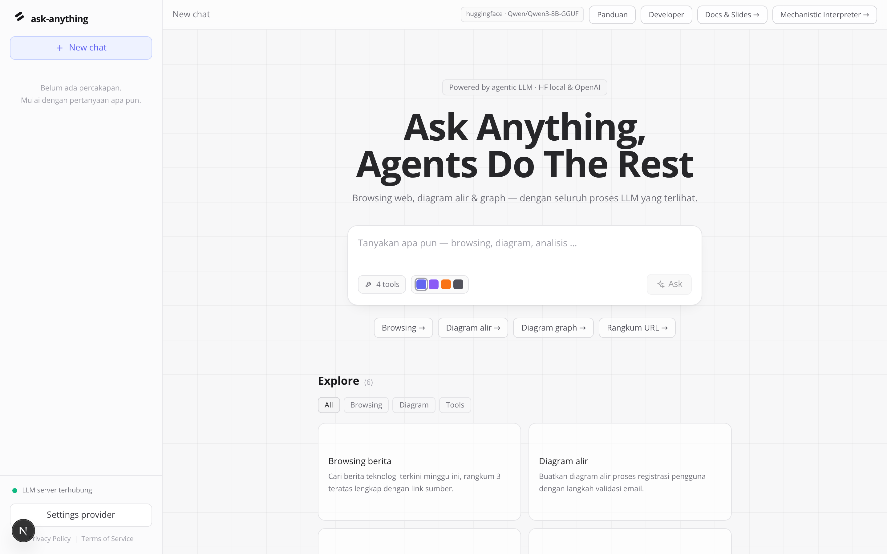
*Layar awal: sidebar riwayat (kiri), header status (atas), composer pertanyaan
(tengah), chip contoh prompt, dan galeri Explore.*

| Bagian | Fungsi |
|---|---|
| **Sidebar kiri** | Tombol `New chat`, riwayat percakapan berkelompok tanggal (`Today`, `Yesterday`, …), indikator status LLM (hijau/merah), tombol `Settings provider`. |
| **Header** | Judul percakapan aktif, chip provider+model (mis. `huggingface · Qwen/Qwen3-8B-GGUF`), tautan `Panduan`, `Developer`, `Docs & Slides`, dan tombol `Mechanistic Interpreter →`. |
| **Composer** | Kotak pertanyaan. Kirim dengan `Enter` atau tombol `Ask`; `Shift+Enter` untuk baris baru. Saat agent bekerja tombol menjadi `Thinking…`. |
| **Badge `4 tools`** | Daftar tool aktif: `web_search`, `fetch_url`, `create_diagram`, `calculator` (hover untuk tooltip). |
| **Chip contoh & Explore** | Prompt siap pakai per kategori (Browsing / Diagram / Tools); klik untuk mengisi composer. |

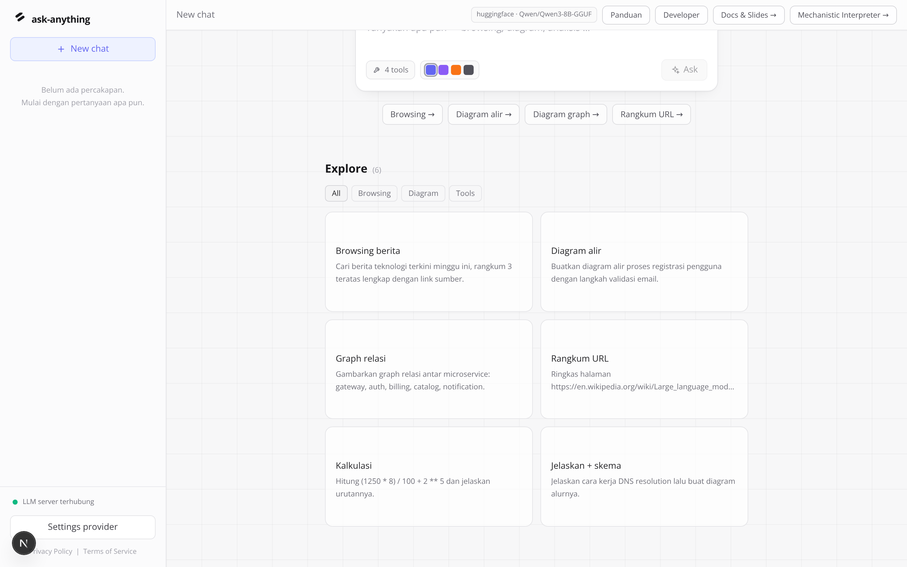
*Galeri Explore dengan tab kategori. Klik kartu untuk memakai promptnya.*

## 3. Chat pertama Anda

1. Klik chip contoh (mis. `Diagram alir →`) atau ketik pertanyaan sendiri.
2. Periksa badge `4 tools` dan pilihan aksen warna di baris bawah composer.
3. Tekan `Enter` / `Ask`. Tombol berubah menjadi `Thinking…`.
4. Jawaban mengalir bertahap (streaming); panel **Mechanistic Interpreter**
   otomatis terbuka di kanan memperlihatkan prosesnya.


*Composer terisi prompt contoh setelah klik chip.*

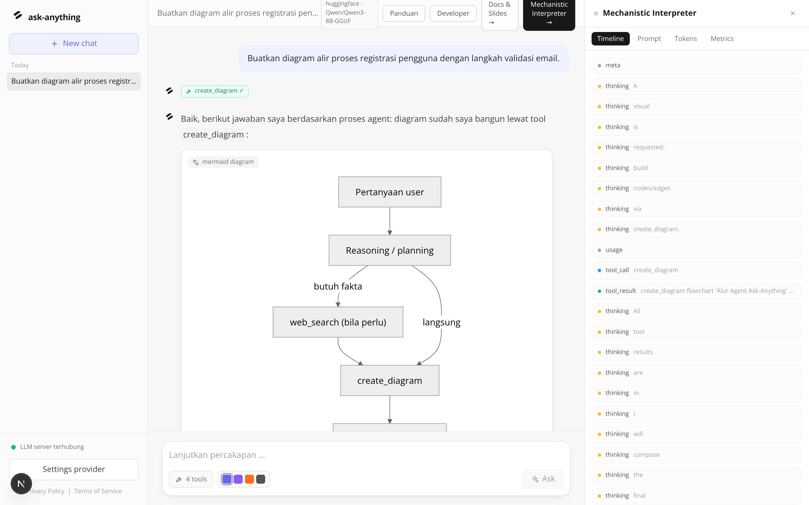
*Satu run lengkap: chip tool `create_diagram ✓`, jawaban teks, diagram Mermaid
yang dirender live, dan Interpreter (kanan) yang merekam semua event.*

## 4. Membaca jawaban agent

| Elemen UI | Artinya |
|---|---|
| Kotak `💭 thinking` | Reasoning mentah model sebelum memutuskan langkah (saat streaming). |
| Chip tool (`web_search ✓`, `create_diagram ✓`, …) | Agent memanggil tool tersebut; ✓ = selesai. Hover untuk ringkasan hasil. |
| Kartu `mermaid diagram` | Diagram alir / graph / mindmap hasil tool, dirender live via Mermaid. |
| Teks markdown | Jawaban final: list, tabel, tautan sumber, dan blok kode dirender otomatis. |

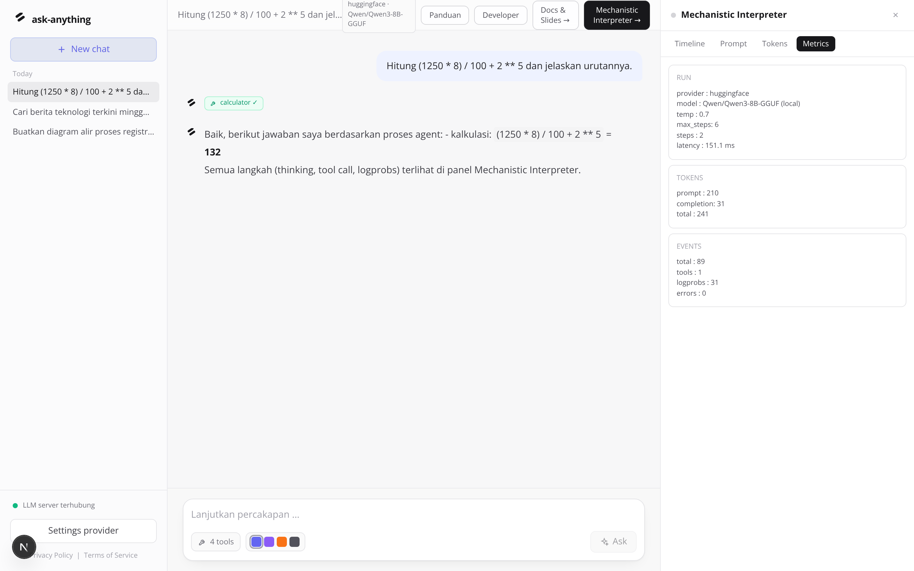
*Tool `calculator`: ekspresi dikirim sebagai argumen tool, hasilnya dikutip
agent pada jawaban final.*

## 5. Browsing & penanganan error

Untuk informasi terkini agent memanggil `web_search` (DuckDuckGo lite tanpa
API key; Serper/Tavily opsional via env), dan dapat melanjutkan dengan
`fetch_url` untuk membaca satu halaman penuh (teks diekstrak, ≤ 12k karakter).

Bila jaringan gagal, error **tidak** mematikan percakapan: status error
dikembalikan ke model sebagai data (`tool_result` berstatus error), dan model
menjawab dengan jujur menyebutkan keterbatasannya — pola *graceful
degradation* yang sengaja dirancang.

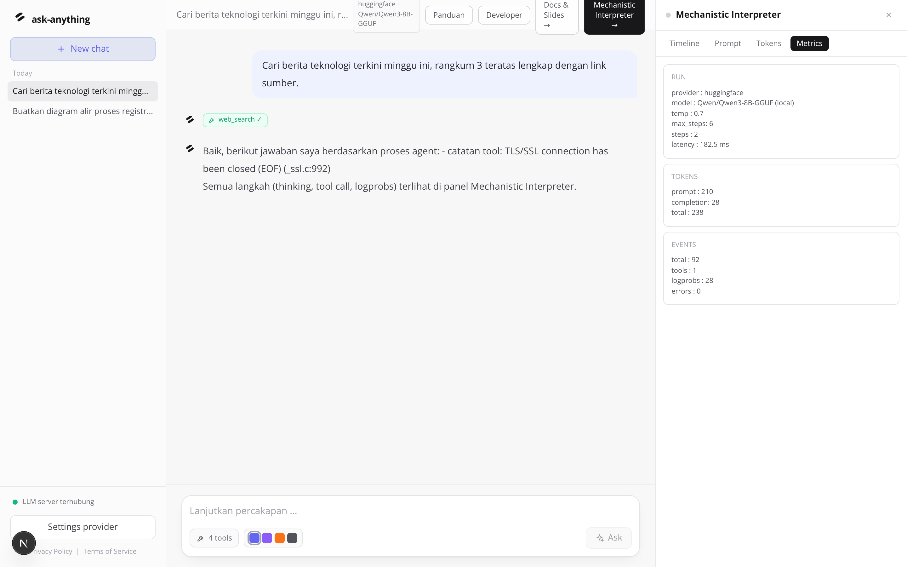
*Contoh: `web_search` gagal di lingkungan offline; error tampil sebagai
tool_result dan agent tetap merangkum dengan menyebut kegagalannya.*

## 6. Mechanistic Interpreter

Panel kanan (tombol `Mechanistic Interpreter →`) merekam **semua** event satu
run, dan tersimpan di SQLite sehingga riwayat bisa di-**replay** penuh.

| Tab | Isi | Kapan dipakai |
|---|---|---|
| **Timeline** | Urutan event `meta → thinking → tool_call → tool_result → … → done`; tiap baris bisa dibentangkan menjadi JSON mentah. | Memeriksa langkah agent & argumen tool. |
| **Prompt** | Prompt assembly persis seperti dikirim ke LLM: system prompt, messages, schema tools. | Debug perilaku model. |
| **Tokens** | Logprobs streaming per token: token terpilih, bar probabilitas, alternatif teratas. | Melihat keyakinan model per token. |
| **Metrics** | Provider/model, temperature, steps, latensi, token usage, jumlah event/error. | Mengukur performa run. |

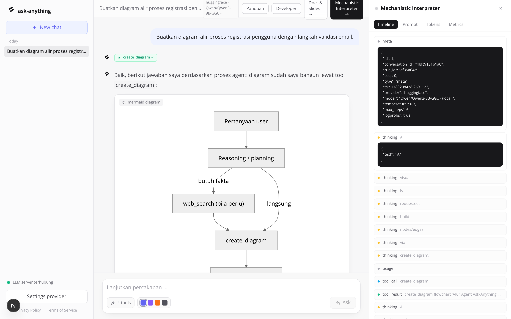
*Tab Timeline dengan baris event dibentangkan (JSON mentah per event).*

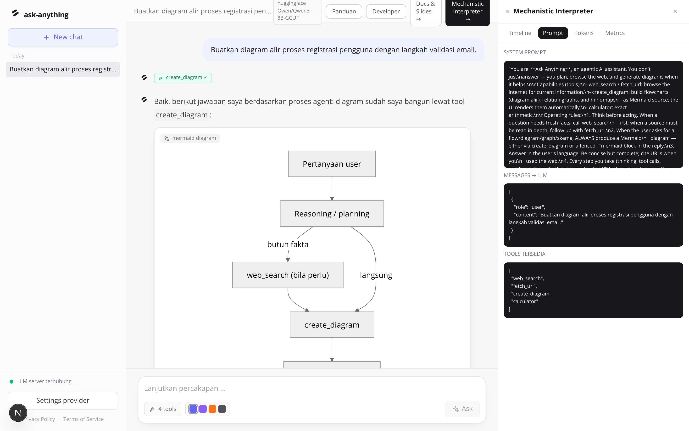
*Tab Prompt: system prompt + messages + tools persis seperti diterima LLM.*

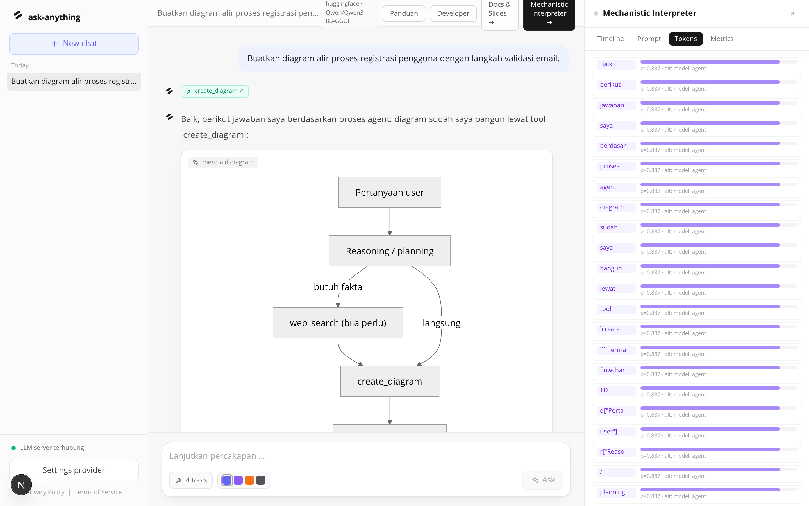
*Tab Tokens: logprobs per token dengan bar probabilitas & alternatif
(tersedia bila provider mendukung, mis. llama.cpp / mode mock).*

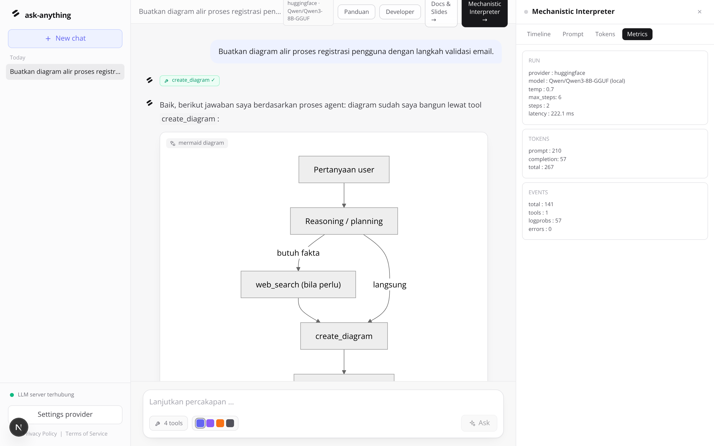
*Tab Metrics: ringkasan run — provider, model, temperature, steps, latensi, usage.*

## 7. Riwayat percakapan

Setiap percakapan tersimpan otomatis di SQLite lokal **beserta trace
event-nya**. Klik judul di sidebar untuk membuka kembali pesan *dan* replay
Interpreter-nya (Timeline/Prompt/Tokens/Metrics tetap lengkap).

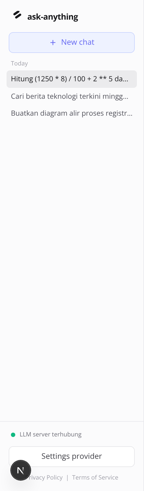
*Riwayat dikelompokkan per tanggal; indikator “LLM server terhubung”; tombol
Settings provider di bawah.*

## 8. Settings provider

Tombol `Settings provider` membuka dialog pemilihan LLM — berlaku runtime
tanpa restart:

| Provider | Kapan dipakai |
|---|---|
| `huggingface` | Server lokal OpenAI-compatible (llama.cpp `llama-server` di port 8081 default). Tool-calling + logprobs native. |
| `openai` | API OpenAI / Azure / proxy kompatibel (isi API key & base URL). |
| `mock` | Demo offline deterministik untuk uji UI & dokumen ini. |

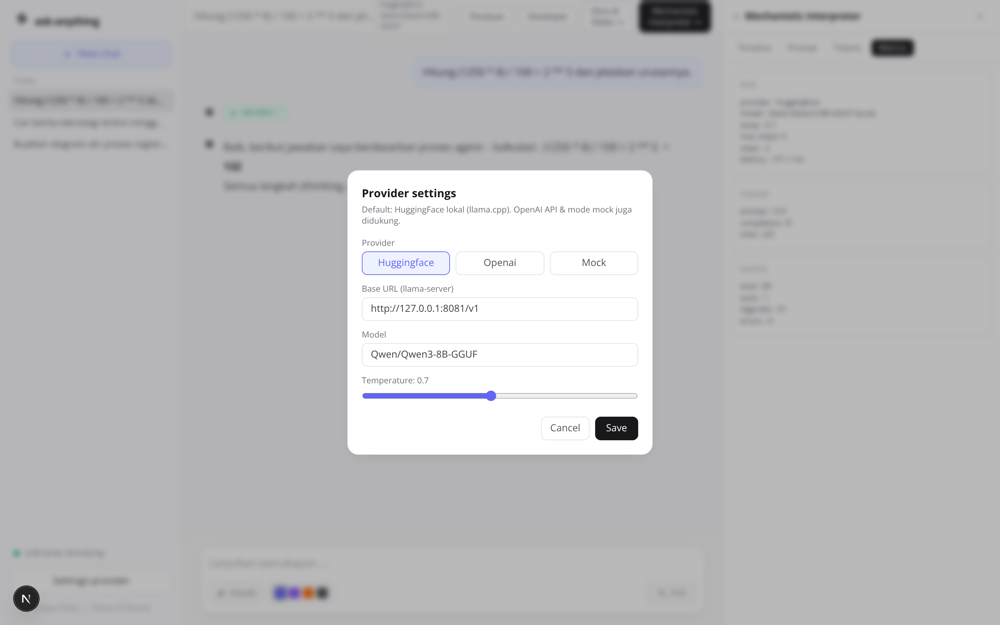
*Dialog settings: provider, base URL, model, dan slider temperature.*

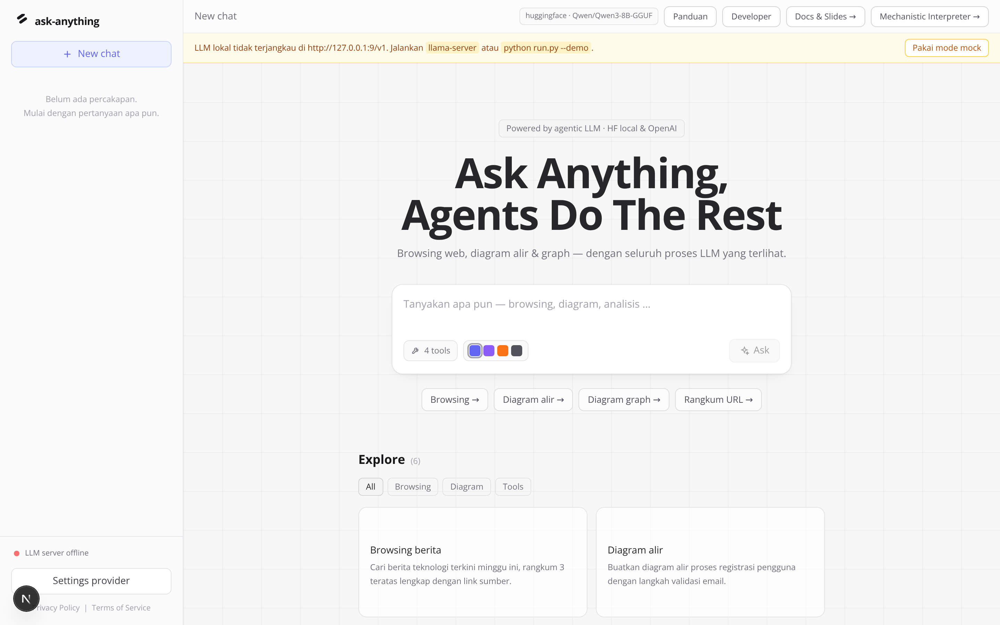
*Bila provider `huggingface` dipilih tetapi server lokal tidak terjangkau,
banner kuning muncul dengan tombol sekali-klik “Pakai mode mock”.*

## 9. Tampilan, aksen & mobile

Empat aksen warna (indigo, violet, orange, zinc) tersedia di composer — klik
titik warna untuk mengganti aksen seluruh UI seketika. Layout responsif sampai
layar ponsel (sidebar disembunyikan, composer tetap penuh).

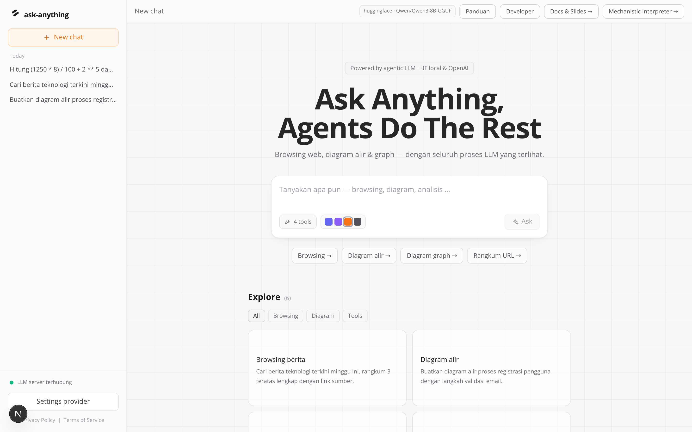
*Aksen orange diterapkan ke tombol, chip, dan ring.*

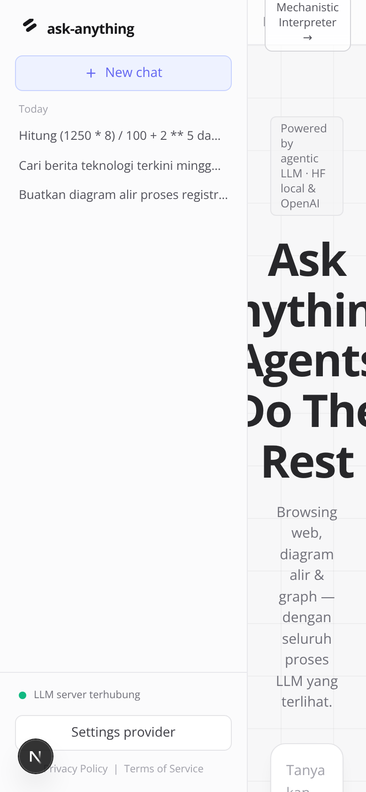
*Tampilan mobile 390×844.*

## 10. Materi belajar lanjutan

- **Slide interaktif** “cara kerja agent”: tombol `Docs & Slides →` di header
  atau `/slides/slides-cara-kerja.html` (navigasi `←`/`→`).
- **Metodologi** lengkap: [`docs/METODOLOGI.md`](METODOLOGI.md).
- **Developer**: [`docs/PANDUAN-DEVELOPER.md`](PANDUAN-DEVELOPER.md) atau
  halaman in-app `/developer`.

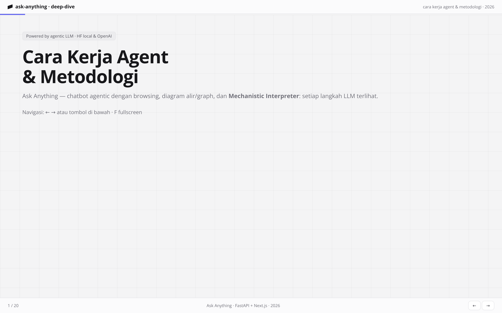
*Slide interaktif disajikan backend di `/slides` dan diproxy frontend.*

## 11. Tips prompt yang efektif

- Sebutkan kata kunci kemampuan: `cari/berita` → browsing,
  `diagram/alur/graph/mindmap` → diagram, `hitung` → calculator.
- Minta sumber eksplisit: *“…lengkap dengan link sumber”*.
- Untuk graph relasi, sebutkan node: *“graph relasi antar microservice:
  gateway, auth, billing, catalog, notification”*.
- Gabungkan tugas: *“Jelaskan cara kerja DNS lalu buat diagram alurnya”*.
- Lanjutkan percakapan untuk merevisi diagram — riwayat dikirim sebagai
  konteks langkah berikutnya.

## 12. Troubleshooting

| Gejala | Penyebab umum | Solusi |
|---|---|---|
| Banner kuning “LLM lokal tidak terjangkau” | `llama-server` belum jalan di port 8081. | Jalankan llama-server / `run.py --demo`, atau klik “Pakai mode mock”. |
| Indikator sidebar merah “LLM server offline” | Base URL provider tidak reachable. | Periksa Settings provider → base URL, atau ganti provider. |
| Tool `web_search` berstatus error | Tidak ada akses internet dari backend. | Normal di lingkungan offline (graceful). Konfigurasi Serper/Tavily bila punya key. |
| Tab Tokens kosong | Provider tidak mengirim logprobs. | Pakai llama.cpp lokal atau mode mock. |
| Diagram tidak muncul | Model tidak menghasilkan Mermaid valid. | Ulangi dengan prompt eksplisit “diagram alir”; validasi server-side akan menolak Mermaid rusak dan memberikannya kembali ke model. |
| UI tampil tapi tidak interaktif | Dev-server Next 16 memblokir resource cross-origin. | Tambahkan host ke `allowedDevOrigins` di `next.config.ts` (sudah disetel untuk 127.0.0.1 & *.e2b.app), lalu restart. |

## 13. Data & privasi

- Semua percakapan + trace tersimpan **lokal** di SQLite
  (`data/ask_anything.db`, lokasi bisa diubah via `ASK_DB_PATH`).
- Tidak ada telemetri dari aplikasi; permintaan LLM hanya menuju provider yang
  Anda pilih.
- Hapus riwayat: `DELETE /api/conversations/{id}` atau hapus file DB saat
  aplikasi mati.

---

*Screenshot di dokumen ini dapat di-generate ulang kapan pun:*

```bash
python3 run.py --demo                     # stack + emulator LLM
pip install playwright brotli             # sekali
BASE_URL=http://127.0.0.1:3000 python3 scripts/capture_screenshots.py main
python3 scripts/capture_screenshots.py pages
```
